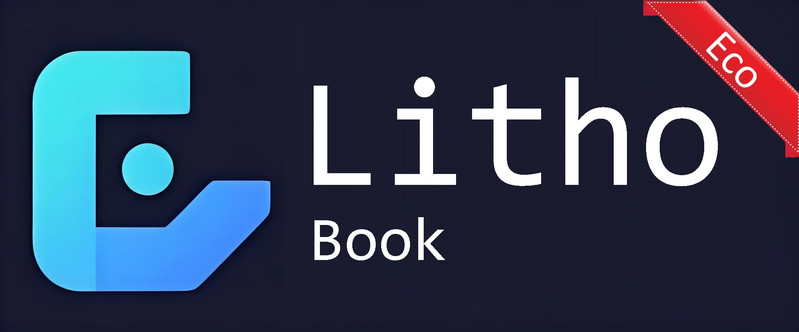
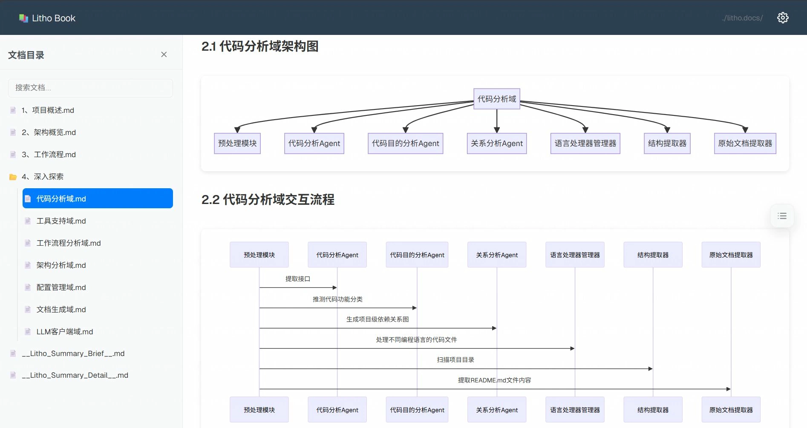
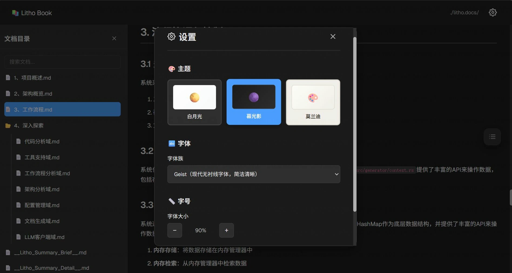
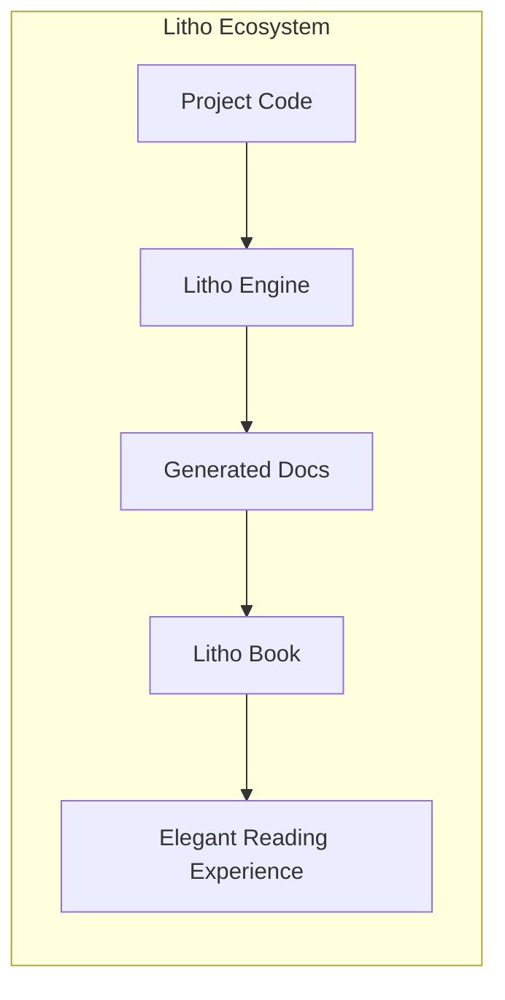
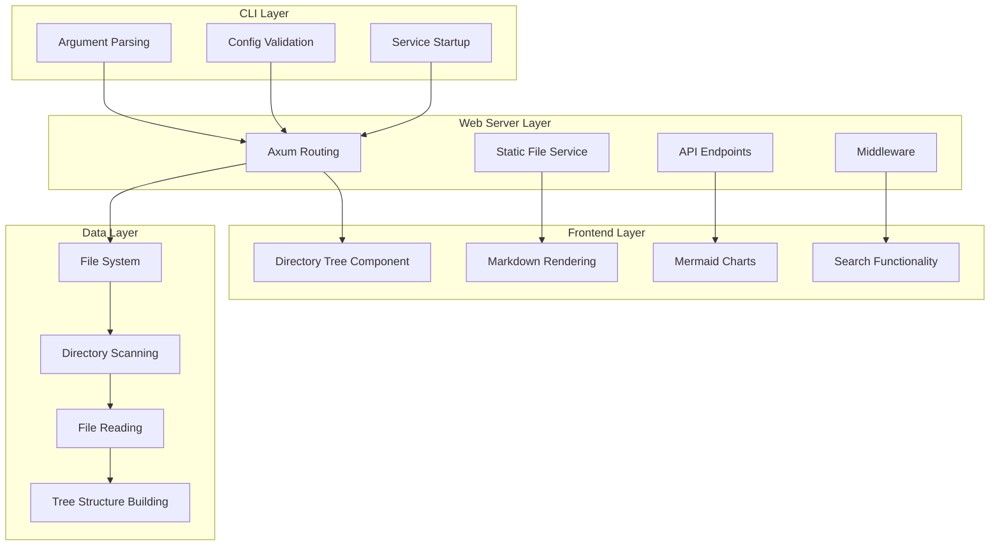
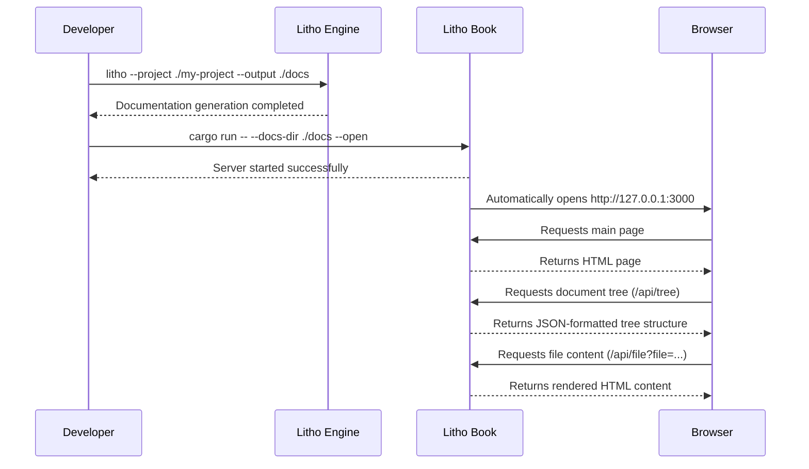

<p align="center">
  
</p>
<h3 align="center">Litho Book</h3>

<p align="center">
    <a href="./README.md">English</a>
    |
    <a href="./README_zh.md">中文</a>
</p>

<p align="center">🛠️ A high-performance documentation reader built with <strong>Rust</strong> and <strong>Axum</strong></p>
<p align="center">📚 Modern web reading experience for documents generated by <strong><a href="https://github.com/sopaco/deepwiki-rs">Litho (deepwiki-rs)</a></strong></p>
<p align="center">
  
  
  
</p>
<hr />

> 🚀 If you like this project, please give it a ⭐ and consider supporting the development of [Litho project](https://github.com/sopaco/deepwiki-rs)!

# 👋 What's Litho Book

**Litho Book** is a modern web documentation reader specifically designed for the [**Litho (deepwiki-rs)**](https://github.com/sopaco/deepwiki-rs) documentation generation engine. It provides an elegant interface and powerful features that allow you to easily browse and read project architecture documentation generated by Litho.

**Litho Book** is completely free and open-source, built with a high-performance Rust technology stack to provide you with a smooth documentation reading experience.

❤️ Like **Litho Book**? Star it 🌟 and learn more about the [**Litho project**](https://github.com/sopaco/deepwiki-rs)! ❤️


# 🌠 Snapshots
<div style="text-align: center;">
  <table style="width: 100%; margin: 0 auto;">
    <tr>
      <td style="width: 50%;"></td>
      <td style="width: 50%;"></td>
    </tr>
  </table>
</div>

# 🌟 Key Features

- **🌲 Smart Directory Tree** - Left panel displays document directory structure with collapsible folders and expand/collapse operations
- **📖 Real-time Rendering** - Right panel renders markdown content in real-time with syntax highlighting and formatting
- **📊 Mermaid Chart Support** - Perfect support for various Mermaid chart rendering, bringing architecture diagrams to life
- **🔍 Intelligent Search** - Quick search for document files with fuzzy matching for filenames and paths
- **📱 Responsive Design** - Supports desktop and mobile devices with adaptive layout for reading anywhere
- **⚡ High-Performance Architecture** - Built with Rust and Axum for low memory usage and fast response times
- **🎨 Modern UI** - Clean and beautiful user interface with clear information hierarchy and elegant interactions
- **📁 Path Navigation** - Title bar shows current document directory path for easy location and navigation
- **🔤 Smart Sorting** - Directories and files are automatically sorted by name for quick content discovery

# 🧠 How it Works

**Litho Book** serves as an important component of the [**Litho (deepwiki-rs)**](https://github.com/sopaco/deepwiki-rs) ecosystem, focusing on providing excellent documentation reading experience:



1. **Document Scanning**: Scans all markdown documentation files in the specified directory
2. **Structure Building**: Builds hierarchical document directory tree structure
3. **Content Rendering**: Real-time rendering of markdown content with syntax highlighting and Mermaid charts
4. **Interactive Experience**: Provides search, navigation and other interactive features to improve reading efficiency

# 🖥️ Getting Started

### Prerequisites
- [**Rust**](https://www.rust-lang.org) (version 1.70 or later)
- [**Cargo**](https://doc.rust-lang.org/cargo/)

### Installation

1. Clone the repository
    ```bash
    git clone <repository-url>
    cd litho-book
    ```

2. Build the project
    ```bash
    cargo build --release
    ```

3. The compiled binary will be available in the `target/release` directory

# 🚀 Usage

**Litho Book** provides a clean command-line interface to quickly start the documentation server:

### Basic Commands

```bash
# Basic usage - specify documentation directory
cargo run -- --docs-dir ./sample-markdowns-docdir

# Specify port and auto-open browser
cargo run -- --docs-dir ./docs --port 8080 --open

# Enable verbose logging
cargo run -- --docs-dir ./docs --verbose
```

### Using with Litho

```bash
# 1. Generate project documentation with Litho
litho --project ./my-project --output ./docs

# 2. Read the generated documentation with Litho Book
cargo run -- --docs-dir ./docs --open
```

### Command Line Arguments

| Argument | Description | Default |
|----------|-------------|---------|
| `-d, --docs-dir <DIR>` | Specify markdown documentation directory path (required) | - |
| `-p, --port <PORT>` | Specify server port | 3000 |
| `--host <HOST>` | Specify bind host address | 127.0.0.1 |
| `-o, --open` | Auto-open browser after startup | false |
| `-v, --verbose` | Enable verbose logging output | false |
| `-h, --help` | Show help information | - |

# 🏗️ Technical Architecture

**Litho Book** adopts a modern Rust technology stack to ensure high performance and reliability:

### Core Technology Stack

- **CLI Framework**: `clap` - Powerful command-line argument parsing and validation
- **Web Framework**: `axum` - High-performance async web framework with modern HTTP features
- **Template Engine**: `askama` - Compile-time template engine with zero runtime overhead
- **Markdown Rendering**: `pulldown-cmark` - High-performance Markdown parser, fully CommonMark compatible
- **Async Runtime**: `tokio` - The most mature async runtime in the Rust ecosystem
- **Serialization**: `serde` - Efficient data serialization and deserialization

### System Architecture Diagram



### ♻️ Execution Workflow


### 📦 Core Components

- **CLI Handler**: Responsible for command-line argument parsing, configuration validation, and server startup
- **Web Server**: High-performance HTTP server based on Axum, providing API and static file services
- **Documentation Engine**: Core logic for handling document scanning, parsing, and rendering
- **Frontend Interface**: Responsive web interface providing intuitive document browsing experience

# 📁 Project Structure

```
litho-book/
├── src/
│   ├── main.rs              # Main program entry and server startup
│   ├── cli.rs               # CLI argument processing and configuration management
│   ├── filesystem.rs        # File system operations and directory scanning
│   ├── server.rs            # Web server and routing configuration
│   └── error.rs             # Error handling and type definitions
├── templates/
│   └── index.html.tpl           # Main page template (Askama)
├── static/                  # Static resource files
│   ├── css/                 # Style files
│   ├── js/                  # JavaScript files
│   └── assets/              # Images and other resources
├── sample-markdowns-docdir/ # Sample documentation directory
├── Cargo.toml               # Project configuration and dependencies
├── Cargo.lock               # Dependency version lock
└── README.md                # Project documentation
```

## 🧩 API Interface Documentation

Litho Book provides the following API endpoints to support dynamic frontend functionality:

| Endpoint | Method | Description | Parameters |
|----------|--------|-------------|------------|
| `/` | GET | Main page | - |
| `/api/file` | GET | Retrieve the content and rendered HTML of a specified file | `file=<path>` |
| `/api/tree` | GET | Get the tree structure of the entire document directory | - |
| `/api/search` | GET | Search files based on a query keyword | `q=<query>` |
| `/api/stats` | GET | Get statistics of the document library (e.g., number of files, size, etc.) | - |
| `/health` | GET | Health check | - |

# 🔧 Development Guide

### Development Environment Requirements

- **Rust**: Version 1.70 or higher
- **Cargo**: Rust package manager
- **Git**: Version control tool

### Local Development

```bash
# Clone the project
git clone <repository-url>
cd litho-book

# Run development version
cargo run -- --docs-dir ./sample-markdowns-docdir --verbose

# Run test suite
cargo test

# Code quality check
cargo clippy

# Code formatting
cargo fmt

# Build release version
cargo build --release
```

### API Documentation

| Endpoint | Method | Description | Parameters |
|----------|--------|-------------|------------|
| `/` | GET | Main page | - |
| `/api/file` | GET | Get file content | `file=<path>` |
| `/api/tree` | GET | Get directory tree structure | - |
| `/api/search` | GET | Search files | `q=<query>` |
| `/api/stats` | GET | Get statistics | - |
| `/health` | GET | Health check | - |

# 📝 Usage Examples

### Complete Workflow

```bash
# 1. Generate project documentation with Litho
git clone https://github.com/sopaco/deepwiki-rs.git
cd deepwiki-rs
cargo build --release
./target/release/litho --project ./my-project --output ./project-docs

# 2. Read documentation with Litho Book
git clone <litho-book-repository>
cd litho-book
cargo run -- --docs-dir ./project-docs --open
```

### Starting the Server

```bash
# Use default settings
cargo run -- -d ./docs

# Custom port and auto-open browser
cargo run -- -d ./docs -p 8080 -o

# Bind to all network interfaces (for team sharing)
cargo run -- -d ./docs --host 0.0.0.0 -p 3000

# Enable verbose logging (for debugging)
cargo run -- -d ./docs --verbose
```

### Access and Usage

1. **Start Service**: After running the command, visit the displayed URL (default: http://127.0.0.1:3000)
2. **Browse Documents**: Left directory tree shows all markdown files with hierarchical expansion support
3. **View Content**: Click file names to view rendered content on the right side
4. **Quick Search**: Use the top search box to quickly find files and content
5. **Chart Support**: Mermaid charts are automatically rendered, supporting various chart types
6. **Responsive Experience**: Get excellent reading experience on different devices

# 🤝 Contributing

We welcome all forms of contributions! Report bugs or submit feature requests through [GitHub Issues](https://github.com/sopaco/litho-book/issues).

## Ways to Contribute

- **Feature Enhancement**: Implement new document reading features and interactive experiences
- **Performance Optimization**: Improve document loading speed and rendering performance
- **Interface Improvement**: Optimize user interface design and user experience
- **Documentation**: Improve project documentation and usage guides
- **Test Coverage**: Add test cases to improve code quality
- **Internationalization**: Support multi-language interface and documentation

## Development Contribution Process

1. Fork this project
2. Create a feature branch (`git checkout -b feature/amazing-feature`)
3. Commit your changes (`git commit -m 'Add some amazing feature'`)
4. Push to the branch (`git push origin feature/amazing-feature`)
5. Create a Pull Request

# ⚛️ Built With

- [**Rust**](https://github.com/rust-lang/rust) - Systems programming language
- [**Axum**](https://github.com/tokio-rs/axum) - Modern async web framework
- [**Tokio**](https://github.com/tokio-rs/tokio) - Async runtime
- [**Askama**](https://github.com/djc/askama) - Compile-time template engine
- [**Clap**](https://github.com/clap-rs/clap) - Command line argument parser
- [**Serde**](https://github.com/serde-rs/serde) - Serialization framework
- [**pulldown-cmark**](https://github.com/raphlinus/pulldown-cmark) - Markdown parser

# 🪪 License

**MIT**. A copy of the license is provided in the [LICENSE](LICENSE) file.

# 🙏 Acknowledgments & Related Projects

- [**Litho (deepwiki-rs)**](https://github.com/sopaco/deepwiki-rs) - Powerful AI-driven documentation generation engine
- [**Axum**](https://github.com/tokio-rs/axum) - High-performance async web framework
- [**Mermaid**](https://mermaid.js.org/) - Excellent chart rendering library
- [**pulldown-cmark**](https://github.com/raphlinus/pulldown-cmark) - High-performance Markdown parser
- [**Tokio**](https://github.com/tokio-rs/tokio) - Foundation of Rust async ecosystem

> 💡 **Recommendation**: If you need to automatically generate project architecture documentation, try [**Litho (deepwiki-rs)**](https://github.com/sopaco/deepwiki-rs) - an AI-based intelligent documentation generation engine that can automatically analyze your project and generate professional C4 architecture documentation!

---

<p align="center">
  <strong>🚀 Explore More Excellent Open Source Projects</strong><br>
  <a href="https://github.com/sopaco/deepwiki-rs">Litho (deepwiki-rs)</a> •
  <a href="https://github.com/sopaco/saga-reader">Saga Reader</a>
</p>
