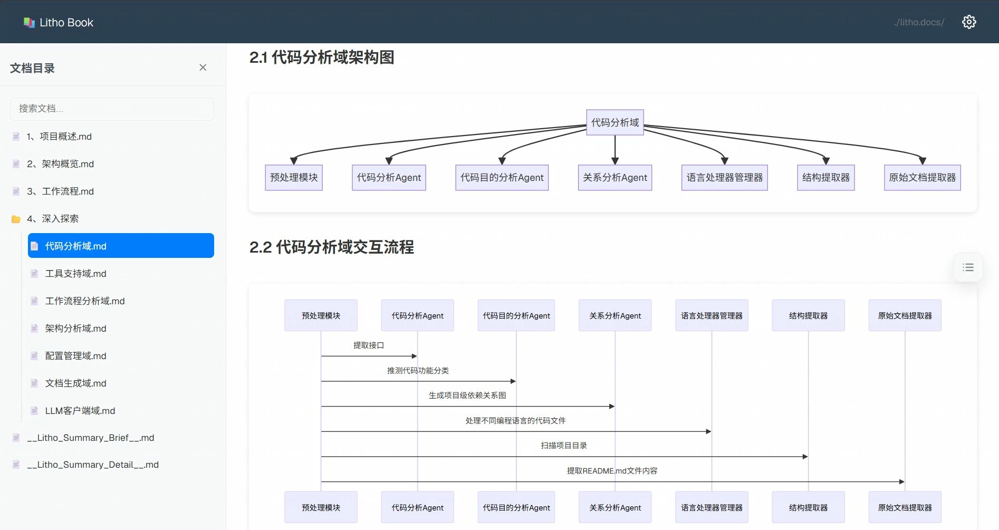
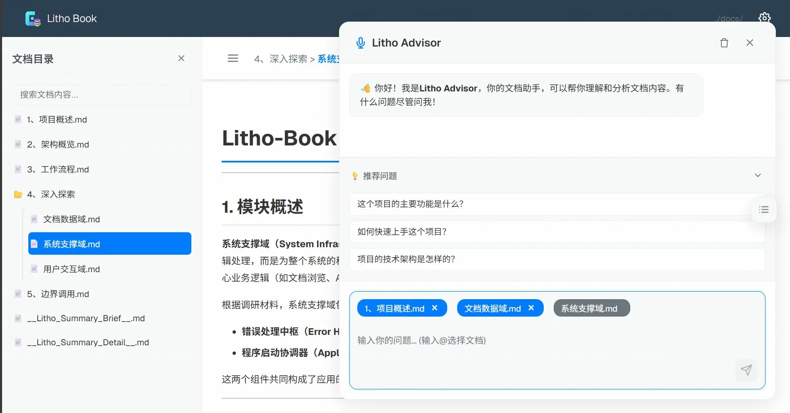

<p align="center">
  
</p>
<h3 align="center">Litho Book</h3>

<p align="center">
    <a href="./README.md">English</a>
    |
    <a href="./README_zh.md">中文</a>
</p>

<p align="center">🛠️ 基于 <strong>Rust</strong> 和 <strong>Axum</strong> 构建的高性能Markdown阅读器，内置Mermaid图表渲染引擎</p>
<p align="center">📚 为 <strong><a href="https://github.com/sopaco/deepwiki-rs">Litho (deepwiki-rs)</a></strong> 生成的文档提供现代化Web阅读体验</p>
<p align="center">
  <a href="./docs/1、项目概述.md"></a>
  
  
</p>
<hr />

> 🚀 如果你喜欢这个项目，请给它一个 ⭐ 并考虑支持 [Litho 项目](https://github.com/sopaco/deepwiki-rs)的发展！

# 👋 什么是 Litho Book

**Litho Book** 是一个专为 [**Litho (deepwiki-rs)**](https://github.com/sopaco/deepwiki-rs) 文档生成引擎设计的现代化Web文档阅读器。它提供了优雅的界面和强大的功能，让你能够轻松浏览和阅读由Litho生成的项目架构文档。

**Litho Book** 完全免费且开源，采用高性能的Rust技术栈构建，为你提供流畅的文档阅读体验。

❤️ 喜欢 **Litho Book**? 点亮小星星 🌟 并了解更多关于 [**Litho 项目**](https://github.com/sopaco/deepwiki-rs)! ❤️

# 🌠 界面预览
<div style="text-align: center;">
  <table style="width: 100%; margin: 0 auto;">
    <tr>
      <td style="width: 50%;"></td>
      <td style="width: 50%;"></td>
    </tr>
  </table>
</div>

# 🌟 核心特性

- **🌲 智能目录树** - 左侧显示文档目录结构，文件夹默认折叠，支持展开/收起操作
- **📖 实时渲染** - 右侧实时渲染markdown文档内容，支持代码高亮和格式化
- **📊 Mermaid图表支持** - 完美支持各种Mermaid图表渲染，让架构图表生动展现
- **🔍 智能搜索** - 快速搜索文档文件，支持文件名和路径模糊匹配
- **📱 响应式设计** - 支持桌面和移动设备，自适应布局，随时随地阅读文档
- **⚡ 高性能架构** - 基于Rust和Axum构建，内存占用低，响应速度快
- **🎨 现代化UI** - 简洁美观的用户界面，清晰的信息层次和优雅的交互体验
- **📁 路径导航** - 标题栏显示当前文档目录路径，方便定位和导航
- **🔤 智能排序** - 目录和文件按名称自动排序，便于快速查找内容

# 🧠 工作原理

**Litho Book** 作为 [**Litho (deepwiki-rs)**](https://github.com/sopaco/deepwiki-rs) 生态系统的重要组成部分，专注于提供优秀的文档阅读体验：


1. **文档扫描**: 扫描指定目录下的所有markdown文档文件
2. **结构构建**: 构建层次化的文档目录树结构
3. **内容渲染**: 实时渲染markdown内容，支持代码高亮和Mermaid图表
4. **交互体验**: 提供搜索、导航等交互功能，提升阅读效率

# 🖥️ 快速开始

### 前提条件
- [**Rust**](https://www.rust-lang.org) (1.70或更高版本)
- [**Cargo**](https://doc.rust-lang.org/cargo/)

### 安装

1. 克隆仓库
    ```bash
    git clone <repository-url>
    cd litho-book
    ```

2. 编译项目
    ```bash
    cargo build --release
    ```

3. 编译后的二进制文件将位于 `target/release` 目录中

# 🚀 使用方法

**Litho Book** 提供简洁的命令行界面，让你快速启动文档服务器：

### 基本命令

```bash
# 基本用法 - 指定文档目录
cargo run -- --docs-dir ./sample-markdowns-docdir

# 指定端口和自动打开浏览器
cargo run -- --docs-dir ./docs --port 8080 --open

# 启用详细日志
cargo run -- --docs-dir ./docs --verbose
```

### 与 Litho 配合使用

```bash
# 1. 使用 Litho 生成项目文档
litho --project ./my-project --output ./docs

# 2. 使用 Litho Book 阅读生成的文档
cargo run -- --docs-dir ./docs --open
```

### 命令行参数

| 参数 | 描述 | 默认值 |
|------|------|--------|
| `-d, --docs-dir <DIR>` | 指定markdown文档目录路径 (必需) | - |
| `-p, --port <PORT>` | 指定服务器端口 | 3000 |
| `--host <HOST>` | 指定绑定的主机地址 | 127.0.0.1 |
| `-o, --open` | 启动后自动打开浏览器 | false |
| `-v, --verbose` | 启用详细日志输出 | false |
| `-h, --help` | 显示帮助信息 | - |

# 🏗️ 技术架构

**Litho Book** 采用现代化的Rust技术栈，确保高性能和可靠性：

### 核心技术栈

- **CLI框架**: `clap` - 强大的命令行参数解析和验证
- **Web框架**: `axum` - 高性能异步web框架，支持现代HTTP特性
- **模板引擎**: `askama` - 编译时模板引擎，零运行时开销
- **Markdown渲染**: `pulldown-cmark` - 高性能Markdown解析器，完全兼容CommonMark
- **异步运行时**: `tokio` - Rust生态最成熟的异步运行时
- **序列化**: `serde` - 高效的数据序列化和反序列化

### 系统架构图


### ♻️ 执行流程


### 📦 核心组件

- **CLI处理器**: 负责命令行参数解析、配置验证和服务器启动
- **Web服务器**: 基于Axum的高性能HTTP服务器，提供API和静态文件服务
- **文档引擎**: 处理文档扫描、解析和渲染的核心逻辑
- **前端界面**: 响应式Web界面，提供直观的文档浏览体验

# 📁 项目结构

```
litho-book/
├── src/
│   ├── main.rs              # 主程序入口和服务器启动
│   ├── cli.rs               # CLI参数处理和配置管理
│   ├── filesystem.rs        # 文件系统操作和目录扫描
│   ├── server.rs            # Web服务器和路由配置
│   └── error.rs             # 错误处理和类型定义
├── templates/
│   └── index.html.tpl           # 主页面模板 (Askama)
├── static/                  # 静态资源文件
│   ├── css/                 # 样式文件
│   ├── js/                  # JavaScript文件
│   └── assets/              # 图片和其他资源
├── sample-markdowns-docdir/ # 示例文档目录
├── Cargo.toml               # 项目配置和依赖
├── Cargo.lock               # 依赖版本锁定
└── README.md                # 项目文档
```

## 🧩 API接口说明

Litho Book提供了以下API端点，用于支持前端的动态功能：

| 端点 | 方法 | 描述 | 参数 |
|------|------|------|------|
| `/` | GET | 主页面 | - |
| `/api/file` | GET | 获取指定文件的内容和渲染后的HTML | `file=<path>` |
| `/api/tree` | GET | 获取整个文档目录的树形结构 | - |
| `/api/search` | GET | 根据查询关键词搜索文件 | `q=<query>` |
| `/api/stats` | GET | 获取文档库的统计信息（文件数、大小等） | - |
| `/health` | GET | 健康检查 | - |

# 🔧 开发指南

### 开发环境要求

- **Rust**: 1.70或更高版本
- **Cargo**: Rust包管理器
- **Git**: 版本控制工具

### 本地开发

```bash
# 克隆项目
git clone <repository-url>
cd litho-book

# 运行开发版本
cargo run -- --docs-dir ./sample-markdowns-docdir --verbose

# 运行测试套件
cargo test

# 代码质量检查
cargo clippy

# 代码格式化
cargo fmt

# 构建发布版本
cargo build --release
```

### API接口文档

| 端点 | 方法 | 描述 | 参数 |
|------|------|------|------|
| `/` | GET | 主页面 | - |
| `/api/file` | GET | 获取文件内容 | `file=<path>` |
| `/api/tree` | GET | 获取目录树结构 | - |
| `/api/search` | GET | 搜索文件 | `q=<query>` |
| `/api/stats` | GET | 获取统计信息 | - |
| `/health` | GET | 健康检查 | - |

# 📝 使用示例

### 完整工作流程

```bash
# 1. 使用 Litho 生成项目文档
git clone https://github.com/sopaco/deepwiki-rs.git
cd deepwiki-rs
cargo build --release
./target/release/litho --project ./my-project --output ./project-docs

# 2. 使用 Litho Book 阅读文档
git clone <litho-book-repository>
cd litho-book
cargo run -- --docs-dir ./project-docs --open
```

### 启动服务器

```bash
# 使用默认设置
cargo run -- -d ./docs

# 自定义端口并自动打开浏览器
cargo run -- -d ./docs -p 8080 -o

# 绑定到所有网络接口 (用于团队共享)
cargo run -- -d ./docs --host 0.0.0.0 -p 3000

# 启用详细日志 (用于调试)
cargo run -- -d ./docs --verbose
```

### 访问和使用

1. **启动服务**: 运行命令后，访问显示的URL (默认: http://127.0.0.1:3000)
2. **浏览文档**: 左侧目录树显示所有markdown文件，支持层级展开
3. **查看内容**: 点击文件名在右侧查看渲染后的内容
4. **快速搜索**: 使用顶部搜索框快速查找文件和内容
5. **图表支持**: Mermaid图表会自动渲染，支持各种图表类型
6. **响应式体验**: 在不同设备上都能获得优秀的阅读体验

# 🤝 贡献指南

我们欢迎所有形式的贡献！通过 [GitHub Issues](https://github.com/sopaco/litho-book/issues) 报告错误或提出功能请求。

## 贡献方式

- **功能增强**: 实现新的文档阅读功能和交互体验
- **性能优化**: 提升文档加载速度和渲染性能
- **界面改进**: 优化用户界面设计和用户体验
- **文档完善**: 改进项目文档和使用指南
- **测试覆盖**: 增加测试用例，提高代码质量
- **国际化**: 支持多语言界面和文档

## 开发贡献流程

1. Fork 本项目
2. 创建功能分支 (`git checkout -b feature/amazing-feature`)
3. 提交更改 (`git commit -m 'Add some amazing feature'`)
4. 推送到分支 (`git push origin feature/amazing-feature`)
5. 创建 Pull Request

# ⚛️ 技术栈

- [**Rust**](https://github.com/rust-lang/rust) - 系统编程语言
- [**Axum**](https://github.com/tokio-rs/axum) - 现代异步Web框架
- [**Tokio**](https://github.com/tokio-rs/tokio) - 异步运行时
- [**Askama**](https://github.com/djc/askama) - 编译时模板引擎
- [**Clap**](https://github.com/clap-rs/clap) - 命令行参数解析
- [**Serde**](https://github.com/serde-rs/serde) - 序列化框架
- [**pulldown-cmark**](https://github.com/raphlinus/pulldown-cmark) - Markdown解析器

# 🪪 许可证

**MIT**。许可证的副本保留在 [LICENSE](LICENSE) 文件中。

# 🙏 致谢与相关项目

- [**Litho (deepwiki-rs)**](https://github.com/sopaco/deepwiki-rs) - 强大的AI驱动文档生成引擎
- [**Axum**](https://github.com/tokio-rs/axum) - 高性能异步Web框架
- [**Mermaid**](https://mermaid.js.org/) - 优秀的图表渲染库
- [**pulldown-cmark**](https://github.com/raphlinus/pulldown-cmark) - 高性能Markdown解析器
- [**Tokio**](https://github.com/tokio-rs/tokio) - Rust异步生态基石

> 💡 **推荐**: 如果你需要自动生成项目架构文档，请尝试 [**Litho (deepwiki-rs)**](https://github.com/sopaco/deepwiki-rs) - 一个基于AI的智能文档生成引擎，它能够自动分析你的项目并生成专业的C4架构文档！

---

<p align="center">
  <strong>🚀 探索更多优秀的开源项目</strong><br>
  <a href="https://github.com/sopaco/deepwiki-rs">Litho (deepwiki-rs)</a> •
  <a href="https://github.com/sopaco/saga-reader">Saga Reader</a>
</p>
