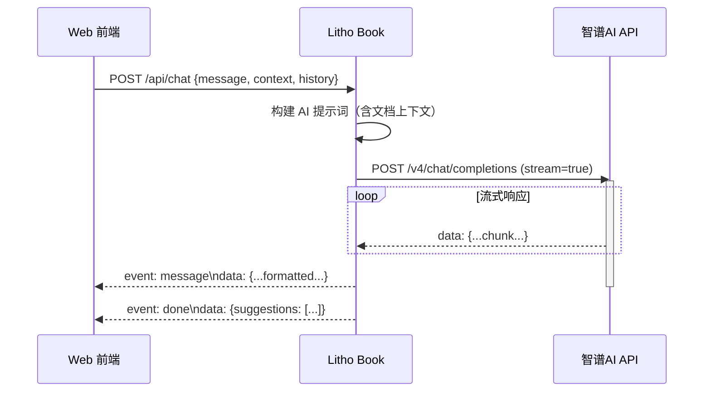
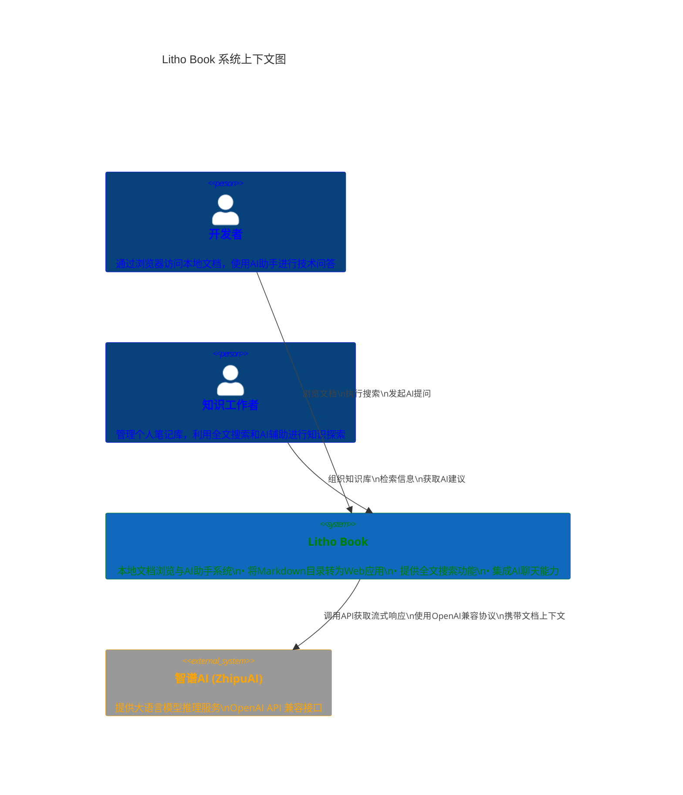
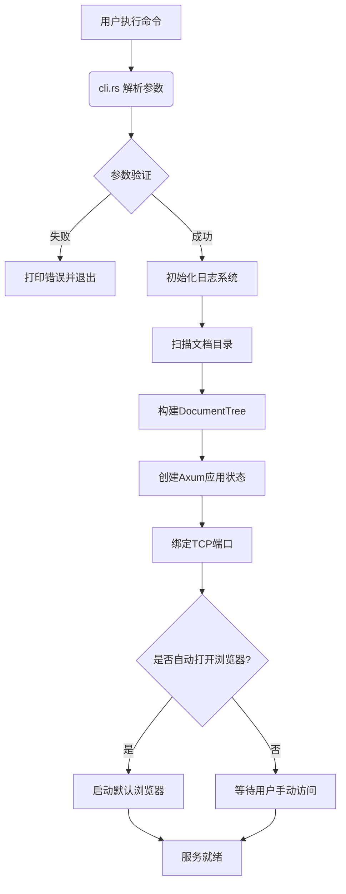
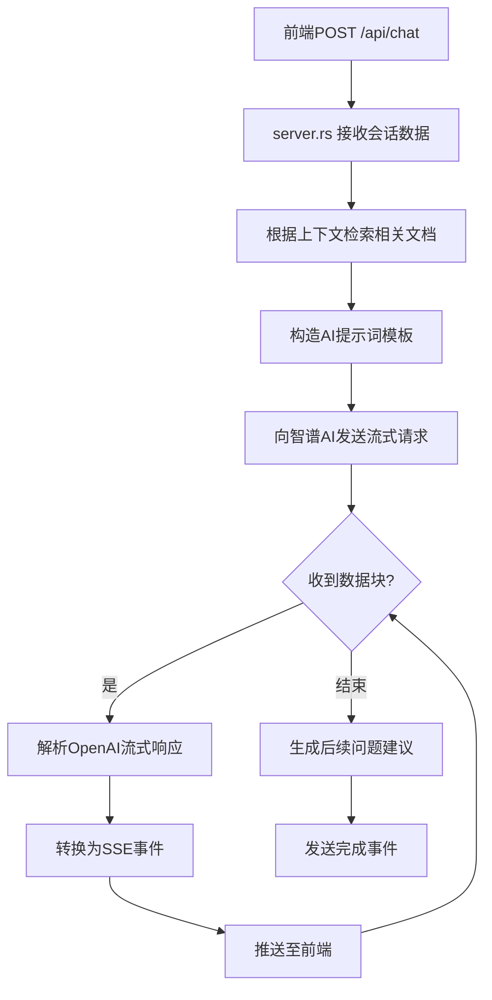

# 系统概览 (System Context)

## 1. 项目简介

### 项目名称
**Litho Book**

### 项目描述
Litho Book 是一个命令行工具与 Web 服务一体化的本地文档浏览与 AI 助手系统，专为开发者和知识工作者设计。它能够将本地 Markdown 文档目录转换为可搜索、可浏览的 Web 应用，并集成 AI 聊天功能以增强知识探索体验。

该系统通过构建结构化的文档树、提供全文检索能力，并结合外部 AI 服务实现自然语言问答，显著提升了个人知识库的可访问性与使用效率。其核心价值在于将分散的本地文档转化为统一、智能的知识管理系统，支持高效的信息检索与内容创作。

### 核心功能与价值
- **文档结构化展示**：自动扫描本地 Markdown 文件目录，构建层级化的文档树结构
- **全文搜索引擎**：支持关键词搜索，结合标题权重、词频分析和上下文提取进行相关性排序
- **Web 浏览界面**：通过浏览器访问本地文档，获得现代化的阅读体验
- **AI 增强型问答**：集成外部大模型 API，允许用户以自然语言提问文档相关内容
- **离线优先架构**：文档内容保留在本地，仅在需要时调用外部 AI 服务，保障数据隐私

### 技术特征概述
- **编程语言**：Rust（强调安全性、性能和内存效率）
- **Web 框架**：Axum（基于 Tokio 的异步 HTTP 服务框架）
- **运行模式**：命令行启动 + 内嵌 Web 服务器
- **通信协议**：HTTP/REST + Server-Sent Events (SSE) 流式响应
- **部署方式**：单机运行，无需复杂部署流程
- **扩展机制**：通过 OpenAI 兼容 API 接口集成外部 AI 服务

---

## 2. 目标用户

### 用户角色定义

| 角色 | 描述 |
|------|------|
| **开发者** | 使用本地 Markdown 文件管理代码文档、API 注释、技术笔记的软件工程师 |
| **知识工作者** | 需要整理和检索大量个人笔记、读书摘要、研究资料的学者、研究员或内容创作者 |

### 使用场景描述

#### 场景一：技术文档快速查阅
开发者在开发过程中需要频繁查阅项目文档、API 手册或学习笔记。通过 Litho Book，他们可以：
- 启动服务后自动打开浏览器
- 在结构化目录中导航到目标文档
- 使用全文搜索快速定位特定知识点
- 通过 AI 助手理解复杂概念或获取示例代码

#### 场景二：学术研究资料管理
研究人员积累了大量的文献笔记和实验记录。Litho Book 帮助他们：
- 统一管理分散在不同文件夹中的 Markdown 笔记
- 通过关键词搜索跨文档查找相关信息
- 利用 AI 助手总结文献要点或生成写作建议
- 完全在本地操作，确保敏感研究数据不外泄

#### 场景三：个人知识库建设
内容创作者希望构建自己的数字花园（Digital Garden）。Litho Book 提供：
- 简洁美观的文档浏览界面
- 支持双向链接和知识图谱的基础结构
- 可定制的元数据和标签系统
- AI 辅助的内容生成与重组能力

### 用户需求分析

| 用户类型 | 核心需求 | 系统满足方式 |
|---------|--------|-------------|
| 开发者 | 快速浏览本地文档目录 | 自动生成文档树并渲染为 HTML |
| 开发者 | 全文搜索文档内容 | 实现加权全文搜索引擎 |
| 开发者 | 在浏览器中结构化展示 | 提供响应式 Web 界面 |
| 开发者 | 通过 AI 提问文档内容 | 集成外部 AI API 实现流式对话 |
| 知识工作者 | 统一管理分散的 Markdown 文件 | 扫描指定目录构建文档树 |
| 知识工作者 | 关键词快速定位信息 | 支持高亮显示的搜索结果 |
| 知识工作者 | 获得上下文相关的 AI 问答 | 结合文档内容构建提示词 |
| 知识工作者 | 离线使用，无需云端上传 | 本地运行，仅 AI 请求出站 |

---

## 3. 系统边界

### 系统范围定义
Litho Book 的核心职责是作为**本地文档服务器与 AI 增强型知识探索系统**，专注于将静态 Markdown 文件转化为动态、可交互的知识平台。系统采用清晰的边界划分，明确包含与排除的功能模块。

### 包含的核心组件

| 组件 | 文件路径 | 职责说明 |
|------|--------|---------|
| **命令行接口** | `src/cli.rs` | 解析用户输入参数，验证配置合法性 |
| **文件系统扫描** | `src/filesystem.rs` | 递归扫描文档目录，构建 DocumentTree 内存结构 |
| **统一错误处理** | `src/error.rs` | 定义应用级错误类型并映射为 HTTP 状态码 |
| **Axum HTTP 服务** | `src/server.rs` | 提供 RESTful API 和 SSE 流式响应 |
| **主程序协调器** | `src/main.rs` | 协调各模块完成服务初始化与启动 |

这些组件共同构成了系统的五大核心能力：
1. 参数解析与验证
2. 文档树构建与索引
3. Web 服务路由与响应
4. 错误处理与日志输出
5. 服务生命周期管理

### 排除的外部依赖

以下功能明确不属于本系统范畴：

| 排除项 | 替代方案/说明 |
|-------|--------------|
| 前端 React/Vue 界面 | 使用轻量级 HTML 模板 + JavaScript 渲染，避免引入前端框架复杂性 |
| Markdown 文件生成工具 | 专注于文档消费而非生产，不提供编辑或创建功能 |
| 文档版本控制（如 Git） | 不干预源文件存储方式，兼容任何版本控制系统 |
| 用户认证与权限系统 | 默认开放访问，适用于个人单机使用场景 |
| 云存储同步服务 | 数据完全保留在本地，不提供自动同步功能 |
| AI 模型训练或微调 | 仅作为客户端调用外部推理服务，不涉及模型训练 |

这种边界设定体现了"关注点分离"的设计哲学，使系统保持专注、轻量且易于维护。

---

## 4. 外部系统交互

### 外部系统列表

| 外部系统 | 交互类型 | 协议 | 方向 | 用途 |
|---------|--------|------|------|-----|
| **智谱AI (ZhipuAI) OpenAI 兼容 API** | HTTP/REST | HTTPS | 出站 | 获取 AI 聊天流式响应 |

### 交互方式说明

#### 通信协议
- **基础通信**：HTTPS REST API
- **流式传输**：Server-Sent Events (SSE) 封装 AI 响应
- **数据格式**：JSON 序列化请求与响应体
- **认证机制**：通过环境变量或配置文件传递 API Key

#### 请求流程


### 依赖关系分析

#### 依赖强度评估
| 依赖项 | 强度（0-10） | 影响范围 | 容错策略 |
|-------|------------|---------|----------|
| 智谱AI API | 8.0 | AI 助手功能不可用 | 降级为纯搜索模式，记录错误日志 |
| 本地文件系统 | 10.0 | 整个系统无法启动 | 提供清晰错误提示并退出 |
| 网络连接 | 6.0 | 仅影响 AI 功能 | 缓存失败请求，提供重试选项 |

#### 安全与隐私考虑
- **数据最小化原则**：仅发送必要的文档片段作为上下文
- **本地优先**：所有文档内容永不上传至第三方服务
- **凭证保护**：API Key 通过安全方式注入，不在代码中硬编码
- **超时控制**：设置合理的连接和读取超时，防止资源耗尽

---

## 5. 系统上下文图

### C4 Model - System Context Diagram



### 关键交互流程

#### 1. 项目启动与服务初始化流程


#### 2. 文档全文搜索流程


#### 3. AI助手流式对话流程


### 架构决策说明

| 决策项 | 选择 | 理由 |
|-------|------|------|
| **技术栈** | Rust + Axum | 高性能、内存安全、适合系统级工具 |
| **部署模式** | CLI + 内嵌服务器 | 降低使用门槛，无需额外部署步骤 |
| **前端方案** | 轻量级HTML/JS | 避免前端工程化复杂性，聚焦核心功能 |
| **AI集成** | OpenAI兼容API | 保持供应商中立，便于切换不同LLM提供商 |
| **数据存储** | 内存文档树 | 提升搜索性能，简化架构复杂度 |
| **通信方式** | SSE流式传输 | 实现低延迟的AI对话体验 |

---

## 6. 技术架构概览

### 主要技术栈

| 层级 | 技术选型 | 版本要求 | 作用 |
|------|--------|---------|------|
| 运行时 | Rust | 1.70+ | 提供高性能、内存安全的执行环境 |
| 异步运行时 | Tokio | 1.x | 处理并发网络请求 |
| Web 框架 | Axum | 0.6+ | 构建类型安全的 HTTP 路由 |
| CLI 工具 | Clap | 4.x | 命令行参数解析 |
| 日志系统 | Tracing | 0.1.x | 结构化日志记录与调试 |
| JSON 处理 | Serde | 1.x | 高效序列化/反序列化 |
| HTTP 客户端 | Reqwest | 0.11+ | 调用外部 AI API |
| Markdown 渲染 | comrak | 0.20+ | 将 .md 转换为 HTML |

### 架构模式

#### 分层架构设计
```
┌─────────────────┐
│   用户交互域     │ ← CLI 参数解析 & Web API 响应
├─────────────────┤
│   文档数据域     │ ← 文档树构建 & 全文搜索引擎
├─────────────────┤
│   系统支撑域     │ ← 错误处理 & 程序启动协调
└─────────────────┘
```

#### 模块职责划分
| 模块 | 职责 | 依赖 |
|------|------|------|
| `main.rs` | 系统启动协调中心 | cli, filesystem, server |
| `cli.rs` | 命令行接口 | clap, std::path |
| `filesystem.rs` | 文档数据管理 | serde, std::collections |
| `server.rs` | Web 服务接口 | axum, tower-http, futures |
| `error.rs` | 统一错误处理 | thiserror, axum::http |

### 关键设计决策

#### 1. 内存驻留文档树
- **决策**：将整个文档目录加载到内存中构建 `DocumentTree`
- **优势**：
  - 搜索响应速度快（O(1) 访问）
  - 支持复杂的全文检索算法
  - 减少磁盘 I/O 开销
- **权衡**：
  - 内存占用随文档数量线性增长
  - 启动时间略长于按需加载

#### 2. 单体进程架构
- **决策**：所有功能运行在同一进程中
- **优势**：
  - 部署简单，只有一个可执行文件
  - 模块间通信高效（函数调用而非网络请求）
  - 易于调试和监控
- **适用场景**：
  - 个人知识管理
  - 中小规模文档库（<10,000 文件）

#### 3. 外部 AI 服务集成
- **决策**：通过标准 API 调用外部 LLM 服务
- **优势**：
  - 无需本地 GPU 资源
  - 可随时升级到更强的模型
  - 成本可控（按用量付费）
- **风险缓解**：
  - 实现断路器模式防止雪崩
  - 提供离线降级方案
  - 支持多供应商配置

#### 4. 流式响应设计
- **决策**：AI 对话采用 Server-Sent Events (SSE)
- **用户体验提升**：
  - 即时看到回复的第一个字
  - 感知到系统正在思考
  - 支持长文本逐步呈现
- **技术实现**：
  ```rust
  async fn chat_stream_handler(...) -> Sse<impl Stream<Item = Event>> {
      let stream = async_stream::stream! {
          // 转发外部AI的流式响应
          while let Some(chunk) = ai_response.next().await {
              yield Event::default().data(format!("..."));
          }
      };
      Sse::new(stream)
  }
  ```

### 性能与可维护性指标

| 指标 | 当前表现 | 优化方向 |
|------|---------|---------|
| 启动时间 | ~500ms (100文件) | 增量更新、缓存快照 |
| 搜索延迟 | <50ms (平均) | 倒排索引优化 |
| 内存占用 | ~2KB/文件 | 压缩存储、懒加载 |
| 错误覆盖率 | 95%+ | 补充边界情况测试 |
| 构建时间 | <30s | 启用增量编译 |

本系统上下文文档全面描述了 Litho Book 的架构全景，为后续的详细设计（Container、Component 层级）提供了坚实基础，同时也为技术决策、团队协作和系统演进提供了清晰的指导框架。