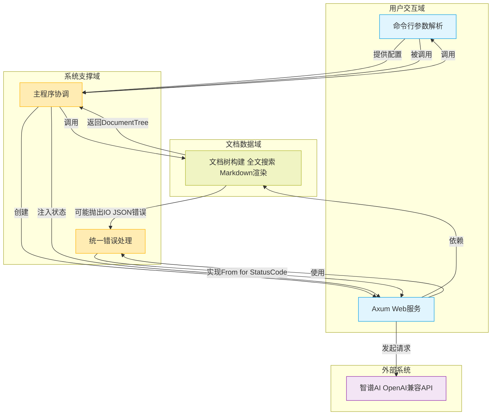
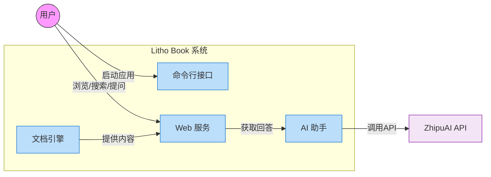
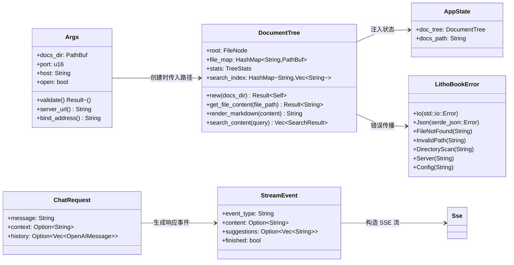
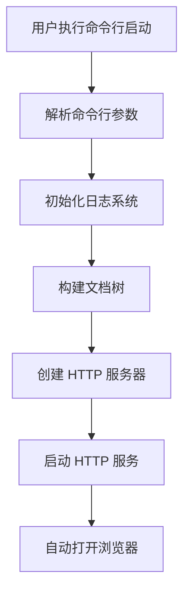
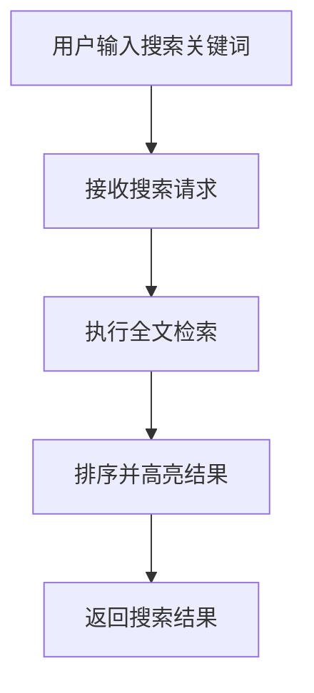
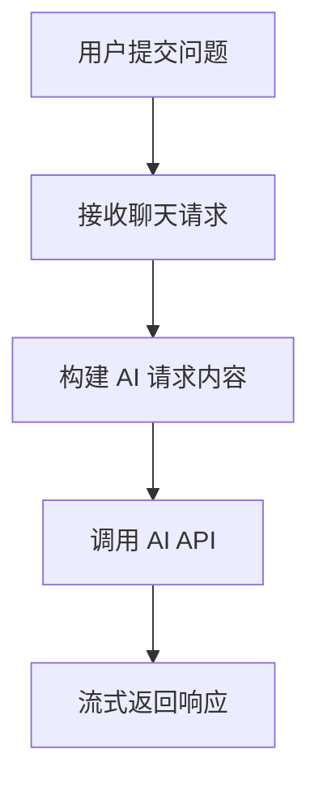
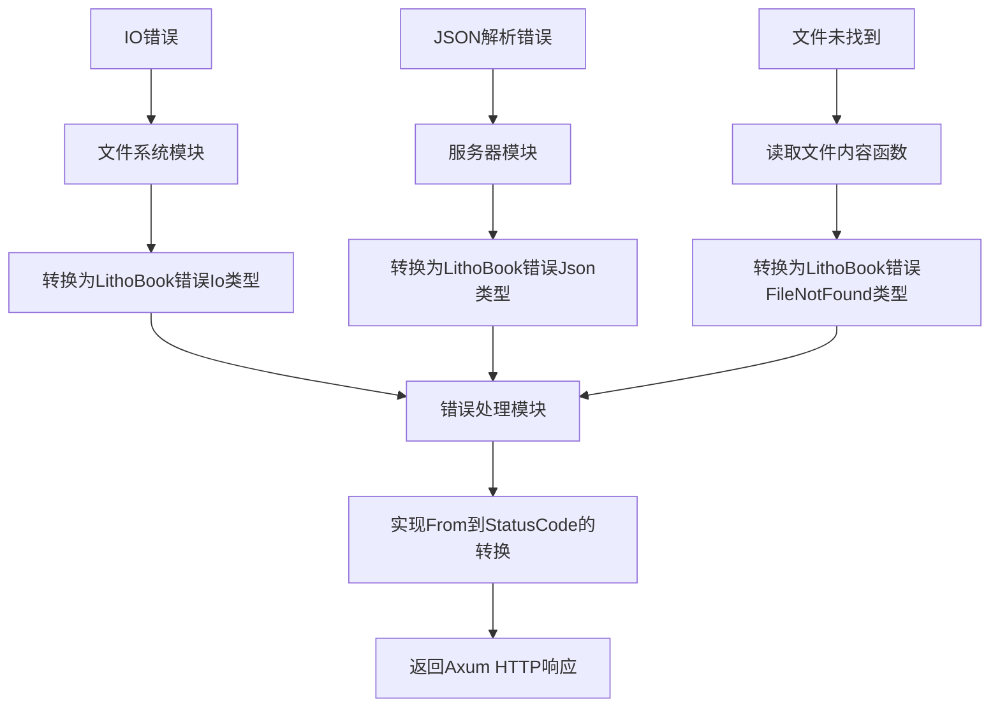
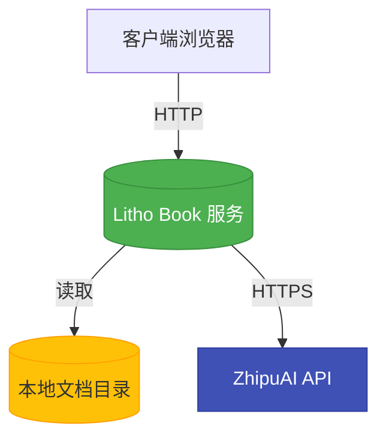

# 系统架构文档

## 1. 架构概览 (Architecture Overview)

### 架构设计理念
Litho Book 是一个面向本地知识管理的全栈应用，其核心设计遵循**职责分离原则**（Separation of Concerns）和**高内聚低耦合**的设计哲学。系统通过清晰的模块划分，将用户交互、数据处理与系统支撑能力解耦，确保各组件专注于单一职责。

该系统采用 **"命令行启动 + Web 服务"** 的混合架构模式，既保留了开发者熟悉的 CLI 配置方式，又提供了现代化的 Web 浏览体验。整体架构强调：
- **类型安全**：基于 Rust 的强类型系统，减少运行时错误
- **零成本抽象**：利用 Rust 的异步运行时 Tokio 实现高性能 I/O 操作
- **内存安全**：无需垃圾回收器即可防止空指针、缓冲区溢出等常见漏洞
- **可维护性**：模块化设计便于未来功能扩展与重构

### 核心架构模式
系统采用典型的**分层架构**（Layered Architecture），分为三个核心领域：
1. **用户交互域**：处理 CLI 参数解析与 HTTP 请求响应
2. **文档数据域**：负责文件扫描、内容索引与搜索逻辑
3. **系统支撑域**：提供日志、错误处理等基础设施能力

同时，在 Web 层采用了 **Axum 框架的函数式路由+状态注入**模式，通过 `AppState` 将共享资源（如 `DocumentTree`）安全地传递给所有请求处理器。

### 技术栈概述
| 类别 | 技术 | 说明 |
|------|------|------|
| **Web 框架** | Axum | 基于 Tokio 的高性能 Rust Web 框架，支持异步处理 |
| **异步运行时** | Tokio | 提供异步任务调度与 I/O 多路复用 |
| **CLI 解析** | Clap | 强大的命令行参数解析库，支持自动生成帮助信息 |
| **错误处理** | Anyhow + ThisError | 统一的应用级错误处理方案 |
| **日志系统** | Tracing + Subscriber | 结构化日志记录，支持不同级别输出 |
| **JSON 序列化** | Serde | 高性能的数据序列化/反序列化框架 |
| **HTTP 客户端** | Reqwest | 支持流式响应的异步 HTTP 客户端 |
| **Markdown 渲染** | Pulldown-Cmark | 安全高效的 Markdown 到 HTML 转换器 |
| **时间处理** | Chrono | 日期时间操作库，支持序列化 |



---

## 2. 系统上下文 (System Context)

### 系统定位与价值
Litho Book 是一个本地知识增强系统，旨在解决个人知识碎片化问题。它将分散在本地的 Markdown 文档转化为结构化、可搜索的知识库，并集成 AI 助手功能，显著提升知识工作者的信息检索效率与创作体验。

**核心业务价值**：
- ✅ **离线可用**：所有文档保留在本地，无需上传云端
- ✅ **快速访问**：一键启动 Web 服务，即时浏览文档目录
- ✅ **智能搜索**：支持全文关键词匹配与相关性排序
- ✅ **AI 辅助**：通过自然语言问答获取文档相关内容解释
- ✅ **轻量高效**：单二进制文件部署，无复杂依赖

### 用户角色与场景
| 角色 | 典型使用场景 |
|------|-------------|
| **开发者** | - 快速查阅技术文档/API 注释<br>- 在浏览器中结构化展示代码笔记<br>- 使用 AI 助手理解复杂架构设计 |
| **知识工作者** | - 整理读书笔记与研究资料<br>- 基于关键词快速定位历史记录<br>- 通过对话形式回顾知识点 |

### 外部系统交互
| 外部系统 | 交互方式 | 用途 |
|--------|---------|------|
| **智谱AI OpenAI兼容API** | HTTP/REST + SSE | 获取流式 AI 回答，用于文档问答功能 |

> ⚠️ **安全提醒**：当前 API 密钥硬编码在源码中（`b0c0afc3b5d0402db47e5132fc0fa882.6vyDm2pOv2NSy5z7`），存在泄露风险，建议改用环境变量注入。

### 系统边界定义
#### 包含组件
- 命令行参数解析 (`cli.rs`)
- 文件系统扫描与文档树构建 (`filesystem.rs`)
- 统一错误处理机制 (`error.rs`)
- Axum HTTP 服务端 (`server.rs`)
- 主程序入口协调 (`main.rs`)

#### 排除组件
- 前端 React/Vue 界面（HTML 模板为静态嵌入）
- Markdown 文件生成工具
- 文档版本控制（如 Git）
- 用户认证与权限系统
- 云存储同步服务
- AI 模型训练或微调



---

## 3. 容器视图 (Container View)

### 领域模块划分
Litho Book 的容器层级由四个主要组件构成：

| 容器 | 技术实现 | 职责 |
|------|----------|------|
| **CLI 接口** | `cli.rs` + Clap | 解析命令行参数，验证输入合法性 |
| **Web 服务** | `server.rs` + Axum | 提供 RESTful API 与 SSE 流式响应 |
| **文档引擎** | `filesystem.rs` | 扫描目录、构建树形结构、执行搜索 |
| **主程序** | `main.rs` | 协调各模块，控制应用生命周期 |

### 领域模块架构
#### 用户交互域
- **命令行接口**
  - 解析 `--path`, `--port`, `--host`, `--open`, `--verbose`
  - 验证文档路径存在性及权限（低端口需管理员权限）
  - 提供跨平台浏览器自动打开支持
- **Web 服务接口**
  - 实现以下关键路由：
    - `GET /` → 返回首页 HTML
    - `GET /api/tree` → 获取文档树结构
    - `GET /api/file?file=xxx.md` → 获取文件内容与 HTML 渲染结果
    - `GET /api/search?q=关键词` → 执行全文搜索
    - `GET /api/stats` → 获取文档统计信息
    - `POST /api/chat` → 流式 AI 对话（SSE）

#### 文档数据域
- **文档树构建器**
  - 递归扫描指定目录，构建内存中的 `DocumentTree`
  - 忽略隐藏文件（`.` 开头）和非 `.md` 文件
  - 维护 `FileNode` 树形结构，包含路径、大小、修改时间等元数据
  - 建立 `file_map` 映射（相对路径 → 实际路径）用于快速查找
- **全文搜索引擎**
  - 在 `search_index` 中缓存每个文件的所有行文本
  - 支持关键词匹配，结合多种因素计算相关性评分：
    - 标题权重（H1/H2 加权 ×3）
    - 精确词匹配（×2）
    - 行首匹配（×1.5）
    - 文件名匹配（+2 分）
  - 返回带 `<mark>` 高亮标签的结果片段与上下文
- **Markdown 渲染器**
  - 使用 `pulldown-cmark` 将 Markdown 转换为 HTML
  - 支持表格、脚注、删除线、任务列表等扩展语法

#### 系统支撑域
- **错误处理中枢 (`error.rs`)**
  - 定义统一的 `LithoBookError` 枚举类型
  - 自动映射至 HTTP 状态码（如 `FileNotFound → 404`）
  - 支持从 `std::io::Error`, `serde_json::Error` 等标准错误自动转换
- **程序启动协调 (`main.rs`)**
  - 主入口函数，负责整个生命周期调度
  - 执行流程：
    1. 解析 CLI 参数
    2. 初始化日志系统（Tracing）
    3. 打印启动横幅
    4. 验证参数合法性
    5. 构建 `DocumentTree`
    6. 创建 Axum 路由器并绑定状态
    7. 启动 TCP 监听
    8. 可选：自动打开浏览器

### 存储设计
本系统采用**内存驻留型存储架构**，不依赖外部数据库：

| 数据类型 | 存储位置 | 生命周期 |
|---------|--------|----------|
| 文档树结构 | 内存 (`DocumentTree`) | 应用运行期间 |
| 文件内容索引 | 内存 (`HashMap<String, Vec<String>>`) | 应用运行期间 |
| 文件路径映射 | 内存 (`HashMap<String, PathBuf>`) | 应用运行期间 |
| 静态模板 | 编译时嵌入二进制 | 编译期固化 |

> 💡 **优势**：避免磁盘 I/O 开销，提升搜索性能
> 🔧 **改进建议**：增加热重载功能，在文件变更时重建索引

### 领域模块间通信
| 依赖方向 | 类型 | 描述 |
|--------|------|------|
| `main.rs` → `cli.rs` | 服务调用 | 主程序调用 CLI 模块解析命令行参数 |
| `main.rs` → `filesystem.rs` | 数据依赖 | 构建文档树并注入 AppState |
| `main.rs` → `server.rs` | 服务调用 | 创建路由器并启动服务 |
| `server.rs` → `filesystem.rs` | 数据依赖 | 访问 DocumentTree 进行搜索、读取文件 |
| `server.rs` → `error.rs` | 服务调用 | 错误自动转换为 HTTP 状态码 |
| `filesystem.rs` → `error.rs` | 数据依赖 | IO/序列化错误包装为 LithoBookError |
| `server.rs` → `reqwest` → `ZhipuAI` | 外部服务调用 | 流式调用 AI 接口获取回答 |

---

## 4. 组件视图 (Component View)

### 核心功能组件
#### `DocumentTree` 组件
```rust
pub struct DocumentTree {
    pub root: FileNode,
    pub file_map: HashMap<String, PathBuf>,
    pub stats: TreeStats,
    pub search_index: HashMap<String, Vec<String>>,
}
```
- **职责**：内存中表示整个文档目录的树形结构
- **关键方法**：
  - `new(docs_dir)`：递归扫描目录构建树
  - `get_file_content()`：根据路径读取文件内容
  - `render_markdown()`：将 Markdown 转为 HTML
  - `search_content(query)`：执行全文搜索并排序

#### `AppState` 组件
```rust
pub struct AppState {
    pub doc_tree: DocumentTree,
    pub docs_path: String,
}
```
- **职责**：作为 Axum 应用的共享状态，贯穿所有请求处理器
- **注入方式**：通过 `.with_state(state)` 注入到 Router

### 技术支撑组件
#### `LithoBookError` 组件
```rust
#[derive(Error, Debug)]
pub enum LithoBookError {
    Io(#[from] std::io::Error),
    Json(#[from] serde_json::Error),
    FileNotFound { path: String },
    InvalidPath { path: String },
    DirectoryScan(String),
    Server(String),
    Config(String),
}
```
- **职责**：统一应用级错误处理
- **特性**：实现 `From<LithoBookError> for StatusCode`，自动映射为 HTTP 状态码

#### `async-stream` 组件
用于实现 `/api/chat` 的流式响应：
```rust
let stream = async_stream::stream! {
    yield Ok(Event::default().event("start").data(...));
    while let Some(chunk) = response_stream.recv().await {
        yield Ok(Event::default().event("content").data(...));
    }
    yield Ok(Event::default().event("finish").data(...));
};
Sse::new(stream)
```

### 组件职责划分
| 组件 | 职责 | 依赖 |
|------|------|-------|
| `Args` | 命令行参数接收与验证 | Clap |
| `DocumentTree` | 文档结构建模与搜索 | std::fs, pulldown-cmark |
| `AppState` | Web 服务状态共享 | DocumentTree |
| `LithoBookError` | 错误统一抽象 | thiserror, axum::http::StatusCode |
| `OpenAIRequest` | AI API 请求封装 | serde |
| `StreamEvent` | SSE 事件格式定义 | serde |

### 组件交互关系


---

## 5. 关键流程 (Key Processes)

### 核心功能流程

#### 项目启动与服务初始化流程


**详细步骤**：
1. 用户执行 `litho-book --path ./docs --port 3000`
2. `cli.rs` 解析参数并验证路径合法性
3. `main.rs` 初始化 Tracing 日志系统
4. 调用 `filesystem::DocumentTree::new()` 扫描目录
5. 构建完成后创建 `AppState` 并绑定到 Axum 路由器
6. 启动 TCP 监听器，开始接受连接
7. 若 `--open` 参数存在，则调用系统命令打开浏览器

#### 文档全文搜索流程


**技术路径**：
1. 前端发送 `GET /api/search?q=性能优化`
2. `search_handler` 提取查询参数
3. 调用 `doc_tree.search_content("性能优化")`
4. 遍历 `search_index`，逐行检查是否包含关键词
5. 计算相关性评分（标题加权、精确匹配等）
6. 对结果按分数降序排列，截断至最多 50 条
7. 添加 `<mark>` 高亮标签后返回 JSON

#### AI 助手流式对话流程


**执行细节**：
1. 前端 POST `{message: "如何使用？", context: "..."}`
2. `chat_stream_handler` 启动异步流
3. 构造包含系统提示、上下文、历史会话的 OpenAI 请求
4. 使用 `reqwest` 发起流式 POST 请求到智谱AI
5. 在后台任务中解析 SSE 字节流，提取 `delta.content`
6. 通过 `tokio::sync::mpsc::channel` 将内容推送到前端
7. 最终生成推荐追问问题并发送完成事件

### 异常处理机制
系统建立了完善的错误处理链条：



**错误映射规则**：
| 应用错误 | HTTP 状态码 |
|---------|------------|
| `FileNotFound` | 404 Not Found |
| `InvalidPath` | 400 Bad Request |
| `Io`, `Json`, `DirectoryScan` | 500 Internal Server Error |
| `Config` | 400 Bad Request |

---

## 6. 技术实现 (Technical Implementation)

### 核心模块实现

#### 文档树构建算法
```rust
fn build_tree(
    current_path: &Path,
    base_path: &Path,
    file_map: &mut HashMap<String, PathBuf>,
    search_index: &mut HashMap<String, Vec<String>>,
    stats: &mut TreeStats,
) -> anyhow::Result<FileNode>
```
- **递归策略**：深度优先遍历目录结构
- **排序规则**：目录优先于文件，同类型按名称升序（忽略大小写）
- **过滤条件**：
  - 跳过以 `.` 开头的隐藏文件
  - 仅索引 `.md` 后缀的文件
- **性能优化**：预分配向量容量，减少内存重新分配

#### 全文搜索算法
```rust
pub fn search_content(&self, query: &str) -> Vec<SearchResult>
```
**评分模型**：
```text
relevance_score = Σ(line_score)
where:
  line_score = base_score × modifiers

modifiers:
  - 标题行 (以 # 开头): ×3
  - 精确单词匹配: ×2
  - 行首匹配: ×1.5
  - 文件名匹配: +2 分
```

**高亮实现**：
```rust
fn highlight_matches(&self, content: &str, query: &str) -> String {
    // 不区分大小写的子串替换
    let start = content_lower.find(&query_lower)?;
    format!(\"{}<mark>{}</mark>{}\", before, matched, after)
}
```

#### 流式 AI 对话实现
采用 `async-stream` + `tokio::sync::mpsc` 模式：
```rust
let (tx, rx) = tokio::sync::mpsc::channel(100);
tokio::spawn(async move {
    let mut stream = response.bytes_stream();
    while let Some(chunk) = stream.next().await {
        if let Ok(data) = parse_sse_chunk(&chunk) {
            tx.send(Ok(content)).await.ok();
        }
    }
});
Sse::new(async_stream::stream! {
    while let Some(result) = rx.recv().await {
        yield Ok(Event::default().data(result.unwrap()));
    }
})
```

### 数据结构设计
#### `FileNode` —— 文件树节点
```rust
pub struct FileNode {
    pub name: String,
    pub path: String,
    pub is_file: bool,
    pub children: Vec<FileNode>,
    #[serde(skip_serializing_if = "Option::is_none")]
    pub size: Option<u64>,
    #[serde(skip_serializing_if = "Option::is_none")]
    pub modified: Option<String>,
}
```
- **序列化优化**：文件夹不序列化 `size` 和 `modified`
- **路径标准化**：Windows 下 `\` 替换为 `/`

#### `SearchResult` —— 搜索结果
```rust
pub struct SearchResult {
    pub file_path: String,
    pub file_name: String,
    pub title: Option<String>, // 从第一个 # 标题提取
    pub matches: Vec<SearchMatch>,
    pub relevance_score: f32,
}
```

### 性能优化策略
| 优化点 | 实现方式 | 效果 |
|-------|---------|------|
| **内存索引** | 启动时加载所有 `.md` 文件内容 | 避免重复磁盘读取 |
| **搜索加速** | 预分割每行文本到 `search_index` | 减少字符串扫描开销 |
| **并发处理** | Tokio 异步运行时 | 高并发下保持低延迟 |
| **流式传输** | SSE 分块返回 AI 响应 | 用户无需等待完整回复 |
| **日志控制** | `--verbose` 控制日志级别 | 生产环境减少 I/O 影响 |

---

## 7. 部署架构 (Deployment Architecture)

### 运行环境要求
| 项目 | 要求 |
|------|------|
| **操作系统** | Windows, macOS, Linux |
| **Rust 版本** | 2024 edition |
| **最低权限** | 读取文档目录权限；若绑定 <1024 端口需管理员权限 |
| **网络** | 本地回环接口（默认 `127.0.0.1`） |
| **依赖** | 无外部依赖（静态编译） |

### 部署拓扑结构


**典型部署方式**：
```bash
# 本地开发模式
litho-book --path ./docs --port 3000 --open

# 服务器模式（允许远程访问）
litho-book --path /var/docs --host 0.0.0.0 --port 8080
```

### 扩展性设计
#### 当前扩展点
- ✅ **模块拆分**：可通过 `mod` 关键字将功能拆分为独立 crate
- ✅ **配置扩展**：现有 CLI 参数体系易于添加新选项
- ✅ **API 扩展**：Axum 路由器支持动态注册新路由
- ✅ **AI 适配**：AI 调用封装良好，可替换为其他 LLM 服务

#### 改进建议
1. **配置文件支持**
   ```toml
   # litho-book.toml
   docs_dir = "./docs"
   port = 3000
   host = "127.0.0.1"
   open_browser = true
   ```
2. **环境变量注入**
   ```bash
   export ZHIPUAI_API_KEY=your_key_here
   ```
3. **缓存机制**
   - LRU Cache 缓存频繁访问的渲染结果
   - Redis 缓存 AI 对话历史
4. **热重载**
   - 使用 `notify` 库监听文件变化
   - 动态更新 `DocumentTree` 而无需重启

### 监控与运维
#### 内建监控能力
- **健康检查**：`GET /health` 返回服务状态与版本
- **统计接口**：`GET /api/stats` 提供文档数量、总大小等指标
- **结构化日志**：Tracing 输出可被 ELK/Sentry 等系统采集

#### 运维建议
| 场景 | 建议 |
|------|------|
| **生产部署** | 使用 systemd/pm2 管理进程生命周期 |
| **日志分析** | 重定向日志到文件或集中式日志系统 |
| **安全性** | 避免绑定 `0.0.0.0` 至公网，或添加身份验证中间件 |
| **备份策略** | 定期备份原始 Markdown 文档目录 |

> 📌 **最佳实践**：将 `litho-book` 作为开发文档的标准查看工具集成到 CI/CD 流程中，每次构建后自动生成并预览文档站点。
