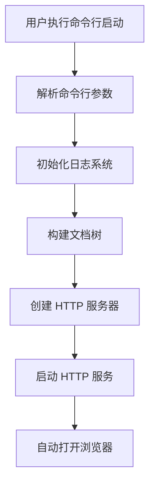
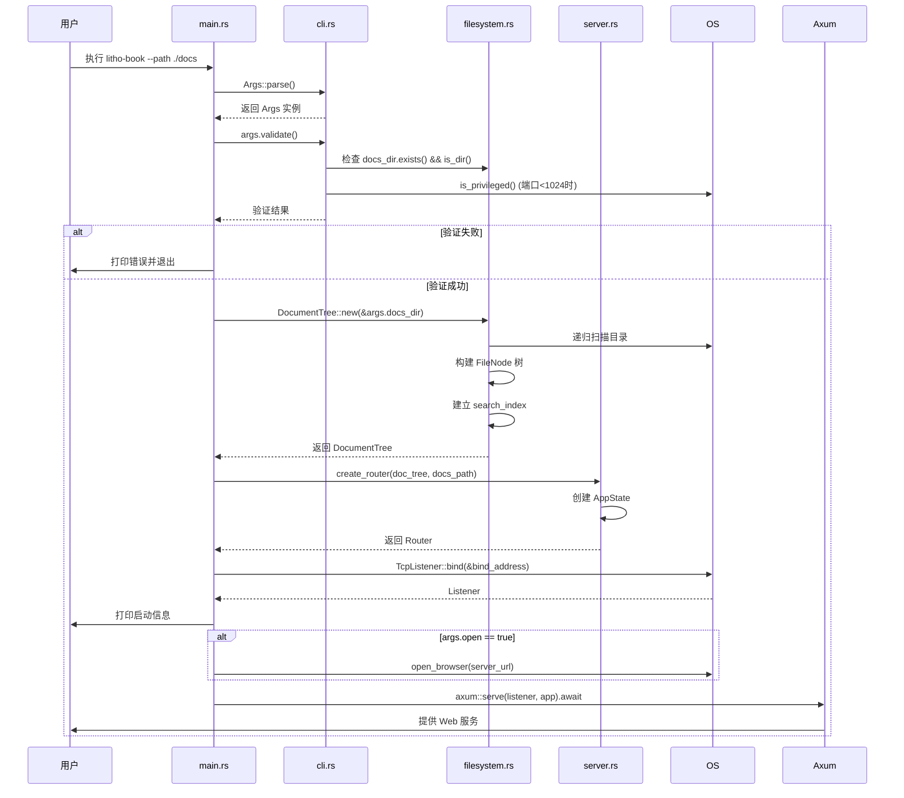
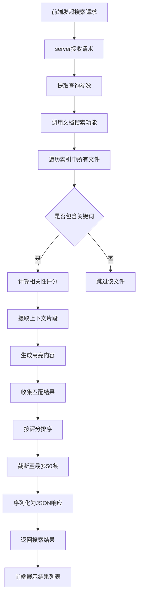
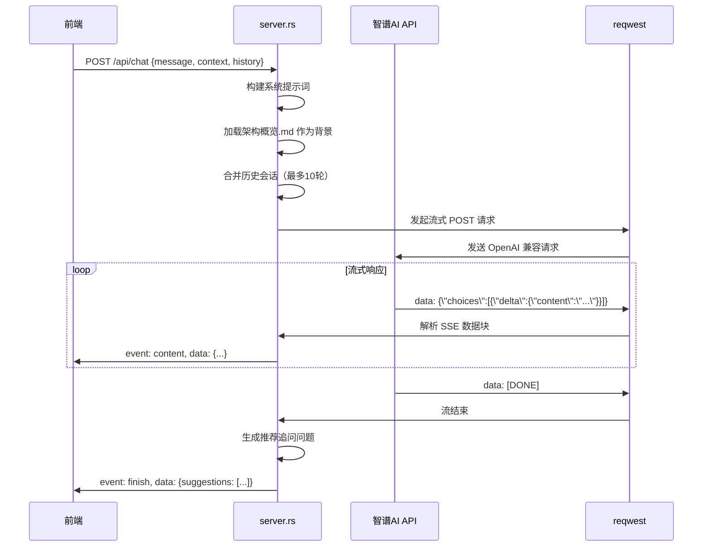
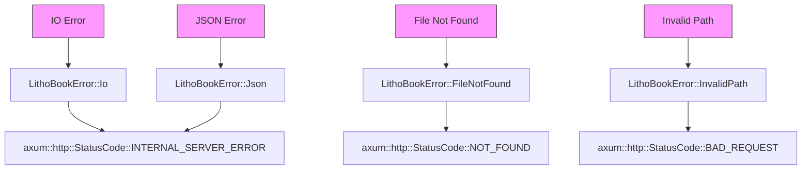
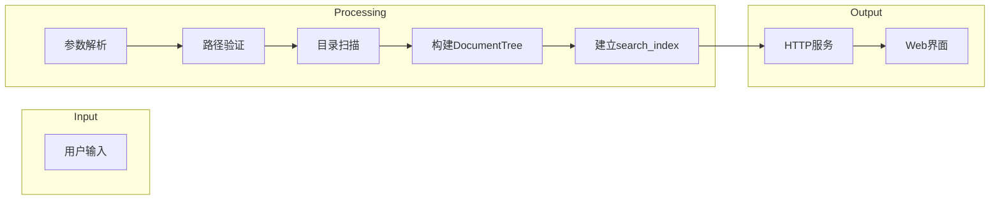

# 核心工作流程

## 1. 工作流程概览 (Workflow Overview)

Litho Book 是一个基于 Rust 的本地文档管理与 AI 增强型知识探索系统，其核心工作流程围绕**文档结构化、服务启动、内容检索与智能交互**四大支柱构建。系统采用命令行驱动 + Web 服务的架构模式，通过清晰的模块划分和职责分离，实现了从用户输入到服务响应的完整生命周期管理。

### 系统主干工作流程
系统的主干工作流程始于用户执行命令行指令，经过参数解析、环境初始化、文档树构建、HTTP 服务绑定，最终完成服务启动并可选地自动打开浏览器。这一流程是用户首次使用系统的必经路径，构成了整个应用的启动中枢。



### 核心执行路径
- **启动路径**：`main.rs` → `cli.rs` → `filesystem.rs` → `server.rs`
- **搜索路径**：`Web 请求` → `server.rs` → `filesystem.rs::search_content()` → `返回结果`
- **AI 对话路径**：`Web 请求` → `server.rs::chat_stream_handler()` → `外部 AI API` → `SSE 流式返回`

### 关键流程节点
| 节点 | 责任模块 | 输入 | 输出 | 状态 |
|------|--------|------|------|------|
| 参数解析 | cli.rs | 命令行参数 | Args 结构体 | 验证中 |
| 文档扫描 | filesystem.rs | 文档目录路径 | DocumentTree 内存结构 | 构建中 |
| 服务绑定 | main.rs/server.rs | AppState, TCP 地址 | TcpListener | 绑定成功/失败 |
| 搜索请求处理 | server.rs/filesystem.rs | 查询关键词 | SearchResult JSON | 处理中/完成 |
| AI 流式响应 | server.rs | 用户问题, 上下文 | SSE Event Stream | 流式传输中 |

### 流程协调机制
系统通过 `AppState` 结构在 Axum Web 服务中共享 `DocumentTree` 和配置信息，实现多请求间的高效数据访问。`main.rs` 作为协调者，负责串联 CLI 解析、文件系统扫描和服务器启动三大模块，确保各组件按正确顺序初始化并协同工作。

---

## 2. 主要工作流程 (Main Workflows)

### 项目启动与服务初始化流程

这是系统最核心的初始化流程，决定了应用能否成功启动并提供服务。

#### 执行顺序与依赖关系


#### 输入输出数据流转
- **输入**：
  - `--path`: 文档目录路径（PathBuf）
  - `--port`: 服务端口（u16，默认3000）
  - `--host`: 绑定主机（String，默认127.0.0.1）
  - `--open`: 是否自动打开浏览器（bool）
  - `--verbose`: 是否启用详细日志（bool）

- **输出**：
  - 控制台打印启动横幅和连接信息
  - 在内存中构建完整的 `DocumentTree` 结构
  - 启动 HTTP 服务监听指定端口
  - 可选地自动打开默认浏览器访问服务地址

### 文档全文搜索流程

该流程支持用户在大量 Markdown 文档中快速定位相关内容，是知识工作者的核心使用场景。

#### 技术流程说明


#### 相关性评分算法
搜索结果的相关性评分基于以下因素加权计算：
- **基础匹配**：+1.0 分
- **标题匹配**（以 `#` 开头）：×3.0 倍
- **精确词匹配**：×2.0 倍
- **行首匹配**：×1.5 倍
- **文件名匹配**：+2.0 分奖励

### AI助手流式对话流程

该流程实现了自然语言交互体验，允许用户通过提问方式获取文档相关内容的摘要和解释。

#### 执行流程详解


#### 数据传递细节
- **请求构建**：
  ```rust
  let messages = vec![
      system_message("你是一个专业的文档助手..."),
      ...history,
      user_message(&request.message)
  ];
  ```
- **流式处理**：使用 `tokio::sync::mpsc::channel` 在后台任务中处理字节流，并将解析后的文本块发送给前端。
- **错误恢复**：若 API 调用失败，返回预设的友好错误消息，保证用户体验不中断。

---

## 3. 流程协调与控制 (Flow Coordination)

### 多模块协调机制

系统通过明确的模块边界和接口定义实现松耦合协作：

| 协调方向 | 依赖类型 | 具体实现 |
|---------|--------|--------|
| CLI → Filesystem | 数据依赖 | `Args` 结构体传递 `docs_dir` 路径 |
| Filesystem → Server | 数据共享 | `DocumentTree` 通过 `AppState` 注入路由处理器 |
| Server → External API | 服务调用 | `reqwest` 客户端发起异步 HTTP 请求 |
| All → Error | 错误映射 | `LithoBookError` 自动转换为 `StatusCode` |

### 状态管理和同步

- **AppState 共享状态**：
  ```rust
  #[derive(Clone)]
  pub struct AppState {
      pub doc_tree: DocumentTree,
      pub docs_path: String,
  }
  ```
  使用 `Clone` 特性允许多个处理器安全共享只读状态，避免了全局变量和锁的竞争。

- **并发控制**：
  - 所有读操作（浏览、搜索）均为无锁并发访问
  - 文档树在启动时一次性构建，运行时不可变
  - AI 流式响应使用独立的 `mpsc` 通道进行异步通信

### 数据传递和共享

| 数据项 | 生产者 | 消费者 | 传递方式 |
|-------|--------|--------|--------|
| DocumentTree | main.rs | server.rs | 函数参数传递 |
| Query Parameters | Axum Extractor | Handler Functions | 类型安全解包 |
| Search Results | filesystem.rs | server.rs | 内存对象直接返回 |
| SSE Events | Background Task | Sse Stream | 异步通道 (mpsc) |

### 执行控制和调度

- **启动调度**：`main.rs` 严格按顺序执行初始化步骤，任何一步失败即终止进程。
- **请求调度**：Axum 框架自动处理高并发请求，每个请求在独立的任务中执行。
- **超时控制**：未显式设置超时，依赖底层 TCP 和 HTTP 客户端默认行为。
- **资源释放**：Rust 所有权机制确保所有资源在作用域结束时自动清理。

---

## 4. 异常处理与恢复 (Exception Handling)

### 错误检测和处理

系统采用分层错误处理策略：



关键错误处理代码：
```rust
impl From<LithoBookError> for axum::http::StatusCode {
    fn from(err: LithoBookError) -> Self {
        match err {
            LithoBookError::FileNotFound { .. } => StatusCode::NOT_FOUND,
            LithoBookError::InvalidPath { .. } => StatusCode::BAD_REQUEST,
            _ => StatusCode::INTERNAL_SERVER_ERROR,
        }
    }
}
```

### 异常恢复机制

- **启动阶段**：
  - 参数验证失败：立即退出并打印错误原因
  - 目录扫描失败：记录错误日志，跳过异常文件继续构建
  - 端口绑定失败：终止程序，提示用户更换端口或检查权限

- **运行时阶段**：
  - 文件读取失败：返回 `404 Not Found`
  - 搜索异常：返回空结果集而非错误
  - AI API 调用失败：返回预设的降级回复

### 容错策略设计

| 场景 | 容错措施 |
|------|----------|
| 无 Markdown 文件 | 扫描完成后发出警告，仍启动服务 |
| 隐藏文件存在 | 自动忽略 `.git`, `.DS_Store` 等文件 |
| 权限不足访问低编号端口 | 提示用户使用 ≥1024 的端口 |
| 浏览器无法自动打开 | 显示手动访问链接 |
| AI 流中断 | 前端显示部分响应内容 |

### 失败重试和降级

- **当前未实现自动重试**：AI API 调用失败后不会自动重试。
- **降级方案**：
  - 搜索功能始终可用，即使 AI 服务不可达
  - 基础文档浏览不依赖外部服务
  - 错误信息对用户友好，避免暴露技术细节

---

## 5. 关键流程实现 (Key Process Implementation)

### 核心算法流程

#### 文档树构建算法
```rust
fn build_tree(
    current_path: &Path,
    base_path: &Path,
    file_map: &mut HashMap<String, PathBuf>,
    search_index: &mut HashMap<String, Vec<String>>,
    stats: &mut TreeStats,
) -> anyhow::Result<FileNode>
```
**执行步骤**：
1. 获取文件/目录名称和相对路径
2. 若为文件且扩展名为 `.md`：
   - 记录元数据（大小、修改时间）
   - 添加到 `file_map` 索引
   - 读取全文并按行存入 `search_index`
   - 更新统计信息
3. 若为目录：
   - 递归扫描子项
   - 按“目录优先、字母排序”规则整理子节点
   - 构建 `children` 列表
4. 返回 `FileNode` 实例

#### 全文搜索算法
```rust
pub fn search_content(&self, query: &str) -> Vec<SearchResult>
```
**执行管道**：
1. 将查询词转为小写
2. 遍历 `search_index` 中每个文件的所有行
3. 对每行执行：
   - 小写匹配关键词
   - 计算相关性评分（标题、精确匹配、位置加权）
   - 提取上下文（前后各一行）
   - 生成高亮 HTML 片段
4. 收集所有匹配结果
5. 按评分降序排序
6. 截断至最多 50 条
7. 返回结果列表

### 数据处理管道



### 业务规则执行

| 规则 | 实现位置 | 逻辑描述 |
|------|--------|--------|
| 仅索引 .md 文件 | filesystem.rs | `path.extension() == Some(\"md\")` |
| 忽略隐藏文件 | filesystem.rs | `name.starts_with('.')` 则跳过 |
| 目录优先排序 | filesystem.rs | `sort_by` 中目录排前面 |
| 标题加权搜索 | filesystem.rs | `line.trim().starts_with('#')` ×3.0 |
| 最大返回50条 | filesystem.rs | `results.truncate(50)` |
| 限制历史会话 | server.rs | `max_history = 10` |

### 技术实现细节

#### 性能优化策略
- **内存缓存**：文档树和搜索索引在内存中构建，避免重复 I/O
- **惰性加载**：仅当请求时才读取具体文件内容
- **流式传输**：AI 响应以 SSE 形式逐块返回，减少延迟
- **并发处理**：Tokio 异步运行时支持高并发请求

#### 安全考虑
- **路径遍历防护**：使用 `strip_prefix(base_path)` 确保文件访问在限定目录内
- **输入验证**：CLI 参数在启动时全面验证
- **错误脱敏**：内部错误不会直接暴露给前端

#### 可维护性设计
- **模块化架构**：各 `.rs` 文件职责单一，易于理解和测试
- **日志追踪**：使用 `tracing` 宏记录关键执行点
- **配置集中管理**：所有 CLI 参数在 `Args` 结构体中定义
- **外部依赖隔离**：AI API 调用封装在独立函数中，便于替换

本系统通过严谨的工作流程设计和高质量的代码实现，为用户提供了一个稳定、高效、智能的本地知识管理解决方案。