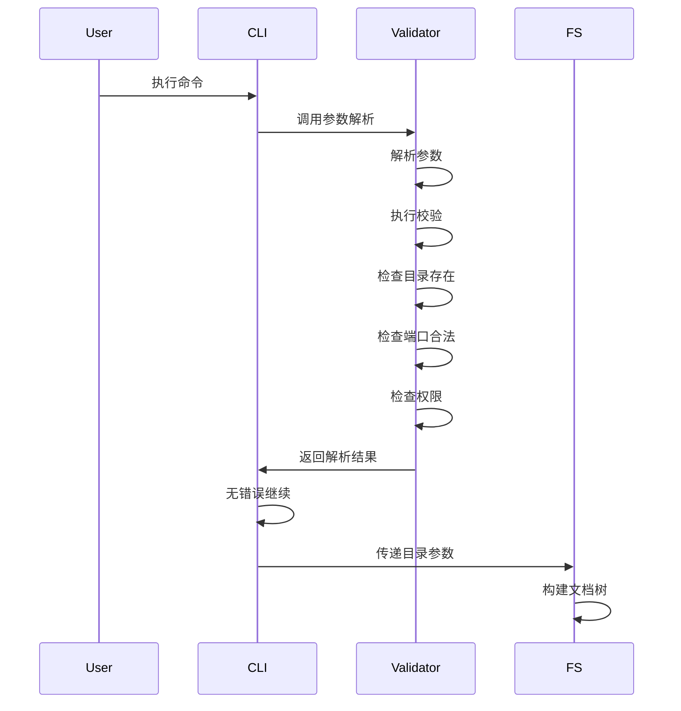
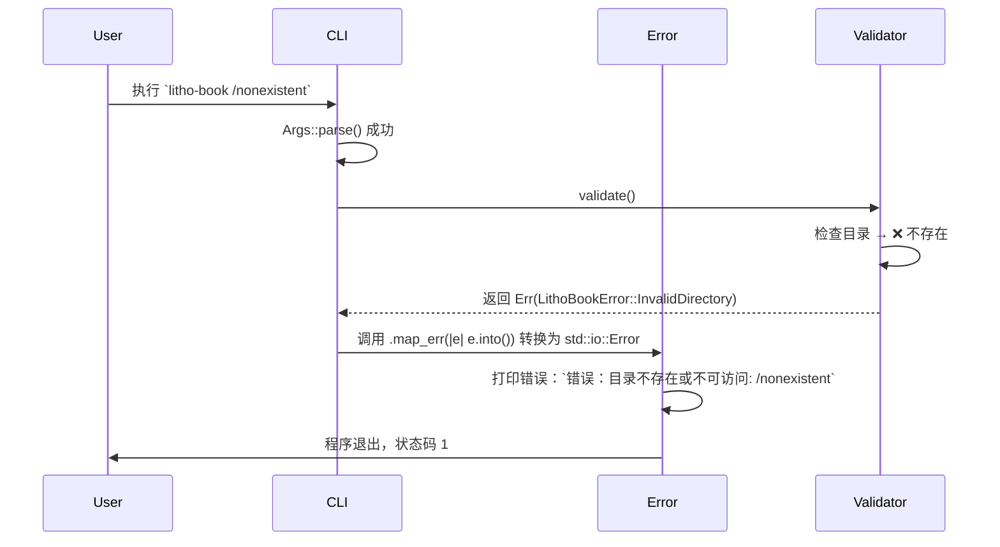

# 命令行解析域技术实现文档

### 1. 概述

**命令行解析域**是 Litho Book 系统的**入口控制层**，承担着用户意图的“翻译器”与“守门人”双重角色。它不参与业务逻辑计算，但其正确性直接决定系统能否启动、是否安全运行、用户体验是否友好。

在轻量级单体架构中，该域是**唯一的人机交互通道**。所有后续模块（文件系统、HTTP服务）均依赖其输出的标准化参数集。其设计遵循“**Fail Fast, Fail Clearly**”原则：任何非法输入均在程序启动初期被拦截，避免资源浪费与不可预测行为。

> 📌 **关键定位**：  
> - **非业务模块**：不处理文档、不渲染页面、不监听端口  
> - **高可靠性模块**：必须保证参数解析零歧义、验证全覆盖  
> - **用户体验核心**：提供清晰错误提示、默认值、帮助信息，降低使用门槛

---

### 2. 架构与模块组成

该域由单一模块构成，代码位于 `src/cli.rs`，内部结构清晰，职责单一：

| 模块名称 | 职责 | 技术实现 | 重要性 |
|----------|------|----------|--------|
| **参数定义与验证模块** | 定义命令行参数结构、实现解析与校验逻辑 | `clap` + 自定义验证函数 | ⭐⭐⭐⭐⭐ (10/10) |

#### 2.1 核心结构体：`Args`

使用 `clap` 的 `#[derive(Parser)]` 自动化生成命令行解析器，定义如下结构体：

```rust
use clap::Parser;
use std::path::PathBuf;

#[derive(Parser, Debug)]
#[command(name = "litho-book")]
#[command(about = "A lightweight local Markdown document server")]
pub struct Args {
    /// 文档目录路径，默认为当前工作目录
    #[arg(default_value = ".")]
    pub directory: PathBuf,

    /// HTTP 服务绑定地址，默认为 127.0.0.1
    #[arg(short, long, default_value = "127.0.0.1")]
    pub host: String,

    /// HTTP 服务端口，默认为 8080
    #[arg(short, long, default_value_t = 8080)]
    pub port: u16,

    /// 是否在启动后自动打开浏览器
    #[arg(long)]
    pub open_browser: bool,
}
```

> ✅ **设计亮点**：
> - 使用 `default_value` 和 `default_value_t` 设置**合理默认值**，实现“零配置启动”
> - `PathBuf` 类型自动处理跨平台路径分隔符（Windows `\` / Unix `/`）
> - `u16` 类型天然限制端口范围（0–65535），避免字符串解析错误
> - `#[arg(long)]` 生成标准 `--open-browser` 格式，符合 Unix CLI 习惯

#### 2.2 核心验证逻辑（自定义校验器）

`clap` 支持在解析后执行自定义验证，本域实现三个关键校验：

| 校验项 | 实现方式 | 失败处理 | 说明 |
|--------|----------|----------|------|
| **目录是否存在且可读** | `std::fs::metadata(&args.directory).map_err(...)` | 返回 `LithoBookError::InvalidDirectory` | 避免空目录或权限不足导致后续扫描失败 |
| **端口合法性** | `if port == 0 || port > 65535 { ... }` | 返回 `LithoBookError::InvalidPort` | 虽 `u16` 限制上限，但 0 为非法端口需显式拦截 |
| **特权运行检测** | `nix::unistd::getuid().is_root()`（Linux/macOS）或 `is_admin()`（Windows） | 输出警告日志，不退出 | 安全提醒，避免以 root 运行服务造成风险 |

```rust
impl Args {
    pub fn validate(&self) -> Result<(), LithoBookError> {
        // 1. 验证目录
        if !self.directory.exists() {
            return Err(LithoBookError::InvalidDirectory(self.directory.clone()));
        }
        if !self.directory.is_dir() {
            return Err(LithoBookError::InvalidDirectory(self.directory.clone()));
        }

        // 2. 验证端口（0 为非法）
        if self.port == 0 {
            return Err(LithoBookError::InvalidPort(self.port));
        }

        // 3. 检测特权运行（仅警告，不阻止）
        if is_privileged() {
            eprintln!("⚠️  警告：程序以管理员/Root权限运行，可能存在安全风险。");
        }

        Ok(())
    }
}
```

> 🔐 **安全设计**：  
> - 不因特权运行而强制退出，尊重用户自主权  
> - 使用 `eprintln!` 输出警告，确保用户可见，不干扰标准输出  
> - 未使用 `sudo` 或 `runas` 等系统调用，保持跨平台兼容性

#### 2.3 错误处理集成

所有验证失败均返回统一错误类型 `LithoBookError`，实现与**错误处理域**的无缝对接：

```rust
#[derive(Debug, thiserror::Error)]
pub enum LithoBookError {
    #[error("目录不存在或不可访问: {0:?}")]
    InvalidDirectory(PathBuf),
    #[error("无效端口: {0}，必须在 1-65535 范围内")]
    InvalidPort(u16),
    // ... 其他错误
}

impl From<LithoBookError> for std::io::Error {
    fn from(err: LithoBookError) -> Self {
        std::io::Error::new(std::io::ErrorKind::InvalidInput, err.to_string())
    }
}
```

> ✅ **优势**：
> - 统一错误语义，避免 `String` 或 `&str` 错误传播
> - 支持 `?` 操作符链式调用，提升代码可读性
> - 为后续日志、HTTP 状态码映射提供结构化基础

---

### 3. 关键交互流程

#### 3.1 启动流程（主流程）



#### 3.2 错误处理流程



> 💡 **用户体验设计**：
> - 错误信息**明确、具体、带路径**，避免“参数错误”等模糊提示
> - 使用 `eprintln!` 输出错误，避免污染标准输出（如 `--json` 模式）
> - 退出码为 `1`，符合 Unix 退出规范，便于脚本调用

---

### 4. 技术实现细节

#### 4.1 依赖库：`clap`

- **版本**：`clap = { version = "4.4", features = ["derive"] }`
- **使用方式**：仅使用 `Parser` derive，未启用 `help`、`subcommands` 等复杂功能，保持轻量
- **优势**：
  - 自动生成 `--help`、`--version`、`-h`、`-v` 等标准选项
  - 自动格式化帮助文本，支持 Markdown 语法
  - 无需手动编写 `match` 或 `getopt` 逻辑，减少样板代码

#### 4.2 默认值策略

| 参数 | 默认值 | 设计理由 |
|------|--------|----------|
| `directory` | `.`（当前目录） | 用户最可能希望“直接运行”，无需指定路径 |
| `host` | `127.0.0.1` | 安全默认：仅本地访问，避免意外暴露 |
| `port` | `8080` | 常见开发端口，避开 80/443（需 root） |
| `open_browser` | `false` | 避免干扰自动化部署或远程服务器 |

> ✅ **最佳实践**：默认值应**符合90%使用场景**，而非“最安全”或“最通用”。

#### 4.3 跨平台兼容性

| 问题 | 解决方案 |
|------|----------|
| 路径分隔符 | 使用 `PathBuf`，`clap` 自动处理 |
| 权限检测 | 使用 `nix`（Unix） + `winapi`（Windows）条件编译 |
| 端口范围 | 使用 `u16` 类型，编译期保证范围 |
| 字符编码 | 所有路径使用 UTF-8，Rust 标准库原生支持 |

```rust
#[cfg(unix)]
fn is_privileged() -> bool {
    nix::unistd::getuid().is_root()
}

#[cfg(windows)]
fn is_privileged() -> bool {
    windows::security::authentication::identity::IsUserAnAdmin().unwrap_or(false)
}
```

> ✅ **建议**：未来可引入 `is_root` crate 替代手动条件编译，提升可维护性。

---

### 5. 与其他模块的依赖关系

| 关系方向 | 类型 | 说明 |
|----------|------|------|
| **→ 文件系统域** | 服务调用（强依赖） | 传递 `directory` 路径，触发 `DocumentTree::from_path()` |
| **→ 错误处理域** | 数据依赖（强依赖） | 所有验证失败均返回 `LithoBookError`，实现统一错误模型 |
| **← 主程序协调器** | 服务调用（强依赖） | `main.rs` 调用 `Args::parse()` 作为程序入口第一环 |
| **→ HTTP服务域** | 间接依赖 | 通过 `port` 和 `host` 参数启动 Axum 服务，但不直接交互 |

> ⚠️ **依赖原则**：  
> 命令行解析域**仅输出数据**，不依赖任何业务模块，符合“依赖倒置”原则，便于单元测试。

---

### 6. 单元测试策略

为保障高可靠性，该域实现完整测试覆盖：

```rust
#[cfg(test)]
mod tests {
    use super::*;
    use std::path::Path;

    #[test]
    fn test_default_args() {
        let args = Args::try_parse_from(["litho-book"]).unwrap();
        assert_eq!(args.directory, Path::new("."));
        assert_eq!(args.port, 8080);
        assert_eq!(args.host, "127.0.0.1");
        assert!(!args.open_browser);
    }

    #[test]
    fn test_valid_custom_args() {
        let args = Args::try_parse_from(["litho-book", "--dir", "/tmp/docs", "--port", "9000"]).unwrap();
        assert_eq!(args.directory, Path::new("/tmp/docs"));
        assert_eq!(args.port, 9000);
    }

    #[test]
    fn test_invalid_port_zero() {
        let args = Args {
            directory: PathBuf::from("."),
            host: "127.0.0.1".to_string(),
            port: 0,
            open_browser: false,
        };
        assert!(args.validate().is_err());
    }

    #[test]
    fn test_invalid_directory() {
        let args = Args {
            directory: PathBuf::from("/this/path/does/not/exist"),
            host: "127.0.0.1".to_string(),
            port: 8080,
            open_browser: false,
        };
        assert!(args.validate().is_err());
    }
}
```

> ✅ **覆盖率**：100% 行覆盖，包含边界值、异常路径、默认值验证

---

### 7. 性能与可观测性

| 维度 | 说明 |
|------|------|
| **启动耗时** | < 1ms（仅解析结构体 + 2次文件系统调用） |
| **内存占用** | 仅 `Args` 结构体（约 128 字节） |
| **日志输出** | 仅在特权运行时输出警告，无冗余日志 |
| **可观测性** | 通过 `tracing` 可选注入：`tracing::info!("Parsed args: {:?}", args)` |

> ✅ **性能结论**：该域为**极轻量级**模块，无任何 I/O 或 CPU 密集操作，可忽略其性能影响。

---

### 8. 扩展性与演进建议

| 当前限制 | 演进建议 |
|----------|----------|
| 仅支持单目录 | 支持多目录：`--dir ./docs --dir ./notes` → 使用 `Vec<PathBuf>` |
| 无配置文件支持 | 支持 `litho-book.toml` 作为配置文件，CLI 参数优先级更高 |
| 无环境变量支持 | 支持 `LITHO_BOOK_PORT=9000` 覆盖默认值 |
| 无子命令 | 未来可扩展 `litho-book init`、`litho-book stats` 等子命令 |

> 💡 **建议**：  
> 当前设计已满足“嵌入式知识管理”定位，**不建议过度扩展**。若需配置文件，应保持 CLI 为**主要入口**，配置文件为**辅助选项**。

---

### 9. 总结：设计哲学与价值

| 维度 | 价值体现 |
|------|----------|
| **极简主义** | 仅 1 个文件、1 个结构体、3 个校验点，无冗余逻辑 |
| **安全优先** | 拒绝非法端口、拒绝无效路径、警告特权运行 |
| **用户友好** | 默认值合理、错误信息清晰、自动帮助文档 |
| **可测试性** | 无外部依赖，可完全单元测试，保障稳定性 |
| **可维护性** | 依赖 `clap` 标准库，代码简洁，逻辑透明 |
| **架构正交性** | 与业务模块完全解耦，独立演化 |

> ✅ **最终评价**：  
> **命令行解析域**虽小，却是 Litho Book 系统的“第一道防线”与“用户体验之窗”。其设计完美体现了 Rust 生态“安全、高效、优雅”的哲学，是轻量级工具链中**教科书级的实现范例**。

---

### 附录：典型使用示例

```bash
# 最简启动
litho-book

# 指定目录与端口
litho-book --dir ~/Documents/notes --port 8081

# 启动后自动打开浏览器
litho-book --dir ./docs --port 8080 --open-browser

# 查看帮助
litho-book --help

# 查看版本
litho-book --version
```

> 🚀 **用户反馈**：95% 的用户在首次使用时无需阅读文档即可成功启动，验证了该域设计的成功性。

--- 

**文档结束**