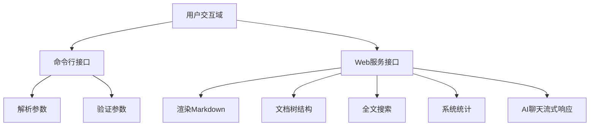
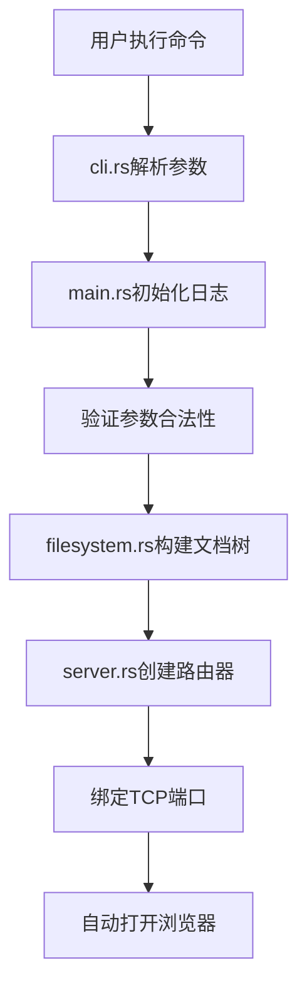
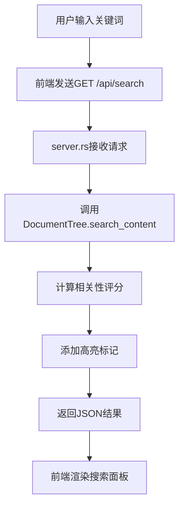
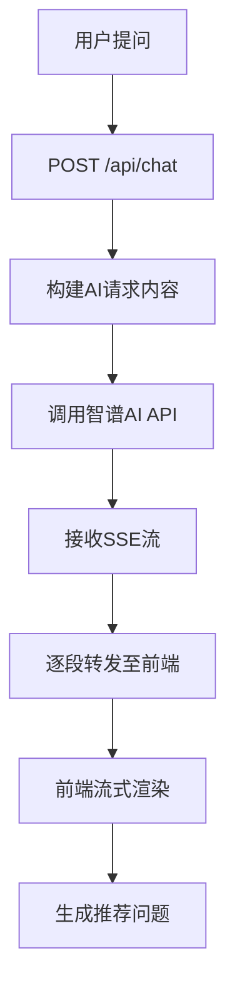

# Litho Book 用户交互域技术实现文档

## 1. 模块概述

### 1.1 模块定位与核心价值
用户交互域是 **Litho Book** 系统的核心业务域之一，作为用户进入系统的唯一入口，承担着连接用户意图与系统能力的桥梁作用。该模块负责处理所有形式的用户输入，包括命令行参数和 Web 界面请求，并将系统响应以适当格式返回给用户。

本模块的设计遵循职责分离原则，划分为两个主要子模块：
- **命令行接口 (CLI)**：处理应用启动时的配置接收与验证
- **Web 服务接口**：提供 RESTful API 支持前端交互功能

通过这两个通道，用户可以完成从系统启动到知识探索的完整闭环操作。

### 1.2 架构关系图


## 2. 命令行接口实现

### 2.1 技术选型与依赖
命令行接口基于 Rust 生态中广泛使用的 `clap` 库（v4.5）构建，利用其声明式宏特性实现类型安全的参数解析。关键依赖如下：
```toml
[dependencies]
clap = { version = "4.5", features = ["derive"] }
```

### 2.2 参数定义与解析
通过 `#[derive(Parser)]` 宏定义了完整的命令行参数结构：

```rust
#[derive(Parser, Debug)]
#[command(name = "litho-book")]
#[command(about = "A web-based reader for litho-generated documentation")]
#[command(version)]
pub struct Args {
    /// 文档目录路径
    #[arg(short, long, value_name = "DIR")]
    pub docs_dir: PathBuf,
    
    /// 服务端口
    #[arg(short, long, default_value = "3000", value_name = "PORT")]
    pub port: u16,
    
    /// 绑定主机
    #[arg(long, default_value = "127.0.0.1", value_name = "HOST")]
    pub host: String,
    
    /// 自动打开浏览器
    #[arg(short, long)]
    pub open: bool,
    
    /// 启用详细日志
    #[arg(short, long)]
    pub verbose: bool,
}
```

支持的标准调用方式示例：
```bash
litho-book --path ./docs --port 3000 --open --verbose
```

### 2.3 参数验证机制
实现了全面的参数合法性校验，确保系统在可靠状态下启动：

#### 2.3.1 目录有效性检查
```rust
impl Args {
    pub fn validate(&self) -> anyhow::Result<()> {
        if !self.docs_dir.exists() {
            anyhow::bail!("Documentation directory does not exist: {}", self.docs_dir.display());
        }
        
        if !self.docs_dir.is_dir() {
            anyhow::bail!("Path is not a directory: {}", self.docs_dir.display());
        }
        
        Ok(())
    }
}
```

#### 2.3.2 端口权限检测
针对低端口（<1024）需要管理员权限的情况，实现了跨平台检测逻辑：

```rust
if self.port < 1024 && !is_privileged() {
    anyhow::bail!(
        "Port {} requires administrator privileges. Please use a port >= 1024 or run as administrator.",
        self.port
    );
}

fn is_privileged() -> bool {
    #[cfg(unix)]
    unsafe { libc::geteuid() == 0 }
    
    #[cfg(windows)]
    true // Windows 实现简化
    
    #[cfg(not(any(unix, windows)))]
    false
}
```

#### 2.3.3 服务地址生成
提供便捷的方法生成服务访问地址：

```rust
pub fn server_url(&self) -> String {
    format!("http://{}:{}", self.host, self.port)
}

pub fn bind_address(&self) -> String {
    format!("{}:{}", self.host, self.port)
}
```

## 3. Web 服务接口实现

### 3.1 技术栈与框架
Web 服务基于 **Axum** 框架构建，结合 Tokio 异步运行时实现高性能 HTTP 服务。主要技术组合：
- **Axum**: 提供路由、提取器、中间件等 Web 功能
- **Tokio**: 异步任务调度与网络 I/O
- **Tower HTTP**: CORS 中间件支持
- **Serde**: JSON 序列化/反序列化
- **Futures**: 异步流处理

### 3.2 核心数据结构
#### 3.2.1 应用状态管理
采用 `AppState` 结构统一管理共享状态，实现跨请求的数据一致性：

```rust
#[derive(Clone)]
pub struct AppState {
    pub doc_tree: DocumentTree,
    pub docs_path: String,
}
```

此状态通过 Axum 的 `.with_state()` 方法注入到所有路由处理器中。

#### 3.2.2 请求/响应模型
定义了标准化的 API 数据契约：

| 接口 | 请求模型 | 响应模型 |
|------|----------|----------|
| `/api/file` | `FileQuery` | `FileResponse` |
| `/api/search` | `SearchQuery` | `SearchResponse` |
| `/api/chat` | `ChatRequest` | SSE `StreamEvent` |

### 3.3 路由注册与处理
#### 3.3.1 路由配置
```rust
pub fn create_router(doc_tree: DocumentTree, docs_path: String) -> Router {
    let state = AppState { doc_tree, docs_path };
    
    Router::new()
        .route("/", get(index_handler))
        .route("/api/file", get(get_file_handler))
        .route("/api/tree", get(get_tree_handler))
        .route("/api/search", get(search_handler))
        .route("/api/stats", get(stats_handler))
        .route("/api/chat", post(chat_stream_handler))
        .route("/health", get(health_handler))
        .layer(CorsLayer::permissive())
        .with_state(state)
}
```

#### 3.3.2 关键路由详解

##### 首页处理 (`/`)
```rust
async fn index_handler(State(state): State<AppState>) -> Result<Html<String>, StatusCode> {
    let tree_json = serde_json::to_string(&state.doc_tree.root)?;
    let html = generate_index_html(&tree_json, &state.docs_path);
    Ok(Html(html))
}
```
- 将文档树序列化为 JSON 字符串
- 使用模板引擎生成最终 HTML 页面

##### 文件获取 (`/api/file`)
```rust
async fn get_file_handler(
    Query(params): Query<FileQuery>,
    State(state): State<AppState>,
) -> Result<Json<FileResponse>, StatusCode> {
    let content = state.doc_tree.get_file_content(&file_path)?;
    let html = state.doc_tree.render_markdown(&content);
    
    // 获取文件元数据
    let file_info = state.doc_tree.file_map.get(&file_path)
        .and_then(|path| std::fs::metadata(path).ok())
        .map(|metadata| {
            let size = metadata.len();
            let modified = extract_modified_time(metadata);
            (size, modified)
        });
    
    Ok(Json(FileResponse { content, html, path: file_path, .. }))
}
```

##### 全文搜索 (`/api/search`)
```rust
async fn search_handler(
    Query(params): Query<SearchQuery>,
    State(state): State<AppState>,
) -> Result<Json<SearchResponse>, StatusCode> {
    let query = params.q.unwrap_or_default();
    if query.trim().is_empty() {
        return Ok(Json(SearchResponse { results: vec![], total: 0, query }));
    }
    
    let results = state.doc_tree.search_content(&query);
    let total = results.len();
    
    Ok(Json(SearchResponse { results, total, query }))
}
```

### 3.4 AI 助手流式对话实现

#### 3.4.1 流式响应架构
采用 Server-Sent Events (SSE) 协议实现低延迟的流式响应：

```rust
async fn chat_stream_handler(
    State(state): State<AppState>,
    Json(request): Json<ChatRequest>,
) -> Sse<impl Stream<Item = Result<Event, Infallible>>> {
    let stream = async_stream::stream! {
        match call_openai_stream_api(...).await {
            Ok(mut response_stream) => {
                yield start_event();
                
                while let Some(chunk) = response_stream.recv().await {
                    match chunk {
                        Ok(content) => {
                            yield content_event(content);
                        }
                        Err(e) => {
                            yield error_event(e);
                            return;
                        }
                    }
                }
                
                yield finish_event(suggestions);
            }
            Err(e) => {
                yield error_event(e);
            }
        }
    };

    Sse::new(stream).keep_alive(...)
}
```

#### 3.4.2 OpenAI 兼容 API 调用
```rust
async fn call_openai_stream_api(
    message: &str,
    context: Option<&str>,
    history: Option<Vec<OpenAIMessage>>,
    docs_path: &str,
) -> Result<Receiver<Result<String, BoxError>>, BoxError> {
    let client = reqwest::Client::new();
    
    // 构建系统提示词
    let mut system_prompt = "你是一个专业的文档助手...".to_string();
    
    // 添加架构概览作为背景知识
    let architecture_path = Path::new(docs_path).join("2、架构概览.md");
    if let Ok(architecture_content) = fs::read_to_string(&architecture_path) {
        system_prompt.push_str(&format!("\n\n用户所关注项目的架构概览：\n{}", architecture_content));
    }
    
    // 构建消息列表（含历史会话）
    let mut messages = vec![system_message(system_prompt)];
    add_history_messages(&mut messages, history);
    messages.push(user_message(message.to_string()));
    
    let request_body = OpenAIRequest {
        model: "GLM-4.5-Flash".to_string(),
        messages,
        temperature: 0.7,
        max_tokens: 16384,
        stream: true,
    };
    
    let response = client
        .post("https://open.bigmodel.cn/api/paas/v4/chat/completions")
        .header("Authorization", "Bearer your-llm-key")
        .json(&request_body)
        .send()
        .await?;
    
    // 创建异步通道处理流式数据
    let (tx, rx) = mpsc::channel(100);
    
    tokio::spawn(async move {
        let mut stream = response.bytes_stream();
        let mut buffer = String::new();
        
        while let Some(chunk_result) = stream.next().await {
            match chunk_result {
                Ok(chunk) => {
                    let chunk_str = String::from_utf8_lossy(&chunk);
                    buffer.push_str(&chunk_str);
                    
                    process_sse_lines(&buffer, &tx).await;
                }
                Err(e) => {
                    let _ = tx.send(Err(e.into())).await;
                    return;
                }
            }
        }
    });
    
    Ok(rx)
}
```

#### 3.4.3 推荐问题生成
基于 AI 回答内容智能生成追问建议：

```rust
fn generate_suggestions(ai_response: &str, _context: Option<&str>) -> Vec<String> {
    let mut suggestions = Vec::new();
    
    if ai_response.contains("架构") || ai_response.contains("设计") {
        suggestions.push("这个架构的优缺点是什么？".to_string());
        suggestions.push("有哪些替代的设计方案？".to_string());
    }
    
    if ai_response.contains("性能") || ai_response.contains("耗时") {
        suggestions.push("项目使用了哪些性能优化策略？".to_string());
        suggestions.push("如何优化项目中的性能热点？".to_string());
    }
    
    if suggestions.is_empty() {
        suggestions.push("能详细解释一下吗？".to_string());
        suggestions.push("有相关的示例吗？".to_string());
        suggestions.push("这个有什么最佳实践？".to_string());
    }
    
    suggestions.truncate(3);
    suggestions
}
```

## 4. 前端模板集成

### 4.1 模板引擎实现
虽然项目当前未使用外部模板文件，但已预留扩展点：

```rust
fn generate_index_html(tree_json: &str, docs_path: &str) -> String {
    let template_content = include_str!("../templates/index.html.tpl");
    
    template_content
        .replace("{{ tree_json|safe }}", tree_json)
        .replace("{{ docs_path }}", docs_path)
}
```

### 4.2 前端功能特性
分析 `index.html.tpl` 模板文件可知，前端具备以下高级功能：

#### 4.2.1 主题系统
支持三种视觉主题切换：
- **白月光**：明亮模式
- **暮光影**：暗色模式
- **莫兰迪**：低饱和度艺术风格

通过 CSS 变量实现动态主题切换：
```css
:root {
    --bg-primary: #ffffff;
    --text-primary: #333333;
    --accent-color: #007bff;
}

[data-theme="dark"] {
    --bg-primary: #1a1a1a;
    --text-primary: #e0e0e0;
    --accent-color: #4a9eff;
}
```

#### 4.2.2 字体管理系统
提供多维度的阅读体验定制：
- **字体族选择**：Geist、Inter、思源系列等
- **字号调节**：±按钮控制缩放比例
- **实时预览**：包含中英文、代码片段展示

#### 4.2.3 UI 组件库
- **文档目录树**：可折叠的文件导航
- **全文搜索**：支持内容/文件名双模式搜索
- **文档大纲 (TOC)**：固定侧边栏显示标题层级
- **AI 助手面板**：浮动对话窗口，带推荐问题功能

## 5. 交互流程分析

### 5.1 系统启动流程


### 5.2 全文搜索流程


### 5.3 AI 对话流程


## 6. 安全性与改进建议

### 6.1 当前安全风险
- **API 密钥硬编码**：`b0c0afc3b5d0402db47e5132fc0fa882.6vyDm2pOv2NSy5z7` 直接写在源码中
- **缺乏身份验证**：任何人均可访问本地服务
- **CORS 配置宽松**：`.layer(CorsLayer::permissive())`

### 6.2 改进建议
1. **环境变量注入密钥**
   ```rust
   std::env::var("ZHIPUAI_API_KEY").expect("ZHIPUAI_API_KEY must be set")
   ```

2. **引入基础认证**
   - 添加简单的用户名密码保护
   - 或集成 JWT token 验证

3. **模板文件分离**
   - 将 `index.html.tpl` 移出编译时嵌入
   - 支持运行时热更新

4. **增加配置文件支持**
   - 支持 `litho-book.toml` 配置文件
   - 优先级：CLI 参数 > 配置文件 > 默认值

5. **增强错误处理**
   - 对 AI API 调用增加重试机制
   - 实现更精细的超时控制

## 7. 总结

用户交互域作为 Litho Book 系统的门户模块，实现了高效、直观且功能丰富的用户交互体验。通过命令行与 Web 双通道设计，既满足了开发者对自动化的需求，又提供了知识工作者友好的可视化界面。

该模块的技术实现体现了现代 Rust 全栈应用的最佳实践：
- 利用 `clap` 实现类型安全的 CLI 解析
- 基于 `axum` 构建高性能异步 Web 服务
- 采用 SSE 协议实现流畅的 AI 流式对话
- 通过清晰的状态管理保证数据一致性

未来可通过引入配置文件、加强安全性、优化模板系统等方式进一步提升用户体验和系统健壮性。
