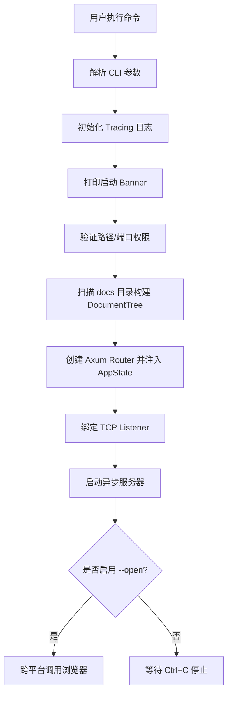

# **Litho-Book 系统支撑域技术实现文档**

---

## **1. 模块概述**

**系统支撑域（System Infrastructure Domain）** 是 Litho-Book 项目中负责提供通用基础设施能力的核心模块，不直接参与业务逻辑处理，而是为整个系统的稳定运行、错误一致性与生命周期管理提供底层保障。该模块遵循“高内聚、低耦合”的设计原则，确保核心业务逻辑（如文档浏览、AI 聊天）能够专注于功能实现，而不必关心日志、错误映射或服务启动等横切关注点。

根据调研材料，系统支撑域包含两个关键子模块：
- **错误处理中枢（Error Handling Hub）**
- **程序启动协调器（Application Startup Coordinator）**

这两个组件共同构成了应用的“骨架”，是连接用户交互域与文档数据域的桥梁，也是系统健壮性的重要基石。

---

## **2. 子模块技术实现详解**

### **2.1 错误处理中枢（`error.rs`）**

#### **2.1.1 设计目标**
- 统一管理所有自定义错误类型
- 实现从内部错误到 HTTP 状态码的自动转换
- 提供清晰的错误语义和上下文信息
- 支持跨模块错误传播与集中处理

#### **2.1.2 核心实现机制**

使用 `thiserror` 库定义枚举型错误类型 `LithoBookError`，并通过 `From` trait 自动映射为 `axum::http::StatusCode`，从而在 Web 层实现统一响应。

```rust
// src/error.rs
use thiserror::Error;

#[derive(Error, Debug)]
pub enum LithoBookError {
    #[error("IO error: {0}")]
    Io(#[from] std::io::Error),

    #[error("JSON serialization error: {0}")]
    Json(#[from] serde_json::Error),

    #[error("File not found: {path}")]
    FileNotFound { path: String },

    #[error("Invalid file path: {path}")]
    InvalidPath { path: String },

    #[error("Directory scan error: {0}")]
    DirectoryScan(String),

    #[error("Server error: {0}")]
    Server(String),

    #[error("Configuration error: {0}")]
    Config(String),
}
```

> ✅ **优势说明**：  
> - `#[from]` 属性允许自动转换 `std::io::Error` 和 `serde_json::Error`，减少样板代码。
> - 每个变体都实现了 `Display` trait，便于日志输出和调试。

#### **2.1.3 HTTP 状态码映射机制**

通过实现 `From<LithoBookError> for axum::http::StatusCode`，将应用级错误自动转换为标准 HTTP 响应码：

```rust
impl From<LithoBookError> for axum::http::StatusCode {
    fn from(err: LithoBookError) -> Self {
        match err {
            LithoBookError::FileNotFound { .. } => StatusCode::NOT_FOUND,
            LithoBookError::InvalidPath { .. } => StatusCode::BAD_REQUEST,
            LithoBookError::Json(_) => StatusCode::INTERNAL_SERVER_ERROR,
            LithoBookError::Io(_) => StatusCode::INTERNAL_SERVER_ERROR,
            LithoBookError::DirectoryScan(_) => StatusCode::INTERNAL_SERVER_ERROR,
            LithoBookError::Server(_) => StatusCode::INTERNAL_SERVER_ERROR,
            LithoBookError::Config(_) => StatusCode::BAD_REQUEST,
        }
    }
}
```

> 🔄 **调用链示例**：
> ```text
> filesystem::get_file_content() → Err(FileNotFound) 
> → Axum 自动调用 .into() → StatusCode::NOT_FOUND 
> → 返回 404 响应给前端
> ```

#### **2.1.4 使用方式（在路由处理器中）**

Axum 支持将任意类型 `T: Into<axum::response::Response>` 作为返回值。结合 `anyhow::Result<T, E>` 与 `.map_err(Into::into)` 可无缝集成：

```rust
async fn get_file_handler(
    Query(params): Query<FileQuery>,
    State(state): State<AppState>,
) -> Result<Json<FileResponse>, StatusCode> {
    let content = state.doc_tree.get_file_content(&file_path)
        .map_err(|e| {
            error!("Failed to read file {}: {}", file_path, e);
            StatusCode::NOT_FOUND
        })?;
    // ...
}
```

或者更优雅地使用 `?` 操作符配合全局错误类型：

```rust
type ApiResult<T> = Result<T, LithoBookError>;

async fn search_handler(...) -> ApiResult<Json<SearchResponse>> {
    let results = doc_tree.search_content(query)?;
    Ok(Json(SearchResponse { ... }))
}
```

此时 Axum 会自动调用 `From<LithoBookError>` 完成状态码转换。

---

### **2.2 程序启动协调器（`main.rs`）**

#### **2.2.1 模块职责**
作为应用程序的主入口函数，`main()` 函数承担了以下关键职责：
1. 解析命令行参数
2. 初始化日志系统
3. 打印启动横幅
4. 验证配置合法性
5. 构建文档树结构
6. 创建并绑定 Web 服务
7. 自动打开浏览器（可选）

其本质是一个**流程调度中心**，协调各模块完成系统初始化。

#### **2.2.2 启动流程图解**



#### **2.2.3 关键技术细节**

##### （1）异步主函数声明
```rust
#[tokio::main]
async fn main() -> anyhow::Result<()> { ... }
```
- 使用 `tokio::main` 宏启动异步运行时
- 返回 `anyhow::Result` 类型以支持任意错误类型的传播

##### （2）日志系统初始化（`init_logging`）
基于 `tracing` + `tracing-subscriber` 实现结构化日志：

```rust
fn init_logging(verbose: bool) {
    let filter = if verbose {
        tracing_subscriber::filter::LevelFilter::DEBUG
    } else {
        tracing_subscriber::filter::LevelFilter::INFO
    };

    tracing_subscriber::registry()
        .with(tracing_subscriber::fmt::layer().without_time().with_target(false))
        .with(filter)
        .init();
}
```

> ⚠️ 当前未记录文件名/行号，适合生产环境；若需调试可开启 `.with_file(true).with_line_number(true)`。

##### （3）跨平台浏览器自动打开（`open_browser`）

利用条件编译实现多平台兼容：

```rust
#[cfg(target_os = "windows")]
fn open_browser(url: &str) -> anyhow::Result<()> {
    std::process::Command::new("cmd").args(["/c", "start", "", url]).spawn()?;
}

#[cfg(target_os = "macos")]
fn open_browser(url: &str) -> anyhow::Result<()> {
    std::process::Command::new("open").arg(url).spawn()?;
}

#[cfg(target_os = "linux")]
fn open_browser(url: &str) -> anyhow::Result<()> {
    let browsers = ["xdg-open", "firefox", "chromium", "google-chrome"];
    for browser in &browsers {
        if std::process::Command::new(browser).arg(url).spawn().is_ok() {
            return Ok(());
        }
    }
    anyhow::bail!("No suitable browser found");
}
```

> ✅ **健壮性设计**：失败时不中断服务，仅记录警告日志。

##### （4）TCP 服务绑定与监听**

使用 `tokio::net::TcpListener` 异步绑定地址：

```rust
let listener = TcpListener::bind(&bind_address).await?;
info!("服务器绑定成功: {}", bind_address);

axum::serve(listener, app).await?;
```

- 若端口被占用或无权限，提前退出并提示用户
- 使用 `axum::serve()` 启动非阻塞服务

##### （5）AppState 注入机制**

将 `DocumentTree` 和 `docs_path` 封装进共享状态，供所有路由访问：

```rust
let state = AppState {
    doc_tree,
    docs_path,
};

let app = Router::new()
    .route("/", get(index_handler))
    .with_state(state); // ← 全局状态注入
```

> 🔐 **安全性注意**：`AppState` 必须实现 `Clone` 或 `Sync + Send`，此处采用 `#[derive(Clone)]`。

---

## **3. 模块间协作关系分析**

| 调用方 | 被调用方 | 协作方式 | 说明 |
|--------|----------|---------|------|
| `main.rs` | `cli.rs` | 服务调用 | 主程序调用 `Args::parse()` 获取配置 |
| `main.rs` | `filesystem.rs` | 数据依赖 | 构建 `DocumentTree` 并注入状态 |
| `main.rs` | `server.rs` | 服务调用 | 创建路由器并传入状态 |
| `server.rs` | `error.rs` | 错误映射 | 所有错误最终转为 HTTP 状态码 |
| `filesystem.rs` | `error.rs` | 错误包装 | IO/JSON 错误封装为 `LithoBookError` |

> 🧩 **架构价值**：系统支撑域处于调用链上游，既发起流程又接收异常，起到了“粘合剂”作用。

---

## **4. 可靠性与扩展性评估**

### **4.1 已具备的优势**
- ✅ **统一错误处理**：前后端一致的错误反馈机制
- ✅ **清晰的启动流程**：线性化控制流易于理解和维护
- ✅ **跨平台兼容性**：Windows/macOS/Linux 浏览器自动打开
- ✅ **异步高性能**：基于 Tokio 的非阻塞 I/O 模型
- ✅ **日志分级控制**：支持 `--verbose` 输出详细日志

### **4.2 潜在改进方向**

| 问题 | 建议方案 |
|------|---------|
| API 密钥硬编码 | 改为环境变量 `ZHIPUAI_API_KEY` 加载 |
| HTML 模板内联 | 外置 `templates/index.html.tpl` 文件，避免重新编译 |
| 缺少配置文件 | 增加 `litho-book.toml` 支持持久化配置 |
| 无热重载机制 | 监听文件变化，动态重建 `DocumentTree` |
| 内存占用较高 | 对渲染结果添加 LRU 缓存（如 `lru` crate） |

---

## **5. 总结**

**系统支撑域**虽不直接面向用户需求，却是 Litho-Book 高可用性的核心保障。它通过两大支柱——**统一错误处理机制**与**程序启动协调逻辑**——实现了以下价值：

- **稳定性增强**：通过标准化错误映射避免未捕获异常导致的服务崩溃
- **开发效率提升**：开发者无需手动处理每种错误对应的 HTTP 状态码
- **用户体验优化**：自动打开浏览器、彩色日志提示、启动统计信息展示
- **架构清晰化**：明确划分关注点，使主流程高度可读且易于测试

该模块的设计充分体现了 Rust 生态在类型安全、零成本抽象和工程实践上的优势，是现代全栈应用中不可或缺的基础组件。

--- 

> 📌 **附录：核心依赖清单（Cargo.toml 片段）**
> ```toml
> [dependencies]
> thiserror = "1.0"
> anyhow = "1.0"
> tracing = "0.1"
> tracing-subscriber = "0.3"
> tokio = { version = "1.47", features = ["full"] }
> ```