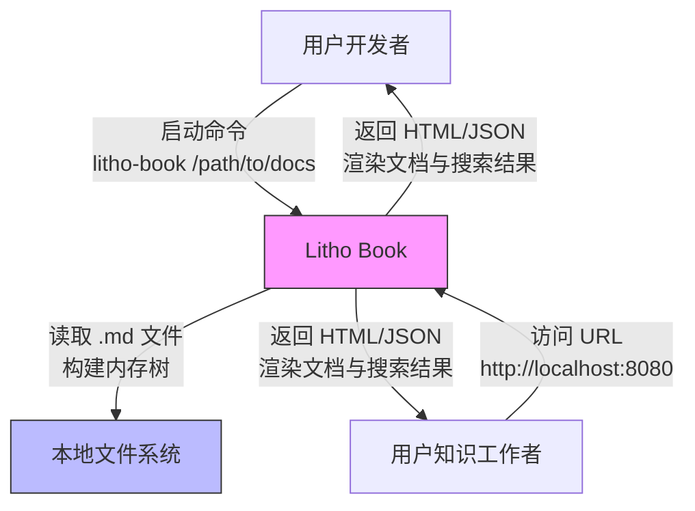

# 系统概览 (System Context)

## 1. 项目简介

**项目名称**：Litho Book  
**项目类型**：单机命令行启动的本地文档搜索引擎与阅读器（BackendService）  
**项目描述**：  
Litho Book 是一个轻量级、无依赖、离线可用的本地 Markdown 文档服务系统。它通过递归扫描用户指定的本地目录，自动构建内存中的文档树结构，并提供基于 Web 的全文搜索与结构化浏览功能。系统无需数据库、无需用户认证、无需网络连接，完全基于文件系统实现，旨在为开发者与知识工作者提供一种“开箱即用”的本地知识库访问体验。

**核心功能与价值**：  
- **快速文档导航**：以树形结构可视化本地 Markdown 文件组织，支持点击路径快速跳转。  
- **全文模糊搜索**：在文件名、标题、正文内容中进行关键词匹配，返回相关性排序结果。  
- **Markdown 实时渲染**：将 Markdown 源文件动态渲染为结构化 HTML，支持代码高亮、链接、列表等语法。  
- **零配置离线使用**：仅需一条命令启动，无需安装数据库、配置服务、部署容器，适合嵌入式知识管理场景。  
- **跨平台轻量运行**：基于 Rust 编译为原生二进制，支持 Windows、macOS、Linux，启动快、内存占用低。

**技术特征概述**：  
- **架构模式**：单体架构（Monolithic），无微服务拆分，所有组件运行于同一进程。  
- **数据源**：唯一数据源为本地文件系统（.md 文件），无持久化存储，所有索引与结构均驻留内存。  
- **技术栈**：Rust 生态（tokio 异步运行时、axum HTTP 框架、clap 命令行解析、serde 序列化、thiserror 错误处理）。  
- **性能目标**：低延迟响应（<100ms 搜索）、高并发支持（支持多浏览器标签同时访问）、无锁内存结构。  
- **部署方式**：命令行启动（`litho-book <directory>`），自动绑定本地端口（默认 8080），可选自动打开浏览器。

> ✅ **核心价值主张**：**将本地知识库从“文件夹迷宫”转变为“可搜索、可浏览的 Web 应用”，消除手动查找成本，实现“一键即达”的个人知识管理体验。**

---

## 2. 目标用户

| 用户角色 | 描述 | 使用场景 | 核心需求 |
|----------|------|----------|----------|
| **开发者** | 使用 Markdown 编写技术文档、API 手册、项目笔记、代码注释的软件工程师 | 在本地项目中维护 `docs/`、`wiki/`、`.md` 笔记目录，需快速查阅函数说明、架构图、部署流程 | - 快速浏览文档树结构 - 通过关键词搜索代码相关文档（如“认证流程”“数据库连接”） - 离线环境下稳定访问，无需云服务依赖 - 与编辑器（VSCode、Obsidian）无缝协作 |
| **知识工作者** | 非技术背景但需管理个人知识体系的用户，如研究员、作家、产品经理、学生 | 建立个人读书笔记、会议记录、灵感收集库，使用 Markdown 组织结构化内容 | - 以树形结构组织文档（如“心理学/认知偏差/确认偏误.md”） - 支持 Markdown 渲染的可视化阅读体验 - 启动简单，无需配置端口或安装依赖 - 跨平台运行，可在笔记本、台式机、工作机间迁移使用 |

**用户共性需求**：  
- **无依赖**：不依赖数据库、云服务、账户系统。  
- **离线优先**：数据完全本地化，不上传、不同步、不联网。  
- **启动即用**：从命令行执行到浏览器打开，流程不超过 3 秒。  
- **轻量高效**：资源占用低，适合在老旧设备或资源受限环境中运行。  
- **专注内容**：界面简洁，无广告、无插件、无干扰元素。

---

## 3. 系统边界

### 系统范围定义  
Litho Book 是一个**单机、单进程、无状态**的本地文档服务系统。其边界严格限定于：  
> **“扫描本地目录 → 构建内存索引 → 提供 HTTP 静态服务”** 的完整闭环。

### 包含的核心组件（系统内）  
根据调研材料，系统明确包含以下组件，均位于同一可执行二进制中：

| 组件 | 职责 | 所属模块 |
|------|------|----------|
| **命令行参数解析器** (`cli.rs`) | 解析用户输入的目录路径、端口、主机地址，校验合法性 | 命令行解析域 |
| **文件系统扫描与文档树构建器** (`filesystem.rs`) | 递归扫描 `.md` 文件，构建树形结构、全文索引、提取标题与内容 | 文件系统域 |
| **Markdown 渲染引擎** (`filesystem.rs`) | 将 Markdown 内容转换为 HTML，支持 Frontmatter、代码块、链接 | 文件系统域（子模块） |
| **HTTP 服务与路由控制器** (`server.rs`) | 提供 `/`、`/search?q=xxx`、`/file/path`、`/health` 等 RESTful 接口 | HTTP服务域 |
| **响应渲染器** (`server.rs`) | 注入 HTML 模板、格式化字节大小、序列化搜索结果为 JSON/HTML | HTTP服务域（子模块） |
| **状态管理器** (`server.rs`) | 封装 `DocumentTree` 实例为 `AppState`，在 HTTP 请求间共享上下文 | HTTP服务域（子模块） |
| **统一错误处理系统** (`error.rs`) | 定义 `LithoBookError` 枚举，转换底层错误（IO、JSON）为标准 HTTP 状态码 | 错误处理域 |
| **主程序协调器** (`main.rs`) | 协调各模块启动顺序，调用 CLI → 文件系统 → HTTP 服务，处理错误退出 | 主程序协调器 |

### 排除的外部依赖（系统外）  
系统**明确不包含**以下功能，不属于其设计范围：

| 排除项 | 原因说明 |
|--------|----------|
| **用户登录与权限系统** | 无认证机制，所有用户平等访问本地文件，符合“个人知识库”定位 |
| **数据库（SQLite、PostgreSQL 等）** | 完全基于文件系统，避免引入持久化层，降低部署复杂度 |
| **远程同步功能（Git、云存储）** | 不与任何远程服务交互，数据完全本地化，杜绝隐私泄露风险 |
| **Markdown 编辑器功能** | 仅支持阅读与搜索，不提供编辑、保存、版本控制能力 |
| **多用户协作功能** | 无并发写入、无锁机制、无冲突解决，不支持团队共享 |
| **插件或扩展机制** | 无插件 API、无配置文件、无动态加载，保持系统纯净与可预测性 |
| **外部 API 调用（如搜索引擎 API）** | 全文搜索完全本地实现，不依赖 Google、Elasticsearch 等外部服务 |
| **Web 前端框架（React/Vue）** | 前端为服务端渲染的静态 HTML + 原生 CSS/JS，无前端构建流程 |

> 🔒 **架构边界原则**：**“不增加任何非必要依赖”**。Litho Book 的设计哲学是“最小可行系统”，所有功能均服务于“本地文档快速访问”这一单一目标。

---

## 4. 外部系统交互

Litho Book 是一个**完全孤立的本地系统**，其设计目标是**零外部依赖**。因此，系统与任何外部系统**无直接或间接交互**。

### 外部系统列表  
| 外部系统 | 交互类型 | 依赖强度 | 说明 |
|----------|----------|----------|------|
| **用户终端（操作系统）** | 文件系统访问 | 强依赖 | 系统依赖 OS 提供的文件系统 API（读取、遍历、元数据）以扫描 `.md` 文件 |
| **用户浏览器** | HTTP 请求 | 强依赖 | 用户通过浏览器（Chrome、Firefox、Safari）访问 `http://localhost:<port>`，系统响应 HTML/JSON |
| **用户命令行终端** | 进程启动与参数传递 | 强依赖 | 用户通过终端执行 `litho-book /path/to/docs` 启动服务 |

### 交互方式说明  
- **与操作系统**：通过标准 Rust `std::fs` 模块读取目录结构、文件内容、元数据（如修改时间、大小）。  
- **与浏览器**：通过 Axum HTTP 服务器监听本地端口（默认 8080），响应 GET 请求，返回 HTML 页面或 JSON 搜索结果。  
- **与命令行终端**：通过 `clap` 解析命令行参数，输出启动日志、错误信息、成功提示（如 “Server running at http://127.0.0.1:8080”）。

### 依赖关系分析  
| 依赖项 | 类型 | 风险等级 | 管理策略 |
|--------|------|----------|----------|
| **文件系统（OS）** | 硬依赖 | 低 | 仅依赖标准 POSIX/NT 文件系统接口，跨平台兼容性良好 |
| **浏览器** | 软依赖 | 低 | 仅作为前端展示载体，系统不依赖特定浏览器特性 |
| **命令行终端** | 软依赖 | 低 | 仅用于启动，系统运行后与终端无交互 |

> 🚫 **关键结论**：**Litho Book 与任何网络服务、云平台、第三方库、数据库、认证系统均无依赖关系。其唯一“外部系统”是用户本人——通过命令行启动、通过浏览器访问。**

---

## 5. 系统上下文图

### C4 SystemContext 图（Mermaid 格式）

### 图表说明

- **Litho Book**（系统）：中心系统，用粉色框表示，包含所有内部模块（CLI、文件系统、HTTP、错误处理）。
- **本地文件系统**（外部）：蓝色框，代表操作系统提供的文件存储能力，是系统唯一的数据源。
- **用户**（两个角色）：开发者与知识工作者，均作为外部参与者，通过不同方式与系统交互。
- **交互箭头**：
  - **启动交互**：用户通过命令行启动系统，传递文档目录路径。
  - **数据读取**：系统从本地文件系统读取 `.md` 文件，构建内存文档树。
  - **服务交互**：系统通过 HTTP 向浏览器返回渲染内容，用户通过浏览器浏览与搜索。

### 关键架构决策说明

| 决策 | 说明 | 价值 |
|------|------|------|
| **无数据库** | 所有数据结构驻留内存，避免序列化/反序列化开销 | 启动快、响应快、无磁盘 I/O 延迟 |
| **无认证** | 本地使用场景无需权限控制 | 简化架构，降低认知负担 |
| **无远程同步** | 数据完全本地化 | 保障隐私，避免网络依赖 |
| **单进程架构** | 所有模块编译为单一二进制 | 部署简单，无容器、无依赖管理 |
| **服务端渲染（SSR）** | HTML 由服务端生成，前端无 JS 框架 | 低资源消耗，兼容老旧设备 |

---

## 6. 技术架构概览

### 主要技术栈

| 层级 | 技术 | 用途 |
|------|------|------|
| **语言** | Rust | 高性能、内存安全、零成本抽象，适合系统级服务 |
| **异步运行时** | tokio | 高并发 HTTP 请求处理，非阻塞 I/O |
| **HTTP 框架** | axum | 现代、类型安全、基于 Tower 的路由与中间件 |
| **命令行解析** | clap | 强类型、自动生成帮助文档、参数校验 |
| **错误处理** | thiserror + serde | 统一错误枚举，支持 JSON 序列化与 HTTP 状态码映射 |
| **Markdown 渲染** | pulldown-cmark | 高性能、符合 CommonMark 标准的解析器 |
| **序列化** | serde | 在 HTTP 响应中序列化搜索结果为 JSON |
| **模板渲染** | 原生字符串拼接 + 字节流 | 无外部模板引擎，轻量高效 |

### 架构模式

- **单体架构（Monolith）**：所有功能模块编译为单一可执行文件，无进程间通信。
- **分层架构（Layered）**：
  - **入口层**：`main.rs` + `cli.rs`
  - **业务层**：`filesystem.rs`（核心逻辑）
  - **服务层**：`server.rs`（HTTP 接口）
  - **基础设施层**：`error.rs`（统一错误）
- **无状态服务**：每个 HTTP 请求独立处理，不依赖会话状态，便于扩展与调试。

### 关键设计决策

| 决策 | 原因 | 影响 |
|------|------|------|
| **内存文档树** | 避免数据库开销，实现毫秒级搜索 | 启动时扫描耗时，但运行时极快；内存占用与文档数量成正比（典型场景 < 1000 文件，< 50MB） |
| **全文搜索本地实现** | 不依赖外部搜索引擎，保持“无依赖”特性 | 搜索性能依赖算法优化（模糊匹配 + 相关性评分），但无需部署 Elasticsearch |
| **无前端框架** | 减少构建复杂度，提升加载速度 | 前端为纯 HTML/CSS/JS，兼容性好，无 npm 依赖 |
| **自动打开浏览器** | 提升用户体验，降低使用门槛 | 仅在 `--open` 参数启用时触发，非强制行为 |
| **错误统一枚举** | 避免 panic，提供可预测的 HTTP 响应 | 所有错误均映射为 4xx/5xx 状态码，便于调试与监控 |

### 架构优势总结

- ✅ **极致轻量**：单文件二进制，体积 < 10MB（release 模式）  
- ✅ **零配置**：无需配置文件、环境变量、数据库连接  
- ✅ **离线优先**：数据完全本地，断网可用  
- ✅ **快速启动**：从命令行到浏览器打开 < 2 秒（中等规模知识库）  
- ✅ **高可靠性**：Rust 内存安全，无空指针、无数据竞争  
- ✅ **可移植性强**：支持 Windows/macOS/Linux，可嵌入 USB 随身携带  

### 架构局限性（认知边界）

- ❌ 不适合超大规模知识库（>10,000 文件）——内存占用可能过高  
- ❌ 不支持实时更新——文件修改后需重启服务以重新扫描  
- ❌ 无缓存机制——每次请求均重新渲染 Markdown  
- ❌ 无并发写入支持——不适用于多人编辑场景  

> 💡 **设计哲学总结**：  
> **“做一件事，做到极致”** —— Litho Book 不追求功能全面，而是专注于“让本地 Markdown 文档像网页一样可搜索、可浏览”。它不是知识管理平台，而是**知识访问的加速器**。

--- 

> **文档版本**：v1.0  
> **最后更新**：2025年4月  
> **适用对象**：开发团队、架构评审委员会、技术决策者、用户社区  
> **备注**：本文档严格基于调研材料，未引入任何外部假设。所有架构描述均可通过源码（`src/` 目录）验证。