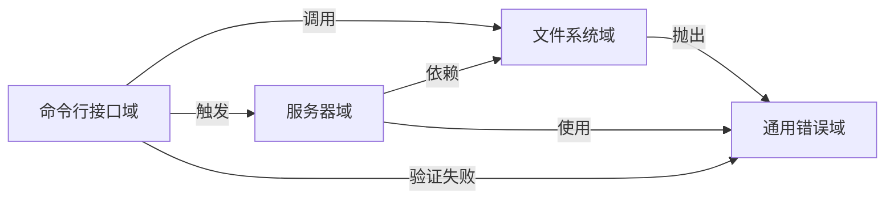

# 系统概览 (System Context)

## 1. 项目简介

### 项目名称
**Litho Book**

### 项目描述
Litho Book 是一个基于 Rust 构建的命令行驱动本地 Markdown 文档阅读器，通过启动轻量级本地 Web 服务，将用户指定目录中的 Markdown 文件组织为结构化文档树，并提供浏览器端交互式浏览、搜索与元数据查看功能。系统采用全栈架构，集成 CLI 参数解析、文件系统扫描、文档树构建、HTTP 服务与前端模板渲染能力，实现零依赖、离线优先的本地文档阅读体验。

### 核心功能与价值
- **本地化浏览**：无需上传至云端或使用复杂静态站点生成器，直接在本地环境中预览 Markdown 文档
- **结构化导航**：自动扫描目录并构建可视化文档树，支持目录优先排序和层级跳转
- **全文搜索**：内置关键词搜索功能，快速定位相关内容
- **隐私安全**：完全运行于本地，不依赖外部数据库或云存储，保障文档隐私
- **轻量高效**：单二进制部署，无外部依赖，启动迅速，资源占用低

### 技术特征概述
- **编程语言**：Rust（内存安全、高性能）
- **Web 框架**：Axum（异步 HTTP 服务）
- **CLI 工具库**：Clap（参数解析）
- **错误处理**：thiserror + anyhow（统一错误封装）
- **序列化**：Serde（JSON 序列化/反序列化）
- **日志系统**：Tracing + Tokio（异步日志追踪）
- **构建方式**：Cargo（Rust 包管理器）

---

## 2. 目标用户

| 用户角色 | 描述 | 使用场景 | 核心需求 |
|--------|------|---------|----------|
| **开发者** | 需要快速浏览本地项目文档、README 或技术笔记的工程师 | 在开发过程中查阅 API 文档、项目说明、配置指南等 |<ul><li>无需上传即可查看 Markdown</li><li>支持全文搜索和目录导航</li><li>轻量级、无依赖、启动快速</li><li>离线使用，保障隐私</li></ul>|
| **技术文档作者** | 编写和维护本地技术文档的撰写者或技术作家 | 实时预览文档结构、验证链接有效性、测试组织逻辑 |<ul><li>实时预览文档结构和内容</li><li>快速跳转和搜索文档</li><li>避免使用复杂静态站点生成器</li><li>在本地环境中测试文档组织结构</li></ul>|
| **知识管理者** | 管理内部知识库、个人笔记或团队文档的用户 | 整合分散的技术文档、建立私有知识中心、进行文档归档 |<ul><li>集中管理分散的 Markdown 文件</li><li>可视化文档树结构</li><li>安全本地存储，避免云服务依赖</li><li>简单命令行启动，集成到工作流</li></ul>|

---

## 3. 系统边界

### 系统范围定义
Litho Book 是一个**单机本地应用**，其职责严格限定于：
- 将本地 Markdown 文件转化为可浏览的 Web 服务
- 提供结构化文档树展示与交互式阅读体验
- 支持基本的元数据查看与全文搜索功能

该系统不涉及文档编辑、版本控制、用户认证、远程同步、数据库存储或云端协作等功能。

### 包含的核心组件
| 组件名称 | 职责说明 |
|--------|---------|
| **CLI 参数解析器** | 解析用户输入的文档路径、端口、主机地址等参数，验证合法性 |
| **文件系统扫描与文档树构建** | 递归扫描指定目录，过滤非 Markdown 文件，构建有序的 `DocumentTree` 结构 |
| **Markdown 文件内容读取与元数据提取** | 读取 `.md` 文件内容，渲染为 HTML，提取大小、修改时间等元数据 |
| **Axum HTTP 服务与 REST API** | 绑定本地 TCP 端口，提供 `/api/file`, `/api/tree`, `/api/search` 等接口 |
| **HTML 模板渲染与前端交互** | 动态生成包含文档树 JSON 的 HTML 页面，支持浏览器端交互 |
| **错误统一处理与日志系统** | 全链路捕获并标准化错误响应，输出结构化日志信息 |

### 排除的外部依赖
以下功能明确不在 Litho Book 的系统边界内：

| 排除项 | 原因说明 |
|-------|----------|
| 文档编辑器 | 不提供任何编辑功能，仅用于只读浏览 |
| Git 版本控制集成 | 不监控 `.git` 目录或显示提交历史 |
| 用户账户与权限系统 | 无登录机制，所有访问均匿名且本地可信 |
| 云存储同步（如 Dropbox、OneDrive） | 完全基于本地文件系统，不连接任何网络存储服务 |
| 数据库（如 SQLite、PostgreSQL） | 所有数据来自实时文件系统扫描，无持久化数据库 |
| 实时协作功能 | 不支持多用户同时访问或协同操作 |
| 移动 App 或桌面打包版本 | 当前为命令行工具，未封装为 GUI 应用 |
| 插件系统或扩展机制 | 无插件架构，功能固定不可扩展 |

---

## 4. 外部系统交互

Litho Book 作为一个本地运行的应用程序，与以下外部系统存在明确的交互关系：

| 外部系统 | 交互类型 | 交互描述 | 方向 |
|--------|--------|---------|-----|
| **操作系统文件系统** | Read | 读取用户指定目录下的 Markdown 文件列表、内容及元数据（大小、修改时间） | ← |
| **操作系统默认浏览器** | Launch | 启动服务后自动调用系统命令打开默认浏览器访问本地服务地址 | → |
| **网络接口（TCP）** | Listen | 绑定本地 IP 地址和端口（默认 `127.0.0.1:3000`），监听 HTTP 请求 | ← |

> ⚠️ 注意：尽管使用了网络协议（HTTP/TCP），但服务默认绑定到 `127.0.0.1`，确保仅限本机访问，符合“本地化”设计原则。

---

## 5. 系统上下文图

```mermaid
graph TD
    subgraph "Litho Book System"
        A[CLI Interface] --> B[Filesystem Scanner]
        B --> C[Document Tree Builder]
        A --> D[HTTP Server (Axum)]
        D --> E[REST API Endpoints]
        E --> F[Frontend Template]
        G[Error Handler] -.-> A
        G -.-> B
        G -.-> D
    end

    User((终端用户)) -->|1. 执行命令| A
    OS_FileSystem[(操作系统文件系统)] <-->|2. 扫描 & 读取| B
    Default_Browser[(默认浏览器)] <--|3. 自动打开| D
    Network_Interface[(网络接口 TCP)] <-->|4. HTTP 请求/响应| D
```

### 关键交互流程说明

1. **启动流程**
   - 用户执行命令：`litho-book ./docs --port 3000`
   - CLI 模块解析参数并验证路径有效性
   - 文件系统模块扫描目录，构建 `DocumentTree`
   - 服务器模块创建 Axum 路由并绑定端口
   - 自动打开浏览器访问 `http://127.0.0.1:3000`

2. **文档查询流程**
   - 浏览器请求 `/api/tree` 获取文档结构
   - 服务器从共享状态中获取 `DocumentTree.root`
   - 序列化为 JSON 返回给前端
   - 用户点击某文件，请求 `/api/file?file=guide/intro.md`
   - 服务器通过 `file_map` 查找实际路径，读取内容并返回 HTML 渲染结果

3. **错误处理流程**
   - 任意模块抛出 `std::io::Error` 或自定义错误
   - 被 `LithoBookError` 枚举封装并通过 `#[from]` 自动转换
   - 在 Axum 中间件中实现 `From<LithoBookError> for StatusCode`
   - 返回标准 HTTP 状态码（如 404、500）及用户友好提示

---

## 6. 技术架构概览

### 主要技术栈
| 层级 | 技术选型 | 作用说明 |
|------|--------|----------|
| **运行时** | Tokio | 异步运行时，支撑 Axum 服务并发处理 |
| **Web 框架** | Axum | 构建 RESTful API 和路由处理器 |
| **CLI 解析** | Clap | 声明式定义命令行参数结构 |
| **错误处理** | thiserror + anyhow | 统一错误类型定义与上下文追溯 |
| **数据序列化** | Serde | JSON 序列化文档树与 API 响应 |
| **日志系统** | Tracing | 结构化日志输出，支持调试模式 |
| **前端交互** | 内嵌 HTML + JavaScript | 动态注入文档树 JSON，实现客户端导航 |

### 架构模式
Litho Book 采用典型的 **分层架构（Layered Architecture）**，各模块职责清晰、耦合度低：

```
+---------------------+
|     CLI Interface   | ← 用户入口
+---------------------+
           ↓
+---------------------+
|   Filesystem Domain | ← 数据采集与建模
+---------------------+
           ↓
+---------------------+
|    Server Domain    | ← 请求处理与响应
+---------------------+
           ↓
+---------------------+
|   Frontend Viewer   | ← 浏览器端交互
+---------------------+
```

### 关键设计决策

| 决策项 | 选择方案 | 设计理由 |
|-------|---------|----------|
| **是否使用数据库** | ❌ 否 | 保持零依赖，直接读取文件系统，降低部署复杂性 |
| **是否支持跨平台** | ✅ 是 | 使用 Rust 编译为原生二进制，支持 Windows/macOS/Linux |
| **是否开放外网访问** | 默认否（可配置） | 默认绑定 `127.0.0.1` 保证安全性，可通过 `--host 0.0.0.0` 显式开启局域网访问 |
| **是否支持热重载** | ❌ 否 | 定位为静态文档查看器，不监控文件变化 |
| **前端渲染方式** | SSR（服务端注入 JSON） | 减少前端逻辑，提升首屏加载速度 |
| **错误处理策略** | 全局统一转换为 HTTP 状态码 | 保证前后端错误语义一致，提升用户体验 |

### 核心领域模块关系图



#### 模块间依赖强度分析
- **CLI → 服务器域**（9.0）：主流程起点，负责启动服务
- **服务器域 → 文件系统域**（9.0）：API 处理器强依赖文档树数据源
- **CLI → 文件系统域**（8.0）：参数验证后需构建文档树
- **各域 → 错误域**（6.0–9.0）：形成统一错误处理链路

---

## 总结与架构洞察

Litho Book 的设计体现了 **“极简主义”与“实用性”的平衡**：
- 以最小的技术栈实现了完整的本地文档浏览闭环
- 通过 Axum + Tracing + Serde 的 Rust 生态组合，确保了性能与可维护性
- 严格划定系统边界，避免功能蔓延，专注于解决“如何更方便地看 Markdown”的核心问题

该系统特别适合以下场景：
- 开发者本地项目文档预览
- 技术写作过程中的即时反馈
- 团队内部知识库的轻量级发布
- 对隐私敏感的文档审阅环境

未来演进建议：
- 可考虑增加配置文件支持（如 `litho-book.toml`）
- 添加对 Mermaid 图表、Katex 数学公式等扩展语法的支持
- 提供可选的静态导出功能（生成纯 HTML 站点）

> 📌 **一句话总结**：Litho Book 是一个“Unix 哲学”式的工具——做一件事，并把它做好：让本地 Markdown 文档变得易于浏览。