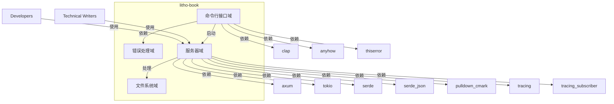

# 系统概览 (System Context)

## 1. 项目简介

### 1.1 项目名称和描述
**项目名称**: litho-book

**项目描述**: litho-book是一个基于Rust语言和Axum框架构建的文档管理系统，为用户提供基于Web的界面来管理和查看Markdown文档。该系统旨在提供高效、可扩展且易于使用的文档管理解决方案。

### 1.2 核心功能与价值
- **文档管理**: 提供Markdown文档的存储、检索和管理功能
- **Web界面**: 通过Web界面查看和与文档交互
- **搜索与导航**: 支持大型文档集合的搜索和导航功能
- **错误处理与日志**: 完善的错误处理和日志记录机制

**业务价值**:
- 为技术作家和开发者提供高效的文档管理和发布系统
- 通过Web界面简化文档的查看和交互过程
- 支持大型文档集合的搜索和导航，提高文档使用效率

### 1.3 技术特征概述
- **编程语言**: Rust
- **Web框架**: Axum
- **异步运行时**: Tokio
- **错误处理**: anyhow, thiserror
- **日志记录**: tracing, tracing_subscriber
- **命令行解析**: clap
- **Markdown处理**: pulldown_cmark
- **数据序列化**: serde, serde_json

## 2. 目标用户

### 2.1 用户角色定义
1. **技术作家**:
   - **描述**: 需要管理和发布技术文档的专业人员
   - **需求**:
     - 文档管理和发布系统
     - Web界面查看和交互文档
     - 大型文档集合的搜索和导航功能

2. **开发者**:
   - **描述**: 需要贡献或维护文档系统的技术人员
   - **需求**:
     - 文档管理和发布系统
     - Web界面查看和交互文档
     - 大型文档集合的搜索和导航功能
     - 与现有工具和工作流程的轻松集成

### 2.2 使用场景描述
- **技术作家**:
  - 创建、编辑和发布技术文档
  - 通过Web界面查看和交互文档
  - 使用搜索和导航功能快速找到所需文档

- **开发者**:
  - 贡献和维护文档系统
  - 通过Web界面查看和交互文档
  - 使用搜索和导航功能快速找到所需文档
  - 集成文档系统到现有工具和工作流程

## 3. 系统边界

### 3.1 系统范围定义
litho-book系统的范围包括核心功能模块，用于管理和提供Markdown文档，以及Web界面用于查看和与文档交互。系统不包括底层操作系统、硬件或网络基础设施。

### 3.2 包含的核心组件
- **文档管理系统**: 核心功能模块，用于管理和提供Markdown文档
- **Web界面**: 用于查看和与文档交互的Web界面
- **搜索与导航功能**: 支持大型文档集合的搜索和导航
- **错误处理与日志**: 完善的错误处理和日志记录机制

### 3.3 排除的外部依赖
- 操作系统
- 硬件
- 网络基础设施

## 4. 外部系统交互

### 4.1 外部系统列表
1. **clap**: 命令行参数解析库
2. **tracing**: 程序仪器化框架
3. **tracing_subscriber**: tracing框架的订阅者
4. **tokio**: 异步运行时
5. **anyhow**: 错误处理库
6. **axum**: Web框架
7. **serde_json**: JSON序列化和反序列化库
8. **thiserror**: 错误类型派生库
9. **serde**: 数据结构序列化和反序列化框架
10. **pulldown_cmark**: CommonMark Markdown解析和渲染库

### 4.2 交互方式说明
- **库依赖**: 系统通过库依赖与外部系统交互，这些库提供了必要的功能模块，如命令行参数解析、错误处理、日志记录、Web框架、数据序列化和Markdown处理等。

### 4.3 依赖关系分析
- **命令行接口域**: 依赖clap库进行命令行参数解析，依赖anyhow和thiserror库进行错误处理。
- **服务器域**: 依赖axum库构建Web框架，依赖tokio库进行异步运行时支持。
- **错误处理域**: 依赖anyhow和thiserror库进行错误处理。
- **日志记录**: 依赖tracing和tracing_subscriber库进行日志记录。
- **数据序列化**: 依赖serde和serde_json库进行数据序列化和反序列化。
- **Markdown处理**: 依赖pulldown_cmark库进行Markdown解析和渲染。

## 5. 系统上下文图

### 5.1 C4 SystemContext图表

### 5.2 关键交互流程
1. **应用程序启动流程**:
   - 用户通过命令行启动应用程序
   - 命令行接口域解析命令行参数
   - 命令行接口域验证参数有效性
   - 服务器域根据参数配置启动服务器

### 5.3 架构决策说明
- **模块化设计**: 系统采用模块化设计，各模块之间通过明确的接口和数据结构进行交互，确保系统的高内聚和低耦合。
- **Rust语言和Axum框架**: 选择Rust语言和Axum框架以确保系统的高性能和可扩展性。
- **异步运行时**: 使用Tokio异步运行时以提高系统的并发处理能力。
- **错误处理和日志记录**: 使用anyhow、thiserror、tracing和tracing_subscriber库进行错误处理和日志记录，以提高系统的可靠性和可维护性。

## 6. 技术架构概览

### 6.1 主要技术栈
- **编程语言**: Rust
- **Web框架**: Axum
- **异步运行时**: Tokio
- **错误处理**: anyhow, thiserror
- **日志记录**: tracing, tracing_subscriber
- **命令行解析**: clap
- **Markdown处理**: pulldown_cmark
- **数据序列化**: serde, serde_json

### 6.2 架构模式
- **模块化架构**: 系统采用模块化架构，各模块之间通过明确的接口和数据结构进行交互，确保系统的高内聚和低耦合。
- **异步架构**: 系统使用Tokio异步运行时，以提高系统的并发处理能力。

### 6.3 关键设计决策
- **模块化设计**: 系统采用模块化设计，各模块之间通过明确的接口和数据结构进行交互，确保系统的高内聚和低耦合。
- **Rust语言和Axum框架**: 选择Rust语言和Axum框架以确保系统的高性能和可扩展性。
- **异步运行时**: 使用Tokio异步运行时以提高系统的并发处理能力。
- **错误处理和日志记录**: 使用anyhow、thiserror、tracing和tracing_subscriber库进行错误处理和日志记录，以提高系统的可靠性和可维护性。

---

这份文档提供了litho-book系统的全面概览，涵盖了系统的核心功能、目标用户、系统边界、外部系统交互、系统上下文图和技术架构概览。文档中的信息基于调研数据，确保了内容的准确性和专业性。