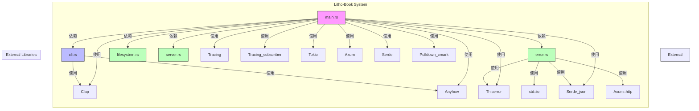
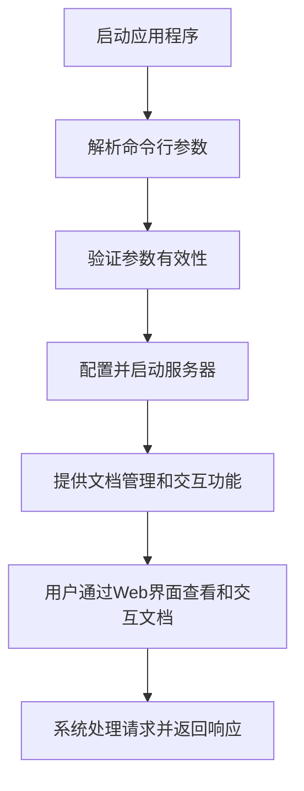
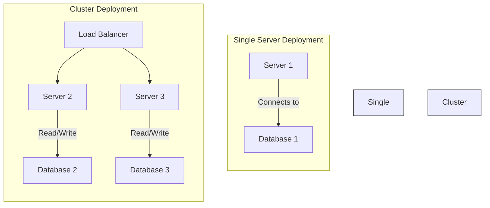

# 系统架构文档

## 1. 架构概览 (Architecture Overview)

### 1.1 架构设计理念
Litho-Book系统采用模块化设计理念，强调高内聚和低耦合的架构原则。系统通过明确的接口和数据结构将各模块连接起来，确保每个模块的职责清晰，便于维护和扩展。系统设计目标是高效、可扩展和易用，通过Rust语言和Axum框架的选择，确保系统的性能和可靠性。

### 1.2 核心架构模式
- **模块化架构**：系统划分为命令行接口域、错误处理域、文件系统域和服务器域四个核心模块，每个模块负责特定功能，通过明确的接口进行交互。
- **分层架构**：系统采用分层架构，将业务逻辑、数据访问和用户接口分离，便于管理和扩展。
- **事件驱动架构**：系统通过事件驱动的方式处理用户请求，提高系统的响应速度和并发处理能力。

### 1.3 技术栈概述
- **编程语言**：Rust
- **Web框架**：Axum
- **命令行解析**：Clap
- **错误处理**：Thiserror
- **日志和跟踪**：Tracing和Tracing_subscriber
- **异步运行时**：Tokio
- **序列化和反序列化**：Serde和Serde_json
- **Markdown解析**：Pulldown_cmark

## 2. 系统上下文 (System Context)

### 2.1 系统定位与价值
Litho-Book是一个基于Rust的文档管理系统，提供Web界面用于管理和查看Markdown文档。系统的核心价值在于为技术作家和开发人员提供一个高效、可扩展和易用的文档管理解决方案，支持文档的搜索、导航和交互功能。

### 2.2 用户角色与场景
- **技术作家**：
  - 需要管理和发布文档
  - 需要Web界面查看和交互文档
  - 需要搜索和导航大型文档集合
- **开发人员**：
  - 需要管理和发布文档
  - 需要Web界面查看和交互文档
  - 需要搜索和导航大型文档集合
  - 需要与现有工具和工作流程的轻松集成

### 2.3 外部系统交互
- **命令行参数解析**：使用Clap库解析命令行参数。
- **日志和跟踪**：使用Tracing和Tracing_subscriber框架进行日志记录和性能跟踪。
- **异步运行时**：使用Tokio库实现异步任务处理。
- **错误处理**：使用Anyhow和Thiserror库进行错误处理。
- **Web服务**：使用Axum框架构建Web服务器，提供RESTful API。
- **数据序列化**：使用Serde和Serde_json库进行数据序列化和反序列化。
- **Markdown处理**：使用Pulldown_cmark库解析和渲染Markdown文档。

### 2.4 系统边界定义
- **包含组件**：
  - 文档管理系统
  - Web界面用于查看和交互文档
  - 搜索和导航功能
  - 错误处理和日志记录
- **排除组件**：
  - 操作系统
  - 硬件
  - 网络基础设施

## 3. 容器视图 (Container View)

### 3.1 领域模块划分
- **命令行接口域**：
  - 负责处理命令行参数，包括定义、解析、验证参数，提供服务器URL和绑定地址，检查当前进程的特权状态。
  - 子模块：命令行参数解析子模块
- **错误处理域**：
  - 负责定义和处理系统中的错误。
  - 使用Thiserror库派生错误类型，并使用Serde_json进行JSON序列化和反序列化。
- **文件系统域**：
  - 负责管理和操作文档文件。
  - 与文件系统交互，读取和写入Markdown文档。
- **服务器域**：
  - 负责启动和管理Web服务器。
  - 使用Axum框架构建Web服务器，提供RESTful API用于文档管理和查询。

### 3.2 领域模块架构

### 3.3 存储设计
- **文件系统存储**：
  - 系统使用文件系统存储Markdown文档，通过filesystem.rs模块进行管理和操作。
  - 文档存储路径和结构由命令行参数配置决定。

### 3.4 领域模块间通信
- **命令行接口域与错误处理域**：
  - 命令行接口域依赖错误处理域来处理命令行参数解析过程中可能出现的错误。
- **命令行接口域与服务器域**：
  - 命令行接口域提供服务器URL和绑定地址，服务器域根据这些参数配置启动服务器。
- **服务器域与文件系统域**：
  - 服务器域通过文件系统域读取和写入Markdown文档，提供RESTful API用于文档管理和查询。

## 4. 组件视图 (Component View)

### 4.1 核心功能组件
- **main.rs**：
  - 系统的入口点，负责初始化和协调各个模块的工作。
  - 依赖其他模块（cli.rs, error.rs, filesystem.rs, server.rs）和外部库。
- **cli.rs**：
  - 命令行接口域，负责解析和验证命令行参数。
  - 使用Clap库解析命令行参数，并提供服务器URL和绑定地址。
- **error.rs**：
  - 错误处理域，负责定义和处理系统中的错误。
  - 使用Thiserror库派生错误类型，并使用Serde_json进行JSON序列化和反序列化。
- **filesystem.rs**：
  - 文件系统域，负责管理和操作文档文件。
  - 与文件系统交互，读取和写入Markdown文档。
- **server.rs**：
  - 服务器域，负责启动和管理Web服务器。
  - 使用Axum框架构建Web服务器，提供RESTful API用于文档管理和查询。

### 4.2 技术支撑组件
- **Clap**：
  - 命令行参数解析库，用于解析和验证命令行参数。
- **Tracing和Tracing_subscriber**：
  - 日志和跟踪框架，用于记录系统日志和性能跟踪。
- **Tokio**：
  - 异步运行时，用于实现异步任务处理。
- **Anyhow和Thiserror**：
  - 错误处理库，用于定义和处理系统中的错误。
- **Axum**：
  - Web框架，用于构建Web服务器和提供RESTful API。
- **Serde和Serde_json**：
  - 序列化和反序列化库，用于数据序列化和反序列化。
- **Pulldown_cmark**：
  - Markdown解析和渲染库，用于解析和渲染Markdown文档。

### 4.3 组件职责划分
- **main.rs**：
  - 初始化系统，协调各个模块的工作。
  - 依赖其他模块和外部库。
- **cli.rs**：
  - 解析和验证命令行参数。
  - 提供服务器URL和绑定地址。
  - 依赖错误处理域来处理命令行参数解析过程中可能出现的错误。
- **error.rs**：
  - 定义和处理系统中的错误。
  - 使用Thiserror库派生错误类型，并使用Serde_json进行JSON序列化和反序列化。
- **filesystem.rs**：
  - 管理和操作文档文件。
  - 与文件系统交互，读取和写入Markdown文档。
- **server.rs**：
  - 启动和管理Web服务器。
  - 使用Axum框架构建Web服务器，提供RESTful API用于文档管理和查询。

### 4.4 组件交互关系

## 5. 关键流程 (Key Processes)

### 5.1 核心功能流程
- **应用程序启动流程**：
  - 用户通过命令行启动应用程序。
  - 系统解析命令行参数，验证参数有效性。
  - 根据参数配置启动服务器。
  - 服务器提供文档管理和交互功能。
  - 用户通过Web界面查看和交互文档。
  - 系统处理请求并返回响应。

### 5.2 技术处理流程
- **命令行参数解析**：
  - 用户通过命令行启动应用程序。
  - 系统解析命令行参数，验证参数有效性。
  - 根据参数配置启动服务器。
- **错误处理**：
  - 在命令行参数解析和文件系统操作过程中，系统会使用error.rs模块定义和处理错误。
- **文件系统操作**：
  - 系统通过filesystem.rs模块与文件系统交互，读取和写入Markdown文档。
- **Web服务器管理**：
  - 系统通过server.rs模块启动和管理Web服务器，提供RESTful API用于文档管理和查询。

### 5.3 数据流转路径
- **命令行参数流转**：
  - 用户输入的命令行参数通过cli.rs模块解析和验证。
  - 验证后的参数传递给main.rs模块，用于配置和启动服务器。
- **文档数据流转**：
  - 用户通过Web界面提交的文档数据通过server.rs模块接收。
  - 文档数据通过filesystem.rs模块存储到文件系统中。
  - 文档数据通过filesystem.rs模块读取，并通过server.rs模块返回给用户。

### 5.4 异常处理机制
- **错误定义和处理**：
  - 系统使用error.rs模块定义和处理错误。
  - 使用Thiserror库派生错误类型，并使用Serde_json进行JSON序列化和反序列化。
- **错误传播和处理**：
  - 在命令行参数解析和文件系统操作过程中，系统会使用error.rs模块定义和处理错误。
  - 错误信息通过JSON序列化和反序列化，便于传输和处理。

## 6. 技术实现 (Technical Implementation)

### 6.1 核心模块实现
- **main.rs**：
  - 系统的入口点，负责初始化和协调各个模块的工作。
  - 依赖其他模块（cli.rs, error.rs, filesystem.rs, server.rs）和外部库。
- **cli.rs**：
  - 命令行接口域，负责解析和验证命令行参数。
  - 使用Clap库解析命令行参数，并提供服务器URL和绑定地址。
- **error.rs**：
  - 错误处理域，负责定义和处理系统中的错误。
  - 使用Thiserror库派生错误类型，并使用Serde_json进行JSON序列化和反序列化。
- **filesystem.rs**：
  - 文件系统域，负责管理和操作文档文件。
  - 与文件系统交互，读取和写入Markdown文档。
- **server.rs**：
  - 服务器域，负责启动和管理Web服务器。
  - 使用Axum框架构建Web服务器，提供RESTful API用于文档管理和查询。

### 6.2 关键算法设计
- **命令行参数解析**：
  - 使用Clap库解析命令行参数，定义并解析命令行参数，验证参数有效性。
- **错误处理**：
  - 使用Thiserror库派生错误类型，并使用Serde_json进行JSON序列化和反序列化。
- **文件系统操作**：
  - 使用标准文件系统API读取和写入Markdown文档。
- **Web服务器管理**：
  - 使用Axum框架构建Web服务器，提供RESTful API用于文档管理和查询。

### 6.3 数据结构设计
- **命令行参数结构**：
  - 定义命令行参数的数据结构，包括服务器URL和绑定地址等。
- **错误类型结构**：
  - 使用Thiserror库派生错误类型，定义系统中的各种错误类型。
- **文档数据结构**：
  - 定义Markdown文档的数据结构，包括文档内容、元数据等。
- **API请求和响应结构**：
  - 定义RESTful API的请求和响应数据结构。

### 6.4 性能优化策略
- **异步处理**：
  - 使用Tokio库实现异步任务处理，提高系统的并发处理能力。
- **缓存机制**：
  - 实现文档缓存机制，减少文件系统的读写操作。
- **并行处理**：
  - 使用多线程或多进程处理高并发请求，提高系统的响应速度。

## 7. 部署架构 (Deployment Architecture)

### 7.1 运行环境要求
- **操作系统**：
  - 支持Linux、macOS和Windows操作系统。
- **硬件要求**：
  - 至少2GB内存，推荐4GB或更高。
  - 至少2个CPU核心，推荐4个或更高。
- **依赖库**：
  - 需要安装Rust编译器和必要的依赖库。

### 7.2 部署拓扑结构
- **单机部署**：
  - 系统可以部署在单台服务器上，适用于小型或中型文档管理需求。
- **集群部署**：
  - 系统可以部署在多台服务器上，通过负载均衡实现高可用和高性能。

### 7.3 扩展性设计
- **水平扩展**：
  - 系统可以通过增加服务器节点实现水平扩展，提高系统的并发处理能力。
- **垂直扩展**：
  - 系统可以通过增加服务器资源（如CPU、内存）实现垂直扩展，提高单台服务器的处理能力。
- **模块化设计**：
  - 系统采用模块化设计，便于添加新功能或替换现有模块。

### 7.4 监控与运维
- **日志记录**：
  - 使用Tracing和Tracing_subscriber框架进行日志记录和性能跟踪。
- **性能监控**：
  - 使用性能监控工具监控系统的性能指标，如CPU使用率、内存使用率、请求响应时间等。
- **健康检查**：
  - 实现健康检查接口，定期检查系统的健康状态。
- **自动化部署**：
  - 使用自动化部署工具（如Ansible、Puppet等）实现系统的自动化部署和配置管理。

## 8. 架构洞察

### 8.1 扩展性设计
- **模块化架构**：
  - 系统采用模块化设计，便于添加新功能或替换现有模块。
- **水平扩展**：
  - 系统可以通过增加服务器节点实现水平扩展，提高系统的并发处理能力。
- **垂直扩展**：
  - 系统可以通过增加服务器资源（如CPU、内存）实现垂直扩展，提高单台服务器的处理能力。

### 8.2 性能考虑
- **异步处理**：
  - 使用Tokio库实现异步任务处理，提高系统的并发处理能力。
- **缓存机制**：
  - 实现文档缓存机制，减少文件系统的读写操作。
- **并行处理**：
  - 使用多线程或多进程处理高并发请求，提高系统的响应速度。

### 8.3 安全性设计
- **错误处理**：
  - 系统使用Thiserror库派生错误类型，并使用Serde_json进行JSON序列化和反序列化，确保错误处理的清晰和一致性。
- **数据验证**：
  - 在命令行参数解析和文件系统操作过程中，系统会进行数据验证，确保数据的正确性和安全性。
- **权限管理**：
  - 系统检查当前进程的特权状态，确保系统的安全性。

## 9. 实用性

### 9.1 开发指导
- **模块开发**：
  - 开发团队应按照模块化设计原则开发各个模块，确保模块的高内聚和低耦合。
- **接口定义**：
  - 开发团队应定义清晰的模块接口和数据结构，便于模块之间的交互。
- **错误处理**：
  - 开发团队应使用Thiserror库派生错误类型，并使用Serde_json进行JSON序列化和反序列化，确保错误处理的清晰和一致性。

### 9.2 运维指导
- **部署策略**：
  - 运维团队应根据系统的扩展性设计，选择合适的部署策略（如单机部署或集群部署）。
- **监控策略**：
  - 运维团队应使用性能监控工具监控系统的性能指标，确保系统的稳定性和可靠性。
- **健康检查**：
  - 运维团队应定期检查系统的健康状态，确保系统的正常运行。

### 9.3 决策支持
- **技术选型**：
  - 系统采用Rust语言和Axum框架，具有高性能和可扩展性，适用于文档管理系统的开发。
- **架构设计**：
  - 系统采用模块化设计，便于添加新功能或替换现有模块，满足业务需求的变化。
- **性能优化**：
  - 系统通过异步处理、缓存机制和并行处理等策略，提高系统的性能和响应速度。

### 9.4 知识传承
- **架构文档**：
  - 系统架构文档提供了系统的整体架构设计、模块划分、组件交互关系等信息，便于新团队成员快速理解系统架构。
- **代码注释**：
  - 代码中应包含详细的注释，说明代码的功能、实现细节和使用方式，便于新团队成员理解代码。
- **开发指南**：
  - 开发指南提供了系统的开发规范、编码规范、测试规范等信息，便于新团队成员遵循规范进行开发。

通过以上架构文档，开发团队和运维团队可以清晰地理解系统的架构设计、技术实现和运维策略，确保系统的高效、可靠和可扩展性。