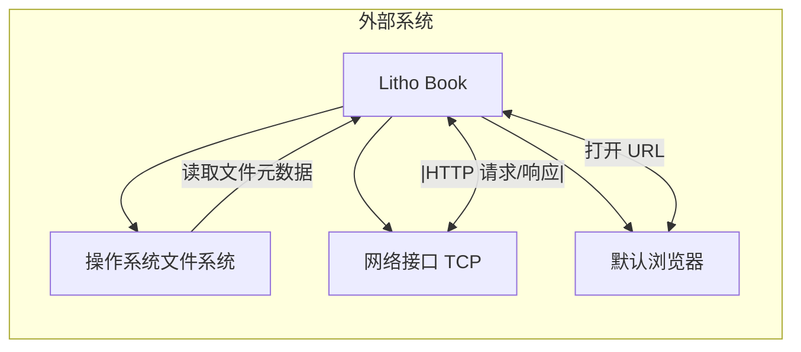
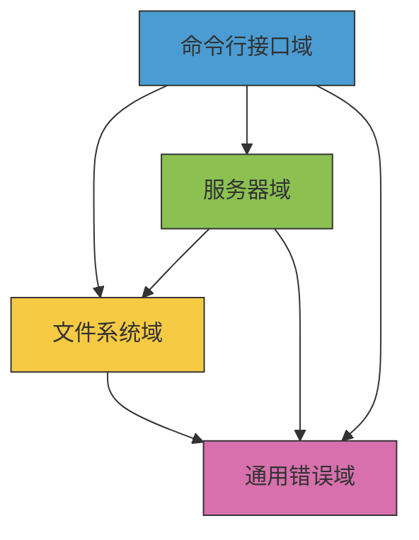
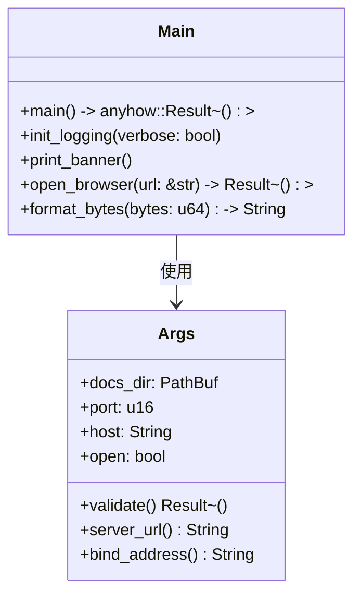
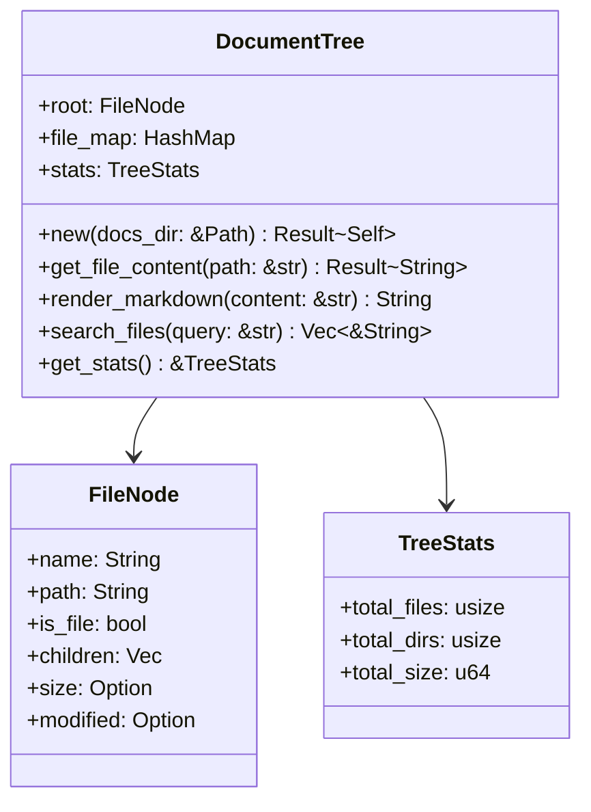
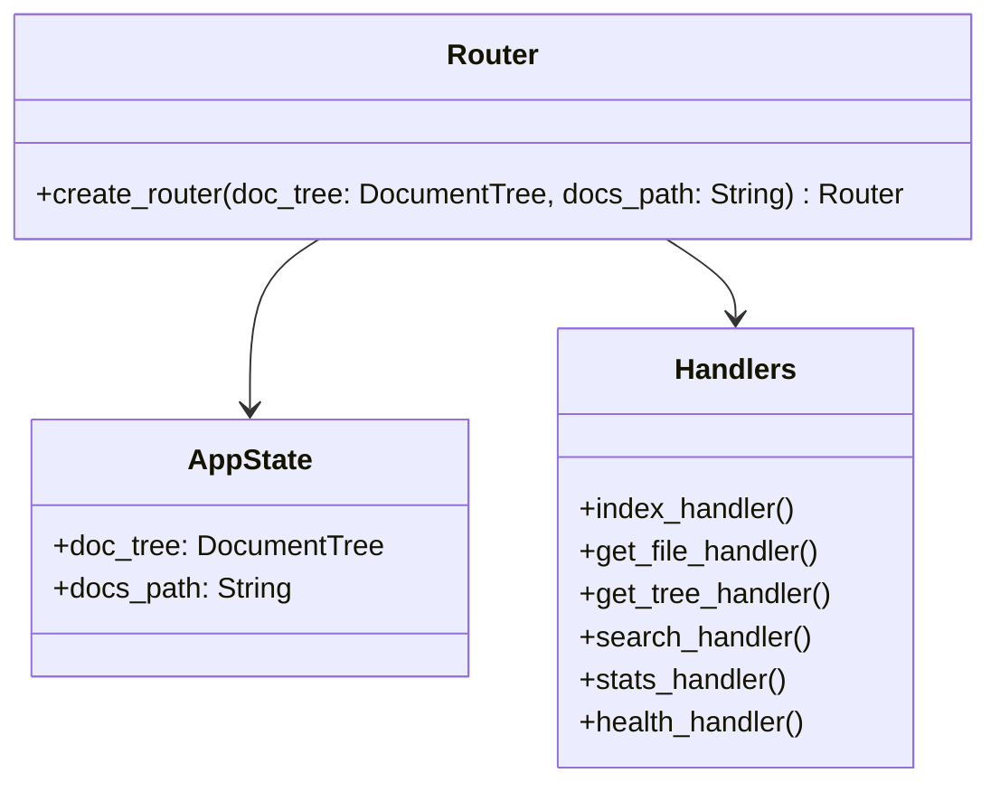
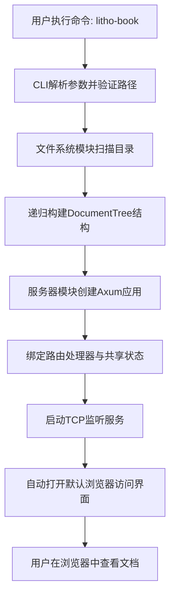
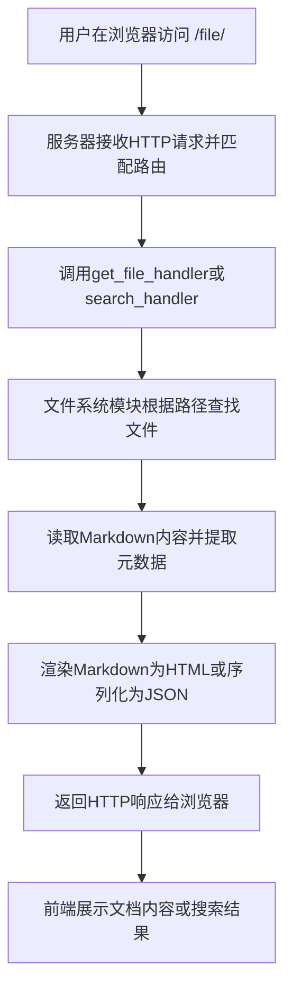
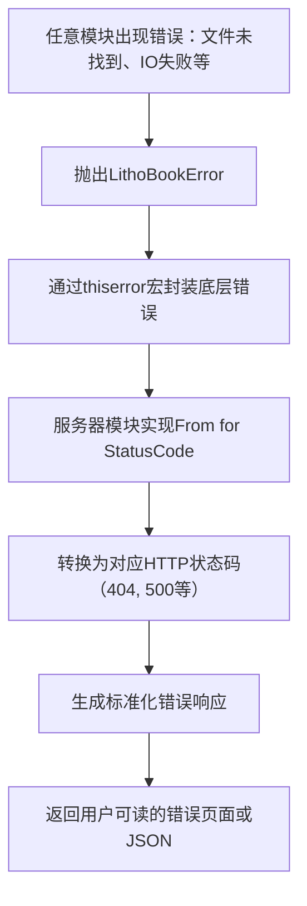
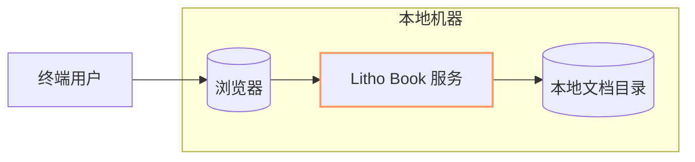

# 系统架构文档

## 1. 架构概览 (Architecture Overview)

### 架构设计理念
Litho Book 遵循**轻量级、离线优先、隐私安全**的核心设计哲学，旨在为开发者和技术文档作者提供一种无需云端依赖的本地 Markdown 文档浏览解决方案。系统采用**命令行驱动 + Web 服务渲染**的混合交互模式，结合了 CLI 的简洁启动与 Web 界面的丰富交互优势。

架构设计强调：
- **零外部依赖**：不依赖数据库、云存储或复杂构建工具
- **单机运行**：完全在本地环境中执行，保障数据隐私
- **快速启动**：通过 Rust 编译优化实现毫秒级服务启动
- **结构化展示**：将扁平文件系统转化为可导航的知识图谱

### 核心架构模式
系统采用典型的**分层架构（Layered Architecture）**，包含清晰的职责分离：

```
┌─────────────────┐
│   用户界面层    │ ← 浏览器端 HTML/CSS/JS
└────────┬────────┘
         ↓
┌────────▼────────┐
│   服务接口层    │ ← Axum HTTP 路由处理器
└────────┬────────┘
         ↓
┌────────▼────────┐
│   数据处理层    │ ← DocumentTree 构建与管理
└────────┬────────┘
         ↓
┌────────▼────────┐
│   数据源层      │ ← 操作系统文件系统
└─────────────────┘
```

同时融合了**模块化设计**原则，各功能域高内聚、低耦合，便于维护和扩展。

### 技术栈概述
| 类别 | 技术选型 | 选择理由 |
|------|--------|---------|
| **编程语言** | Rust | 内存安全、高性能、编译为静态二进制 |
| **Web 框架** | Axum | 异步支持好、类型安全、与 Tokio 兼容 |
| **CLI 解析** | Clap | 声明式 API、自动帮助生成、跨平台 |
| **错误处理** | thiserror | 统一错误封装、上下文追溯 |
| **序列化** | Serde | 高效 JSON 处理、宏驱动 |
| **日志系统** | Tracing | 结构化日志、异步友好 |
| **异步运行时** | Tokio | 成熟生态、高性能事件循环 |

---

## 2. 系统上下文 (System Context)

### 系统定位与价值
Litho Book 定位于**本地知识库可视化工具**，填补了传统文件管理器与静态网站生成器之间的体验空白。其核心价值在于：
- 将分散的 `.md` 文件组织为结构化的文档树
- 提供浏览器端的搜索、导航和预览功能
- 实现“开箱即用”的零配置文档服务
- 保障敏感技术文档的本地化存储与访问

### 用户角色与场景
| 角色 | 使用场景 | 关键需求 |
|------|--------|---------|
| **开发者** | 查看项目 README、API 文档 | 快速启动、离线可用、隐私保护 |
| **技术文档作者** | 预览写作成果、测试文档结构 | 实时刷新、目录导航、内容搜索 |
| **知识管理者** | 整合团队笔记、个人知识库 | 集中管理、可视化结构、简单部署 |

### 外部系统交互


- **操作系统文件系统**：只读访问用户指定目录下的 Markdown 文件
- **网络接口（TCP）**：绑定本地端口提供 HTTP 服务
- **默认浏览器**：自动启动并访问服务地址

### 系统边界定义
#### 包含组件
- ✅ CLI 参数解析器（Clap）
- ✅ 文件系统扫描与文档树构建
- ✅ Markdown 内容读取与元数据提取
- ✅ Axum HTTP 服务与 REST API
- ✅ HTML 模板渲染与前端交互
- ✅ 错误统一处理与日志系统

#### 排除组件
- ❌ 文档编辑器（仅阅读模式）
- ❌ Git 版本控制集成
- ❌ 用户账户与权限系统
- ❌ 云存储同步（如 Dropbox）
- ❌ 数据库（SQLite 等）
- ❌ 实时协作功能
- ❌ 移动 App 或桌面打包版本
- ❌ 插件系统或扩展机制

> **边界说明**：Litho Book 是一个纯粹的本地文档阅读器，不涉及任何持久化修改、远程同步或用户认证功能。

---

## 3. 容器视图 (Container View)

### 领域模块划分
根据业务关注点，系统划分为四个核心领域模块：



| 模块 | 类型 | 职责 |
|------|-----|------|
| **命令行接口域** | 用户交互 | 参数解析、路径验证、服务启动协调 |
| **文件系统域** | 数据处理 | 扫描目录、构建文档树、读取内容 |
| **服务器域** | 后端服务 | HTTP 路由、状态管理、响应序列化 |
| **通用错误域** | 支撑服务 | 统一错误定义、HTTP 映射转换 |

### 存储设计
系统采用**无数据库设计**，所有数据来源于本地文件系统：

- **主存储**：用户指定的 Markdown 文件目录
- **内存缓存**：
  - `DocumentTree`: 预构建的文档结构树
  - `file_map`: 路径到实际文件的映射表
- **临时状态**：`AppState` 中共享的应用状态

> ⚠️ **注意**：所有数据均为只读，不会对原始文件进行任何修改。

### 领域模块间通信
| 依赖方向 | 通信方式 | 示例 |
|---------|----------|------|
| CLI → 文件系统 | 函数调用 `DocumentTree::new()` | 构建文档树 |
| CLI → 服务器 | 函数调用 `create_router()` | 创建 HTTP 应用 |
| 服务器 → 文件系统 | 方法调用 `get_file_content()` | 获取文件内容 |
| 所有模块 → 错误域 | 错误传播 `anyhow::Result<T>` | 统一错误处理 |

关键通信机制：
- **共享状态**：通过 `AppState` 在多个请求间共享 `DocumentTree`
- **错误链**：使用 `#[from]` 宏实现底层错误向上聚合
- **异步协调**：Tokio 运行时管理并发请求处理

---

## 4. 组件视图 (Component View)

### 核心功能组件
#### 命令行接口域


- **Args**: Clap 定义的参数结构体，包含文档目录、端口、主机等配置
- **Main**: 主函数入口，负责初始化、流程编排和错误退出

#### 文件系统域


- **DocumentTree**: 核心数据结构，代表整个文档目录的树形表示
- **FileNode**: 树节点，包含名称、路径、子节点及元数据
- **file_map**: 哈希表实现 O(1) 路径查找性能

#### 服务器域


- **AppState**: Axum 共享状态，确保多请求访问同一份数据
- **路由处理器**：每个 API 端点对应一个异步处理函数
- **CORS Layer**: 允许任意来源访问（本地服务适用）

#### 通用错误域
```mermaid
classDiagram
    class LithoBookError {
        +Io(std::io::Error)
        +Json(serde_json::Error)
        +FileNotFound{ path: String }
        +InvalidPath{ path: String }
        +DirectoryScan(String)
        +Server(String)
        +Config(String)
    }
    
    class Result~T~ {
        <<type alias>>
        std::result::Result<T, LithoBookError>
    }
    
    LithoBookError --> "From" --> axum::http::StatusCode
    Result~T~ ..> LithoBookError
```

- **枚举式错误设计**：覆盖所有可能的错误场景
- **自动转换**：`From<LithoBookError> for StatusCode` 实现 HTTP 映射

---

## 5. 关键流程 (Key Processes)

### 核心功能流程：文档浏览启动流程


**详细步骤**：
1. `cli::Args::parse()` 解析命令行参数
2. `args.validate()` 验证目录存在且为有效路径
3. `DocumentTree::new()` 扫描目录并构建树结构
4. `server::create_router()` 初始化 Axum 应用
5. `TcpListener::bind()` 监听指定端口
6. `open_browser()` 调用系统命令打开浏览器
7. 用户通过 `/api/tree` 加载文档结构

### 技术处理流程：文档内容查询流程


**性能优化点**：
- 路径查找使用 `HashMap` 实现 O(1) 查询
- Markdown 渲染在请求时动态执行（避免预渲染开销）
- 元数据从文件系统实时获取保证准确性

### 异常处理机制：系统错误处理流程


**错误分类与映射**：
| 错误类型 | HTTP 状态码 | 场景示例 |
|---------|------------|---------|
| `FileNotFound` | 404 Not Found | 请求不存在的文件 |
| `InvalidPath` | 400 Bad Request | 路径格式非法 |
| `Io` / `Json` | 500 Internal Server Error | 文件读取失败、序列化异常 |
| `Config` | 400 Bad Request | 配置参数无效 |

---

## 6. 技术实现 (Technical Implementation)

### 核心模块实现

#### 文档树构建算法
```rust
fn build_tree(
    current_path: &Path,
    base_path: &Path,
    file_map: &mut HashMap<String, PathBuf>,
    stats: &mut TreeStats,
) -> anyhow::Result<FileNode> {
    // 1. 获取文件名和相对路径
    let name = current_path.file_name().unwrap().to_string_lossy();
    let relative_path = current_path.strip_prefix(base_path).unwrap().to_str().replace('\\', '/');
    
    // 2. 处理文件节点
    if current_path.is_file() {
        if is_markdown_file(current_path) {
            file_map.insert(relative_path.clone(), current_path.to_path_buf());
            // 记录统计信息
            stats.total_files += 1;
            stats.total_size += metadata.len();
        }
        return Ok(FileNode { /* ... */ });
    }
    
    // 3. 处理目录节点（递归）
    let mut children = Vec::new();
    let mut entries: Vec<_> = std::fs::read_dir(current_path)?.collect();
    
    // 4. 排序：目录优先，同类型按名称排序
    entries.sort_by(|a, b| {
        let a_is_dir = a.path().is_dir();
        let b_is_dir = b.path().is_dir();
        match (a_is_dir, b_is_dir) {
            (true, false) => Ordering::Less,
            (false, true) => Ordering::Greater,
            _ => a.file_name().cmp(&b.file_name()),
        }
    });
    
    // 5. 递归构建子树
    for entry in entries {
        let child = Self::build_tree(&entry.path(), base_path, file_map, stats)?;
        children.push(child);
    }
    
    Ok(FileNode { name, path: relative_path, is_file: false, children, .. })
}
```

**关键特性**：
- **递归深度优先遍历**
- **智能排序策略**：目录优先 + 字母顺序
- **隐藏文件过滤**：跳过以 `.` 开头的文件
- **非 Markdown 过滤**：仅保留 `.md` 文件

#### 响应序列化实现
```rust
async fn get_file_handler(
    Query(params): Query<FileQuery>,
    State(state): State<AppState>,
) -> Result<Json<FileResponse>, StatusCode> {
    let file_path = params.file.ok_or(StatusCode::BAD_REQUEST)?;
    
    // 从内存映射中查找文件
    let content = state.doc_tree.get_file_content(&file_path)?;
    let html = state.doc_tree.render_markdown(&content);
    
    // 提取元数据
    let file_info = state.file_map.get(&file_path).and_then(|path| {
        std::fs::metadata(path).ok().map(|m| (m.len(), format_modified_time(m.modified())))
    });
    
    // 构造响应对象
    let response = FileResponse {
        content,
        html,
        path: file_path,
        size: file_info.as_ref().map(|(s, _)| *s),
        modified: file_info.and_then(|(_, m)| m),
    };
    
    Ok(Json(response))
}
```

使用 Serde 自动序列化为 JSON，前端可直接消费。

### 数据结构设计
#### FileNode 设计考量
```rust
#[derive(Debug, Clone, Serialize, Deserialize)]
pub struct FileNode {
    pub name: String,
    pub path: String,
    pub is_file: bool,
    pub children: Vec<FileNode>,
    #[serde(skip_serializing_if = "Option::is_none")]
    pub size: Option<u64>,
    #[serde(skip_serializing_if = "Option::is_none")]
    pub modified: Option<String>,
}
```

- **条件序列化**：`skip_serializing_if` 减少 JSON 体积
- **克隆友好**：实现 `Clone` 便于状态共享
- **跨平台路径**：使用 `/` 分隔符兼容 Windows 和 Unix

### 性能优化策略
| 优化点 | 实现方式 | 效果 |
|-------|---------|------|
| **启动速度** | 预构建文档树 | 首次加载后无需重复扫描 |
| **查询性能** | HashMap 路径索引 | O(1) 文件查找 |
| **内存效率** | 共享 DocumentTree | 避免多请求复制数据 |
| **网络传输** | 条件序列化 | 减少 JSON 响应大小 |
| **并发处理** | Tokio 异步运行时 | 高并发请求支持 |

---

## 7. 部署架构 (Deployment Architecture)

### 运行环境要求
| 项目 | 要求 |
|------|------|
| **操作系统** | Windows, macOS, Linux |
| **Rust 版本** | 1.70+ （推荐稳定版） |
| **磁盘空间** | 可执行文件约 5-10MB + 文档存储空间 |
| **内存** | ≥ 128MB RAM（取决于文档规模） |
| **端口** | 默认 3000，可自定义 1024-65535 |

### 部署拓扑结构


- 单进程运行，无外部依赖
- 服务绑定 `127.0.0.1` 默认仅本机访问
- 可通过 `--host 0.0.0.0` 开放局域网访问

### 扩展性设计
#### 水平扩展
- ❌ 不支持多实例负载均衡（单机工具定位）
- ✅ 可在同一台机器运行多个实例于不同端口

#### 垂直扩展
- ✅ 支持超大文档库（内存足够即可）
- ✅ 动态搜索性能随 SSD 提升而改善
- ✅ 异步架构支持高并发浏览请求

#### 扩展点建议
1. **插件系统**：允许自定义渲染器或元数据提取器
2. **缓存层**：增加 Redis 缓存频繁访问的内容
3. **身份验证**：添加 Basic Auth 保护私人文档
4. **导出功能**：支持 PDF/HTML 打包下载

### 监控与运维
#### 内建监控能力
- **健康检查**：`/health` 端点返回服务状态
- **统计信息**：`/api/stats` 提供文档库指标
- **结构化日志**：Tracing 输出调试信息

#### 运维指导
```bash
# 启动服务（基础）
litho-book ./docs --port 3000

# 启动服务（高级）
litho-book ./docs \
  --port 8080 \
  --host 0.0.0.0 \
  --open \
  --verbose

# 查看帮助
litho-book --help
```

**最佳实践**：
- 将常用命令写入 shell 别名或脚本
- 使用 `--verbose` 调试启动问题
- 定期清理文档目录避免性能下降
- 避免在机械硬盘上处理超大文档库

---

## 架构洞察与决策支持

### 扩展性设计思考
当前架构已具备良好的垂直扩展能力，未来可通过以下方式增强：
- **懒加载机制**：对于超大目录，改为按需扫描子目录
- **增量更新**：监听文件变化，动态更新 `DocumentTree`
- **分布式部署**：改造为客户端-服务器模式，支持远程文档库

### 性能考虑
**潜在瓶颈**：
1. **初始扫描时间**：大型文档库首次启动较慢
2. **内存占用**：完整文档树驻留内存
3. **全文搜索性能**：线性遍历所有文件

**优化建议**：
- 引入 SQLite 全文索引加速搜索
- 实现 LRU 缓存热门文件内容
- 添加进度指示器提升用户体验

### 安全性设计
**现有防护**：
- 默认绑定 `127.0.0.1` 限制外网访问
- 严格的路径验证防止目录穿越
- 统一错误处理避免信息泄露

**改进建议**：
- 添加 CSP 头防止 XSS 攻击
- 支持 HTTPS 本地证书加密传输
- 实现访问令牌认证机制

### 开发与运维指导
#### 开发者指南
- 新增 API 需遵循 `axum::routing::get()` 模式
- 错误应继承 `LithoBookError` 枚举
- 共享状态必须通过 `State<AppState>` 注入

#### 运维建议
- 生产环境建议使用 systemd/pm2 管理进程
- 可结合 nginx 反向代理实现域名访问
- 日志级别设置为 `info` 平衡可观测性与性能

本架构文档为 Litho Book 提供了全面的技术蓝图，既满足当前轻量级本地文档阅读的需求，也为未来的演进留下了合理的设计空间。