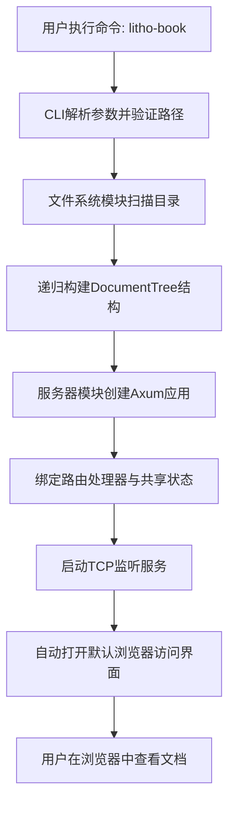
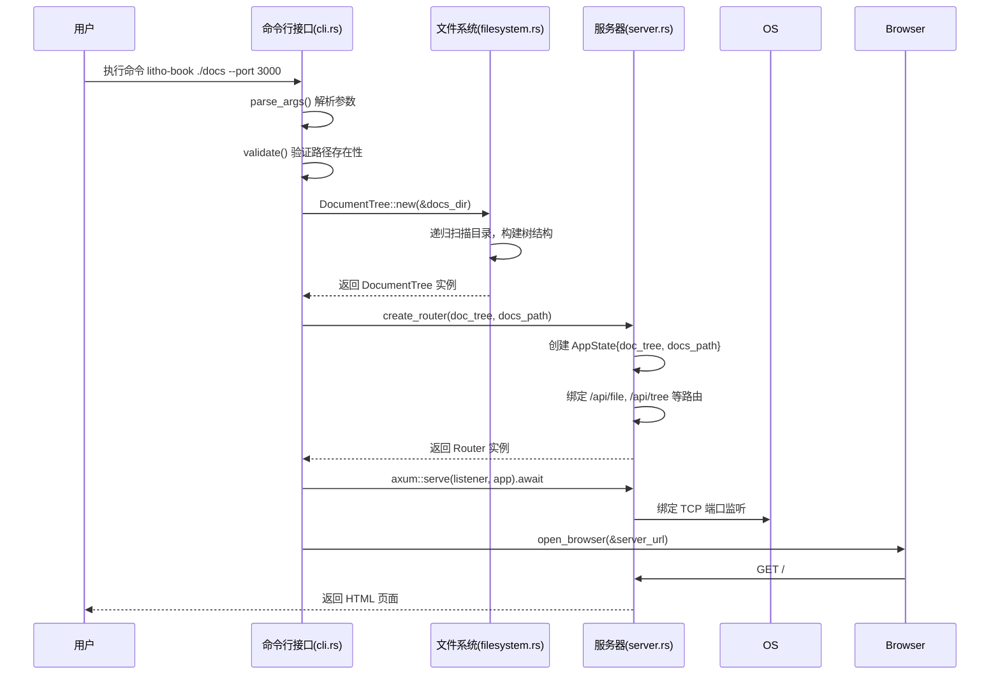
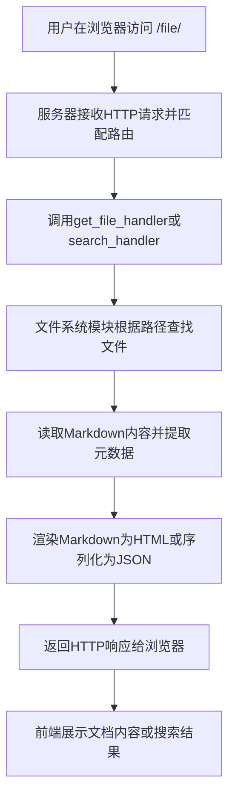
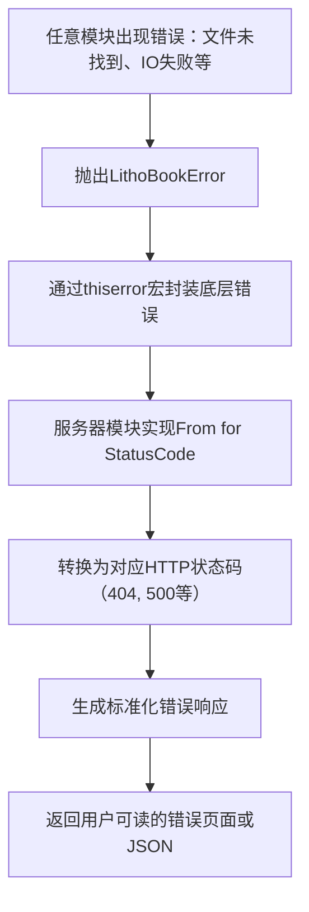
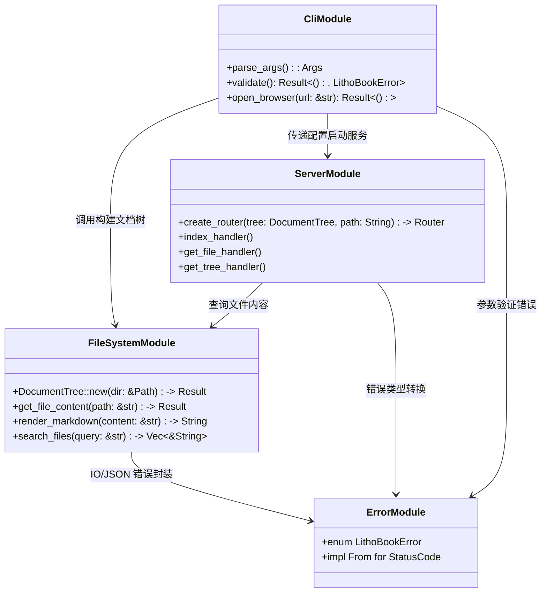

# 核心工作流程

## 1. 工作流程概览 (Workflow Overview)

Litho Book 是一个基于 Rust 构建的本地 Markdown 文档阅读器，其核心工作流程围绕“**从命令行启动到 Web 浏览器展示文档**”这一主干路径展开。系统通过 CLI 入口接收用户指令，协调文件系统扫描与 Web 服务启动两大核心模块，最终将本地 Markdown 文件转化为可交互的 Web 界面。

### 系统主干工作流程
整个系统的执行始于 `src/main.rs` 的 `main()` 函数，遵循以下关键执行路径：
1. **参数解析与验证**：CLI 模块解析用户输入的文档目录、端口等参数，并进行有效性检查。
2. **文档树构建**：文件系统模块递归扫描指定目录，过滤非 Markdown 文件，构建结构化的 `DocumentTree`。
3. **Web 服务初始化**：服务器模块创建 Axum 路由器，绑定共享状态（包含文档树），并注册 API 处理器。
4. **服务启动与浏览器打开**：绑定 TCP 监听器，启动 HTTP 服务器，并根据配置自动打开默认浏览器。

### 核心执行路径


### 关键流程节点
- **入口节点**：`main()` 函数调用 `cli::Args::parse()`
- **数据采集节点**：`filesystem::DocumentTree::new()` 执行目录扫描
- **服务暴露节点**：`server::create_router()` 注册所有 API 路由
- **用户触达节点**：`open_browser()` 尝试启动操作系统默认浏览器

### 流程协调机制
各模块通过清晰的依赖关系和数据传递实现协调：
- **CLI → 文件系统**：传递 `docs_dir` 路径用于构建文档树
- **CLI → 服务器**：传递端口、主机地址用于绑定服务
- **文件系统 → 服务器**：通过 `AppState` 共享 `DocumentTree` 实例
- **错误处理贯穿全链路**：统一使用 `LithoBookError` 进行异常封装与转换

---

## 2. 主要工作流程 (Main Workflows)

### 核心业务流程详解

#### 2.1 文档浏览启动流程
这是系统的核心业务流程，连接用户意图与功能交付。



**输入输出数据流转**：
- **输入**：`docs_dir: PathBuf`, `port: u16`, `host: String`, `open: bool`
- **中间产物**：`DocumentTree { root: FileNode, file_map: HashMap<String, PathBuf>, stats: TreeStats }`
- **输出**：运行中的 HTTP 服务实例 + 可能触发的浏览器进程

#### 2.2 文档内容查询流程
该流程体现系统的动态服务能力，支持实时内容获取。



**技术流程说明**：
1. 请求进入 Axum 路由系统，匹配 `/api/file?file=guide/intro.md`
2. `get_file_handler()` 提取查询参数 `file`
3. 通过 `AppState.doc_tree.get_file_content()` 查找文件内容
4. 使用 `pulldown-cmark` 库将 Markdown 渲染为 HTML
5. 构造 `FileResponse` 结构体并序列化为 JSON 响应

**数据流示例**：
```json
// 请求
GET /api/file?file=README.md

// 响应
{
  "content": "# Litho Book\nA web-based reader...",
  "html": "<h1>Litho Book</h1><p>A web-based reader...</p>",
  "path": "README.md",
  "size": 1024,
  "modified": "2025-04-10 14:30:00"
}
```

#### 2.3 系统错误处理流程
统一的错误处理机制保障了系统的健壮性和用户体验一致性。



**错误类型映射表**：
| 错误类型 | HTTP 状态码 | 触发场景 |
|---------|------------|--------|
| `FileNotFound` | 404 Not Found | 请求的文件不存在于 `file_map` 中 |
| `InvalidPath` | 400 Bad Request | 用户提供的路径格式非法 |
| `Io` | 500 Internal Server Error | 文件读取、目录扫描等 IO 操作失败 |
| `Json` | 500 Internal Server Error | JSON 序列化/反序列化失败 |

---

## 3. 流程协调与控制 (Flow Coordination)

### 多模块协调机制
系统采用分层架构设计，各模块职责分明且协同工作：



### 状态管理和同步
- **共享状态**：通过 `AppState` 结构体在多个请求间共享 `DocumentTree` 和 `docs_path`。
- **不可变性保证**：`DocumentTree` 在服务启动后不再修改，避免并发写入问题。
- **线程安全**：`AppState` 被包装在 Axum 的 `State<T>` 提取器中，确保跨异步任务的安全访问。

### 数据传递和共享
- **路径映射**：`file_map: HashMap<String, PathBuf>` 实现相对路径到绝对路径的快速查找（O(1) 时间复杂度）。
- **统计信息缓存**：`TreeStats` 在构建文档树时一次性计算并缓存，避免重复遍历。
- **模板注入**：`generate_index_html()` 将 `tree_json` 和 `docs_path` 注入 HTML 模板，实现前后端数据传递。

### 执行控制和调度
- **启动顺序控制**：`main()` 函数严格按顺序执行参数验证 → 构建文档树 → 启动服务。
- **异步运行时**：使用 `#[tokio::main]` 宏启动 Tokio 异步运行时，支持高并发请求处理。
- **资源清理**：当用户按下 Ctrl+C 时，Tokio 会优雅关闭服务器并终止程序。

---

## 4. 异常处理与恢复 (Exception Handling)

### 错误检测和处理
系统采用集中式错误管理策略，所有错误最终都归结为 `LithoBookError` 枚举：

```rust
#[derive(Error, Debug)]
pub enum LithoBookError {
    #[error("IO error: {0}")]
    Io(#[from] std::io::Error),
    
    #[error("JSON serialization error: {0}")]
    Json(#[from] serde_json::Error),
    
    #[error("File not found: {path}")]
    FileNotFound { path: String },
    
    #[error("Invalid file path: {path}")]
    InvalidPath { path: String },
}
```

**错误传播链示例**：
```
std::fs::read_dir() 
→ std::io::Error 
→ LithoBookError::Io 
→ axum::http::StatusCode::INTERNAL_SERVER_ERROR
```

### 异常恢复机制
- **启动阶段**：若参数验证失败或文档目录扫描出错，程序立即退出（`std::process::exit(1)`），防止不一致状态。
- **运行阶段**：单个请求失败不会影响其他请求，错误被局部捕获并返回相应状态码。
- **日志记录**：使用 `tracing` 库记录错误详情（`error!()`、`warn!()`），便于故障排查。

### 容错策略设计
- **静默跳过无效文件**：遇到隐藏文件（`.` 开头）或非 `.md` 文件时仅打印 debug 日志，继续处理其余文件。
- **宽松的搜索逻辑**：`search_files()` 支持路径片段匹配和大小写不敏感搜索，提升可用性。
- **多平台浏览器兼容**：`open_browser()` 函数针对 Windows、macOS、Linux 分别使用 `cmd/start`、`open`、`xdg-open` 命令尝试启动浏览器。

### 失败重试和降级
- **浏览器自动打开失败**：若无法自动打开浏览器，系统会提示用户手动访问 URL，而非中断服务。
- **端口占用检测**：虽然当前版本未主动检测端口占用，但会在绑定失败时输出清晰错误信息（“无法绑定到地址”）。
- **降级显示**：即使某些文件读取失败，只要文档树构建成功，主界面仍可正常加载。

---

## 5. 关键流程实现 (Key Process Implementation)

### 核心算法流程

#### 5.1 文档树构建算法
```rust
fn build_tree(
    current_path: &Path,
    base_path: &Path,
    file_map: &mut HashMap<String, PathBuf>,
    stats: &mut TreeStats,
) -> anyhow::Result<FileNode> {
    // 1. 获取文件名和相对路径
    let name = current_path.file_name().unwrap().to_string_lossy();
    let relative_path = current_path.strip_prefix(base_path).unwrap().to_str().replace('\\', '/');
    
    // 2. 判断是文件还是目录
    if current_path.is_file() {
        // 2.1 只处理 .md 文件
        if path.extension().and_then(|s| s.to_str()) == Some("md") {
            // 2.2 记录文件信息到 file_map 和 stats
            file_map.insert(relative_path.clone(), current_path.to_path_buf());
            stats.total_files += 1;
            stats.total_size += metadata.len();
        }
        
        // 2.3 返回文件节点
        return Ok(FileNode { name, path: relative_path, is_file: true, children: vec![], size: Some(...), modified: ... });
    }
    
    // 3. 处理目录：先读取子项，再排序
    let mut entries: Vec<_> = std::fs::read_dir(current_path)?.collect();
    entries.sort_by(|a, b| {
        let a_is_dir = a.path().is_dir(); let b_is_dir = b.path().is_dir();
        match (a_is_dir, b_is_dir) {
            (true, false) => Less,      // 目录优先
            (false, true) => Greater,   // 文件次之
            _ => a.file_name().cmp(&b.file_name()), // 同类按名称排序
        }
    });
    
    // 4. 递归构建子树
    for entry in entries {
        let path = entry.path();
        // 跳过隐藏文件...
        match Self::build_tree(&path, base_path, file_map, stats) {
            Ok(child) => children.push(child),
            Err(e) => warn!(\"Failed to process path {}: {}\", path.display(), e),
        }
    }
    
    // 5. 返回目录节点
    Ok(FileNode { name, path: relative_path, is_file: false, children, size: None, modified: None })
}
```

**算法特点**：
- **时间复杂度**：O(n log n)，主要消耗在每层目录的排序操作。
- **空间复杂度**：O(n)，存储所有文件节点和路径映射。
- **稳定性**：使用稳定排序算法，保证相同名称文件的顺序一致性。

#### 5.2 Markdown 渲染管道
```rust
pub fn render_markdown(&self, content: &str) -> String {
    use pulldown_cmark::{Parser, Options, html};
    
    // 1. 配置解析选项
    let mut options = Options::empty();
    options.insert(Options::ENABLE_TABLES);
    options.insert(Options::ENABLE_FOOTNOTES);
    // ... 启用多种扩展语法
    
    // 2. 创建 Markdown 解析器
    let parser = Parser::new_ext(content, options);
    
    // 3. 将解析结果转换为 HTML
    let mut html_output = String::new();
    html::push_html(&mut html_output, parser);
    
    html_output
}
```

**性能优化点**：
- **零拷贝字符串处理**：大量使用 `&str` 和 `String::new()` 避免不必要的内存分配。
- **预编译正则表达式**：虽未显式使用 regex，但 `pulldown-cmark` 内部已优化常见模式匹配。
- **批量写入**：`push_html()` 直接追加到目标字符串缓冲区，减少中间对象创建。

### 数据处理管道
完整的数据流动路径如下：
```
文件系统 (.md 文件)
     ↓ read_to_string()
Rust 字符串 (Markdown 源码)
     ↓ pulldown_cmark::Parser
事件流 (Heading, Text, CodeBlock...)
     ↓ html::push_html()
HTML 字符串
     ↓ serde_json::to_value()
JSON 序列化
     ↓ Axum Response
HTTP 响应体
```

### 业务规则执行
- **文件过滤规则**：
  - 排除以 `.` 开头的隐藏文件/目录
  - 仅包含扩展名为 `.md` 的文件
- **排序规则**：
  - 目录排在文件之前
  - 同类项按文件名升序排列（不区分大小写）
- **安全规则**：
  - 不允许路径穿越攻击（如 `../../../etc/passwd`），因为所有路径均来自预扫描的 `file_map`
  - CORS 设置为宽松模式（`.layer(CorsLayer::permissive())`），适用于本地开发环境

### 技术实现细节
- **异步框架**：使用 Tokio 作为运行时，Axum 作为 Web 框架，天然支持异步非阻塞 I/O。
- **依赖注入**：通过 `Router::with_state(state)` 将 `AppState` 注入所有处理器函数。
- **编译时模板**：使用 `include_str!(\"../templates/index.html.tpl\")` 在编译期嵌入 HTML 模板，减少运行时文件 I/O。
- **跨平台兼容**：`open_browser()` 函数针对不同操作系统使用原生命令行工具启动浏览器。

该系统通过精巧的模块划分、严谨的错误处理和高效的异步架构，实现了轻量级、高性能、易用的本地文档浏览体验，充分体现了 Rust 语言在系统编程领域的优势。