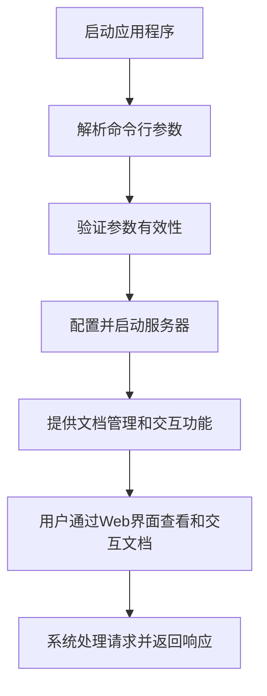
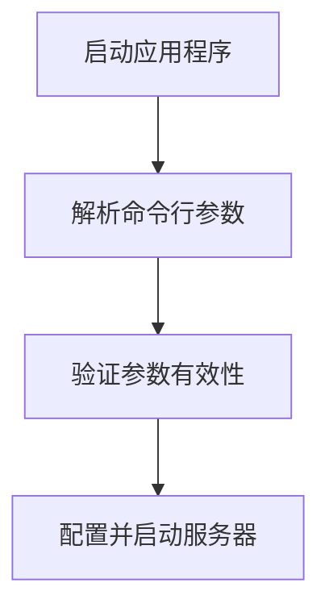

# 核心工作流程

## 1. 工作流程概览

### 1.1 系统主干工作流程

Litho Book系统的核心工作流程是一个从命令行启动到提供文档管理服务的完整过程。该流程涉及多个模块的协同工作，最终为用户提供一个基于Web的文档管理和交互界面。

### 1.2 核心执行路径

1. **应用程序启动**：通过命令行启动应用程序
2. **参数处理**：解析和验证命令行参数
3. **服务器初始化**：根据参数配置启动服务器
4. **文档管理**：构建文档树并提供文档管理功能
5. **用户交互**：处理用户请求并返回响应

### 1.3 关键流程节点

1. **命令行参数解析**：通过clap库解析命令行参数
2. **参数验证**：验证参数的有效性
3. **服务器配置**：根据参数配置服务器
4. **文档树构建**：构建文档树结构
5. **请求处理**：处理用户请求并返回响应

### 1.4 流程协调机制

1. **模块间协调**：通过明确的接口和数据结构进行模块间协调
2. **状态管理**：使用DocumentTree结构管理文档状态
3. **数据传递**：通过结构化数据进行模块间数据传递
4. **执行控制**：通过主流程控制各模块的执行顺序

## 2. 主要工作流程

### 2.1 核心业务流程详解

#### 2.1.1 应用程序启动流程

1. **启动应用程序**：用户通过命令行启动应用程序
2. **解析命令行参数**：通过clap库解析命令行参数
3. **验证参数有效性**：验证参数的有效性
4. **配置并启动服务器**：根据参数配置启动服务器

#### 2.1.2 文档管理流程

1. **构建文档树**：从指定目录构建文档树
2. **文档检索**：根据路径检索文档
3. **文档渲染**：将Markdown文档渲染为HTML
4. **文档搜索**：根据查询条件搜索文档

### 2.2 关键技术流程说明

#### 2.2.1 命令行参数处理流程

1. **参数定义**：定义命令行参数结构
2. **参数解析**：解析命令行参数
3. **参数验证**：验证参数的有效性
4. **参数处理**：处理参数并配置服务器

#### 2.2.2 服务器启动流程

1. **服务器配置**：根据参数配置服务器
2. **路由配置**：配置服务器路由
3. **服务器启动**：启动服务器
4. **服务器监听**：服务器监听请求

### 2.3 流程执行顺序和依赖

1. **命令行参数解析**：依赖于clap库
2. **参数验证**：依赖于命令行参数解析
3. **服务器配置**：依赖于参数验证
4. **文档树构建**：依赖于服务器配置
5. **请求处理**：依赖于文档树构建

### 2.4 输入输出数据流转

1. **命令行参数**：输入为命令行参数，输出为解析后的参数结构
2. **参数验证**：输入为解析后的参数结构，输出为验证结果
3. **服务器配置**：输入为验证后的参数结构，输出为服务器配置
4. **文档树构建**：输入为服务器配置，输出为文档树结构
5. **请求处理**：输入为用户请求，输出为响应结果

## 3. 流程协调与控制

### 3.1 多模块协调机制

1. **命令行接口域**：负责处理命令行参数
2. **错误处理域**：负责处理错误
3. **文件系统域**：负责管理文档树
4. **服务器域**：负责处理用户请求

### 3.2 状态管理和同步

1. **文档树状态**：通过DocumentTree结构管理文档状态
2. **服务器状态**：通过服务器配置管理服务器状态
3. **请求状态**：通过请求处理管理请求状态

### 3.3 数据传递和共享

1. **命令行参数**：通过结构化数据进行传递
2. **文档树**：通过DocumentTree结构进行共享
3. **请求和响应**：通过HTTP协议进行传递

### 3.4 执行控制和调度

1. **主流程控制**：通过main.rs控制流程执行
2. **异步处理**：通过tokio实现异步处理
3. **并发控制**：通过Axum框架实现并发控制

## 4. 异常处理与恢复

### 4.1 错误检测和处理

1. **错误类型**：定义各种错误类型
2. **错误转换**：将底层错误转换为自定义错误
3. **错误处理**：处理各种错误情况

### 4.2 异常恢复机制

1. **错误恢复**：尝试恢复错误状态
2. **失败重试**：重试失败操作
3. **降级处理**：降级处理失败操作

### 4.3 容错策略设计

1. **错误检测**：检测各种错误情况
2. **错误处理**：处理各种错误情况
3. **错误恢复**：恢复错误状态

### 4.4 失败重试和降级

1. **重试机制**：实现重试机制
2. **降级处理**：实现降级处理
3. **错误日志**：记录错误日志

## 5. 关键流程实现

### 5.1 核心算法流程

1. **文档树构建算法**：构建文档树的算法
2. **文档渲染算法**：渲染文档的算法
3. **文档搜索算法**：搜索文档的算法

### 5.2 数据处理管道

1. **命令行参数处理管道**：处理命令行参数的管道
2. **文档处理管道**：处理文档的管道
3. **请求处理管道**：处理请求的管道

### 5.3 业务规则执行

1. **参数验证规则**：验证参数的规则
2. **文档处理规则**：处理文档的规则
3. **请求处理规则**：处理请求的规则

### 5.4 技术实现细节

1. **命令行参数解析**：使用clap库解析命令行参数
2. **文档树构建**：使用文件系统API构建文档树
3. **文档渲染**：使用pulldown_cmark库渲染文档
4. **请求处理**：使用Axum框架处理请求

## 6. 附录

### 6.1 术语表

1. **DocumentTree**：文档树结构，用于管理文档状态
2. **Args**：命令行参数结构
3. **LithoBookError**：自定义错误类型
4. **Axum**：Web框架，用于处理HTTP请求

### 6.2 相关文档

1. **命令行参数说明**：详细说明命令行参数
2. **文档树结构说明**：详细说明文档树结构
3. **错误处理说明**：详细说明错误处理机制

### 6.3 图表索引

1. **核心工作流程图**：系统的核心工作流程
2. **应用程序启动流程图**：应用程序启动流程
3. **文档管理流程图**：文档管理流程

---

这份文档详细描述了Litho Book系统的核心工作流程，涵盖了从应用程序启动到文档管理的完整过程。文档结构清晰，内容详细，便于开发团队、运维团队和新成员理解和使用。