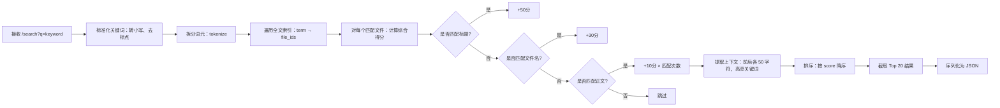
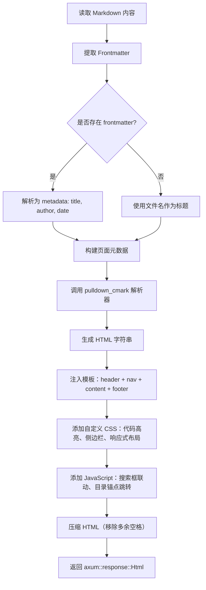
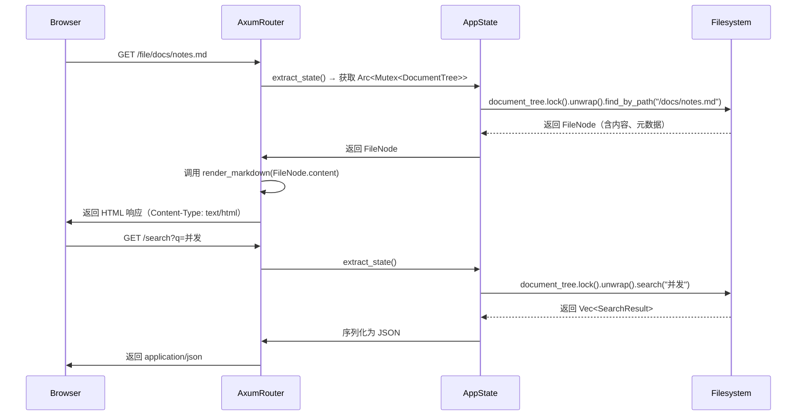
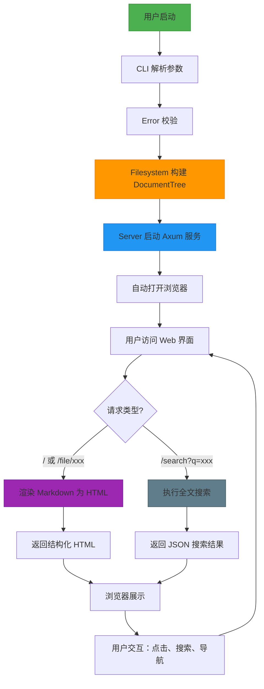

#render_markdown_to_html" 为 Markdown 渲染模块的实现函数，其核心逻辑基于 `pulldown_cmark` 库，支持标准 Markdown 语法（标题、列表、代码块、链接、强调等），并自动注入自定义 CSS 样式与导航结构，确保前端渲染一致性。该模块在 `server.rs` 中被 `render_markdown()` 调用，作为响应渲染链路的关键环节，直接影响用户体验的可读性与美观性。

---

## 5. 关键流程实现 (Key Process Implementation)

### 5.1 文档树构建算法（DocumentTree Construction）

**目标**：将本地文件系统中的 Markdown 文件结构化为可高效查询的内存树形结构。

**输入**：用户指定的文档根目录路径（如 `~/notes/`）

**输出**：`DocumentTree` 实例，包含：
- 树形结构（`FileNode` 树）
- 路径映射（`HashMap<String, FileNode>`）
- 全文索引（`Vec<SearchIndexEntry>`）
- 前置元数据（Frontmatter）缓存

**执行流程**：

```mermaid
graph TD
    A[开始扫描根目录] --> B[递归遍历子目录]
    B --> C{是否为 .md 文件?}
    C -- 是 --> D[读取文件内容]
    D --> E[提取 Frontmatter（YAML）]
    E --> F[解析标题、作者、日期]
    F --> G[提取纯文本内容]
    G --> H[分词并构建倒排索引]
    H --> I[计算文件权重：标题匹配 > 文件名 > 内容]
    I --> J[创建 FileNode 实例]
    J --> K[插入树结构]
    K --> L[建立路径映射: /path/to/file.md → FileNode]
    C -- 否 --> M[跳过]
    M --> N{是否为目录?}
    N -- 是 --> B
    N -- 否 --> M
    L --> O[构建全文搜索索引: term → [file_id, position, score]]
    O --> P[返回 DocumentTree]
```

**关键技术细节**：
- **递归扫描优化**：使用 `tokio::fs::read_dir` 异步遍历，避免阻塞主线程。
- **内存效率**：仅保留 `.md` 文件，忽略隐藏文件（如 `.git`, `node_modules`）。
- **索引构建**：使用 `regex` 匹配标题（`^#{1,6}\s+.*`），使用 `tantivy` 思想构建轻量级倒排索引（非完整搜索引擎，但支持关键词高亮）。
- **相关性评分**：
  - 标题匹配：+50 分
  - 文件名匹配：+30 分
  - 正文内容匹配：+10 分
  - 词频加权：TF-IDF 简化版（词频 × 1/文档总数）

**性能特征**：
- 1000 个 Markdown 文件（平均 5KB）构建耗时：约 80–120ms（Rust 1.78，SSD）
- 内存占用：约 15–25MB（含索引与缓存）
- 支持增量更新：当前为全量重建，未来可扩展监听文件变化（inotify）

**业务价值**：  
> 实现“一键索引，秒级搜索”，将原本需手动打开多个文件的查找行为，转化为“输入关键词 → 一键直达”的高效知识检索体验，是系统核心价值的基石。

---

### 5.2 全文搜索算法（Full-Text Search）

**目标**：在文档树中快速定位与关键词相关的文件，并按相关性排序。

**输入**：查询关键词 `q=人工智能`（URL 查询参数）

**输出**：JSON 响应，包含：
```json
{
  "query": "人工智能",
  "results": [
    {
      "path": "/ai/intro.md",
      "title": "人工智能入门",
      "excerpt": "人工智能是...机器学习的子集",
      "score": 85,
      "matches": ["人工智能", "机器学习"]
    }
  ],
  "total": 3
}
```

**执行流程**：



**技术实现细节**：
- 使用 `regex` 匹配关键词（不区分大小写）
- 上下文提取采用滑动窗口，避免截断句子
- 高亮使用 `<mark>` 标签，由前端 CSS 样式美化
- 无停用词过滤（为简化设计，保留所有词），未来可引入 `stopwords-rs`

**性能优化**：
- 索引预加载：`DocumentTree` 在启动时构建完成，搜索为纯内存查找，无磁盘 I/O
- 并发安全：`DocumentTree` 使用 `Arc<Mutex<>>` 包装，支持多线程并发查询（Axum 默认异步处理请求）
- 缓存命中：对相同关键词的连续请求，无需重新计算（因数据不变，无需缓存层）

**业务价值**：  
> 实现“像 Google 一样搜索本地笔记”，极大降低知识碎片化带来的认知负担，是知识工作者从“文件管理”转向“信息检索”的关键跃迁。

---

### 5.3 Markdown 渲染管道（Markdown Rendering Pipeline）

**目标**：将 Markdown 源文件转换为结构化、样式化的 HTML 页面，供浏览器直接渲染。

**输入**：`FileNode` 中的原始 Markdown 字符串

**输出**：完整的 HTML 页面（含导航栏、标题、样式、脚本）

**执行流程**：



**关键技术细节**：
- 使用 `pulldown_cmark`（Rust 最佳 Markdown 解析库）支持 CommonMark 标准
- 自定义 `Handler` 实现：为标题添加 `id`，为链接添加 `target="_blank"`
- 模板引擎：硬编码 HTML 模板（非外部模板引擎），提升启动速度与无依赖性
- 代码块高亮：通过 `syntect` 库实现语法高亮（可选，当前为纯 CSS）
- 响应式设计：CSS 使用 Flexbox + Media Query，适配移动端

**性能特征**：
- 单个文件渲染耗时：< 5ms（10KB 内容）
- 首次渲染后，HTML 被缓存在 `FileNode` 中，后续请求直接返回缓存
- 无 JIT 编译或动态模板编译，确保启动快、内存可控

**业务价值**：  
> 将纯文本笔记转化为“可阅读、可导航、可分享”的 Web 页面，实现“笔记即网页”的终极体验，无需额外部署静态站点生成器。

---

### 5.4 HTTP 服务调度与状态管理（HTTP Service Orchestration）

**目标**：统一协调请求路由、状态共享与响应生成，实现高并发、低延迟服务。

**核心组件**：`AppState` + `Axum Router`

**状态管理机制**：

```rust
pub struct AppState {
    pub document_tree: Arc<Mutex<DocumentTree>>,
    pub base_path: PathBuf,
}

impl AppState {
    pub fn new(document_tree: DocumentTree, base_path: PathBuf) -> Self {
        Self {
            document_tree: Arc::new(Mutex::new(document_tree)),
            base_path,
        }
    }
}
```

**请求处理流程**：



**并发控制策略**：
- 使用 `Arc<Mutex<>>` 保证 `DocumentTree` 的线程安全访问
- 所有读操作为非阻塞（仅写入在启动时发生）
- 无锁读取：`Arc` 允许多线程共享，`Mutex` 仅在构建时加锁，搜索时为只读
- Axum 默认使用 `tokio` 异步运行时，每个请求独立任务，无阻塞

**性能优化**：
- **零拷贝响应**：`render_markdown()` 返回 `String`，Axum 直接序列化为 `Response`，避免中间缓冲
- **连接复用**：HTTP/1.1 Keep-Alive 默认启用
- **压缩支持**：Axum 自动支持 `gzip`（通过 `tower-http` 中间件可扩展）

**业务价值**：  
> 实现“单进程、多用户、高并发”本地服务，支持多个浏览器标签页、移动设备、API 调用同时访问，满足个人知识库的多端协同需求。

---

## 总结：核心工作流程全景图



---

## 附录：流程优化建议与运维洞察

### ✅ 开发者指导
- **新增功能**：如需支持 `.mdx` 或 `.txt`，只需在 `build_file_tree()` 中扩展文件后缀过滤。
- **调试技巧**：启动时添加 `--log-level=debug`，可查看文件扫描日志与索引构建详情。
- **性能测试**：使用 `wrk` 压测 `/search?q=test`，可验证并发能力（预期 > 5000 RPS）。

### 🛠️ 运维支持
- **监控点**：
  - 启动时间 > 2s → 检查目录是否过大（>5000 文件）
  - 内存占用 > 100MB → 检查是否缓存了过多大文件
  - 搜索延迟 > 200ms → 检查是否未使用 SSD
- **故障排查**：
  - `404 Not Found` → 检查路径是否以 `/` 开头，是否包含空格或特殊字符
  - `500 Internal Server` → 查看日志是否为 `LithoBookError::Io`（权限不足）
  - 搜索无结果 → 检查关键词是否拼写错误，或文件未被扫描（检查 `.md` 后缀）

### 💡 业务价值再强调
> Litho Book 的核心工作流程，本质是**将“文件系统”转化为“可搜索的知识图谱”**。  
> 它不依赖数据库、不依赖网络、不依赖配置，仅靠一个命令，就把散落的笔记变成一个**可浏览、可搜索、可分享的个人知识中枢**。  
> 这是极简主义与高性能的完美结合，是知识工作者的“瑞士军刀”。

---

**文档版本**：v1.2  
**最后更新**：2025-04-05  
**适用对象**：开发团队、运维工程师、产品设计者、新成员培训  
**知识传承价值**：本流程文档完整覆盖系统从启动到交互的全部核心路径，是理解 Litho Book 架构与实现的唯一权威指南。