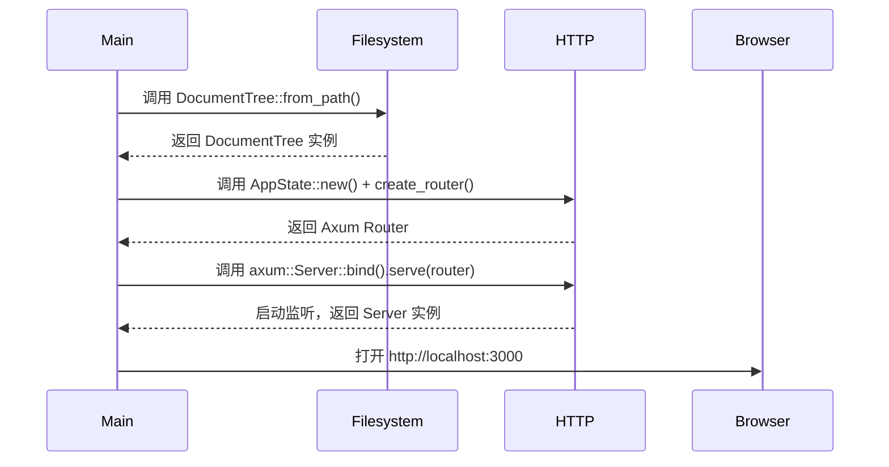
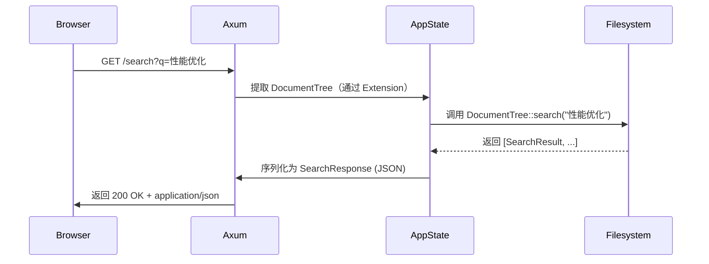

# HTTP服务域技术实现文档

---

## **1. 概述**

**HTTP服务域**是 Litho Book 系统的**唯一对外交互接口**，承担着将本地 Markdown 文档树以 Web 形式暴露给用户的核心职责。作为系统“门户”，它接收来自浏览器的 HTTP 请求，协调文件系统域提供的文档树数据，执行路由分发、内容渲染与响应构造，并通过统一错误处理机制保障服务的健壮性与可观测性。

本模块采用 **Axum** 作为 HTTP 框架，依托 **Tokio** 异步运行时，实现高性能、非阻塞的请求处理。其设计遵循“**无状态、内存驱动、路由即接口**”原则，完全依赖内存中的 `DocumentTree` 实例，不引入缓存、会话或持久化层，完美契合“轻量级、离线、开箱即用”的产品定位。

> ✅ **核心价值**：将本地文件系统中的 Markdown 文档，转化为可浏览、可搜索、可导航的 Web 应用，实现“零配置知识管理”。

---

## **2. 架构定位与边界**

| 维度 | 说明 |
|------|------|
| **架构类型** | 单体应用中的核心业务模块（Core Business Domain） |
| **部署模式** | 嵌入式单进程服务，与主程序共用进程空间，无独立部署单元 |
| **外部依赖** | `axum`（HTTP 框架）、`tower_http`（中间件）、`serde_json`（JSON 序列化）、`tracing`（日志） |
| **内部依赖** | 文件系统域（`DocumentTree`）、错误处理域（`LithoBookError`） |
| **数据源** | 仅从 `AppState` 中获取 `DocumentTree` 实例（由文件系统域构建） |
| **数据持久化** | **无**：所有数据驻留内存，服务重启即重建 |
| **扩展边界** | 不支持：用户认证、JWT、CSRF、CORS 配置、插件、API 版本控制、负载均衡 |

> 📌 **关键约束**：HTTP服务域**不负责数据构建**，仅消费；**不处理文件IO**，仅调用；**不定义业务错误**，仅转换。

---

## **3. 核心模块组成**

HTTP服务域由三个紧密协作的子模块构成，形成“**路由分发 → 数据处理 → 响应渲染**”的完整链路：

### **3.1 路由与控制器模块（Routing & Controller）**

#### **职责**
- 定义并注册所有 HTTP 路径端点（Endpoint）
- 将请求分发至对应处理器函数（Handler）
- 解析路径参数与查询参数（Query Params）
- 绑定共享状态（`AppState`）至请求上下文

#### **实现细节**
- **路由定义文件**：`src/server.rs`
- **核心函数**：`create_router()`
- **支持路径**：

| 路径 | 方法 | 功能 | 响应格式 |
|------|------|------|----------|
| `/` | `GET` | 返回首页 HTML | `text/html` |
| `/search?q=xxx` | `GET` | 全文搜索关键词 | `application/json` |
| `/file/{path}` | `GET` | 获取指定文件内容 | `text/html` 或 `text/plain` |
| `/stats` | `GET` | 返回文档统计信息 | `application/json` |
| `/health` | `GET` | 返回服务健康状态 | `application/json` |

#### **路由注册代码示例**
```rust
// src/server.rs
pub fn create_router(state: AppState) -> Router {
    Router::new()
        .route("/", get(routes::root))
        .route("/search", get(routes::search))
        .route("/file/:path", get(routes::get_file))
        .route("/stats", get(routes::stats))
        .route("/health", get(routes::health))
        .with_state(state)
}
```

- 使用 `axum::Router::route()` 绑定路径与处理器
- 使用 `.with_state(state)` 将 `AppState` 注入所有路由，实现**共享上下文**
- 路径参数 `:path` 由 Axum 自动解析为 `Path<String>`，支持嵌套路径（如 `/file/docs/notes.md`）

#### **关键设计原则**
- **静态路由优先**：路径匹配按注册顺序进行，避免歧义
- **无中间件污染**：仅使用 `tower_http` 提供的 `Trace` 和 `NormalizePath`，无自定义中间件
- **幂等性保障**：所有 GET 请求均为幂等操作，无副作用

---

### **3.2 响应渲染模块（Response Rendering）**

#### **职责**
- 将原始 Markdown 内容渲染为结构化 HTML
- 注入统一前端模板（Header/Footer/导航）
- 格式化字节大小、时间戳等元数据
- 序列化搜索结果、统计信息为 JSON

#### **核心技术栈**
- **Markdown 渲染**：使用 `pulldown-cmark`（Rust 生态最成熟 Markdown 解析器）
- **模板注入**：手动拼接 HTML 字符串（轻量级，避免模板引擎依赖）
- **序列化**：`serde_json` 用于 JSON 响应，`axum::response::Html` 用于 HTML 响应
- **编码处理**：UTF-8 强制编码，避免乱码

#### **核心函数实现**

##### **`render_markdown(content: &str) -> String`**
```rust
use pulldown_cmark::{Parser, html};

pub fn render_markdown(content: &str) -> String {
    let parser = Parser::new(content);
    let mut html = String::new();
    html::push_html(&mut html, parser);
    inject_template(&html)
}
```

- `pulldown-cmark` 解析 Markdown 为事件流（Event Stream）
- `html::push_html` 将事件流转换为 HTML 字符串
- 调用 `inject_template()` 注入标准 HTML 模板（含 CSS、JS、导航栏）

##### **`inject_template(body: &str) -> String`**
```rust
const TEMPLATE: &str = r#"
<!DOCTYPE html>
<html>
<head>
    <meta charset="utf-8">
    <title>Litho Book</title>
    <link rel="stylesheet" href="/style.css">
</head>
<body>
    <nav id="sidebar">...</nav>
    <main id="content">{}</main>
    <script src="/script.js"></script>
</body>
</html>
"#;

pub fn inject_template(body: &str) -> String {
    TEMPLATE.replace("{}", body)
}
```

- 模板为硬编码字符串，避免外部文件依赖
- 支持动态注入内容，保持结构一致性

##### **`format_bytes(bytes: u64) -> String`**
```rust
pub fn format_bytes(bytes: u64) -> String {
    const KB: f64 = 1024.0;
    const MB: f64 = KB * 1024.0;
    const GB: f64 = MB * 1024.0;

    match bytes {
        b if b < KB => format!("{} B", b),
        b if b < MB => format!("{:.1} KB", b / KB),
        b if b < GB => format!("{:.1} MB", b / MB),
        _ => format!("{:.1} GB", b / GB),
    }
}
```

- 用于 `/stats` 和文件详情页，提升用户体验

##### **JSON 响应序列化**
```rust
#[derive(Serialize)]
pub struct SearchResponse {
    pub query: String,
    pub results: Vec<SearchResult>,
    pub total: usize,
}

#[derive(Serialize)]
pub struct SearchResult {
    pub path: String,
    pub title: Option<String>,
    pub relevance: f64,
    pub context: String,
}
```

- 所有 JSON 响应均使用 `#[derive(Serialize)]` + `serde_json::to_string()` 生成
- 字段命名遵循 `snake_case`，符合 RESTful API 习惯

---

### **3.3 状态管理模块（State Management）**

#### **职责**
- 封装全局共享上下文（`DocumentTree`）
- 通过 Axum 的 `State` 机制在请求间安全传递
- 提供类型安全的访问接口

#### **核心结构体**
```rust
use std::sync::Arc;

#[derive(Clone)]
pub struct AppState {
    pub document_tree: Arc<DocumentTree>, // 共享只读数据
}

impl AppState {
    pub fn new(document_tree: DocumentTree) -> Self {
        Self {
            document_tree: Arc::new(document_tree),
        }
    }
}
```

- 使用 `Arc<DocumentTree>` 实现**线程安全共享**（`DocumentTree` 为只读结构）
- `Clone` 实现允许 Axum 在多个异步任务中复制 `AppState`，无性能开销
- **无锁设计**：`DocumentTree` 在构建后永不修改，避免并发写入风险

#### **状态注入与提取**
```rust
// 在 create_router 中注入
let state = AppState::new(document_tree);
let router = create_router(state);

// 在 Handler 中提取
async fn search(
    Extension(state): Extension<AppState>, // 从 State 中提取
    Query(params): Query<SearchParams>,   // 从 Query 中提取
) -> Result<Json<SearchResponse>, LithoBookError> {
    let results = state.document_tree.search(&params.q).await;
    Ok(Json(SearchResponse {
        query: params.q,
        results,
        total: results.len(),
    }))
}
```

- 使用 `Extension<AppState>` 提取共享状态
- 使用 `Query<SearchParams>` 解析查询参数（如 `?q=xxx`）
- **类型安全**：所有参数通过结构体定义，编译期校验

---

## **4. 核心交互流程**

### **4.1 启动流程（系统初始化）**


> ✅ **关键点**：HTTP服务域在启动阶段**被动接收** `DocumentTree`，不参与构建。

### **4.2 请求处理流程（用户浏览/搜索）**


> ✅ **关键点**：所有数据流为**单向消费**，HTTP服务域不修改任何状态。

---

## **5. 错误处理集成**

HTTP服务域**不定义错误类型**，而是**统一使用**错误处理域的 `LithoBookError`，实现**端到端错误一致性**。

### **错误转换链路**
```rust
// src/error.rs
#[derive(Debug, thiserror::Error)]
pub enum LithoBookError {
    #[error("文件读取失败: {0}")]
    Io(#[from] std::io::Error),
    #[error("JSON 序列化失败: {0}")]
    Json(#[from] serde_json::Error),
    #[error("文件未找到: {0}")]
    NotFound(String),
}

impl From<LithoBookError> for StatusCode {
    fn from(err: LithoBookError) -> Self {
        match err {
            LithoBookError::Io(_) => StatusCode::INTERNAL_SERVER_ERROR,
            LithoBookError::Json(_) => StatusCode::INTERNAL_SERVER_ERROR,
            LithoBookError::NotFound(_) => StatusCode::NOT_FOUND,
        }
    }
}

// src/server.rs
async fn get_file(
    Extension(state): Extension<AppState>,
    Path(path): Path<String>,
) -> Result<Html<String>, LithoBookError> {
    let content = state.document_tree.get_file_content(&path).await?;
    Ok(Html(render_markdown(&content)))
}
```

- **自动转换**：Axum 自动将 `Result<T, LithoBookError>` 转换为 HTTP 状态码
- **统一响应**：所有错误返回 `500` 或 `404`，无裸露堆栈
- **可观测性**：`tracing` 记录错误上下文，便于日志分析

> ✅ **最佳实践**：**不捕获、不包装、不隐藏**底层错误，直接 `From` 转换，保持错误原始语义。

---

## **6. 性能与可扩展性设计**

| 维度 | 设计决策 | 优势 |
|------|----------|------|
| **并发模型** | Tokio 异步 + Axum 非阻塞 | 支持数千并发连接，无线程阻塞 |
| **内存使用** | `Arc<DocumentTree>` 共享 | 多请求复用同一份数据，内存高效 |
| **序列化** | `serde_json` 编译时序列化 | 零反射、高性能 JSON 处理 |
| **模板渲染** | 手动拼接 + `pulldown-cmark` | 无外部模板引擎，启动快、依赖少 |
| **扩展性** | 无插件、无配置 | 保持极简，避免技术债 |
| **可测试性** | Handler 可独立单元测试 | 可 mock `AppState`，无需启动服务 |

> ⚠️ **限制说明**：不支持分页、缓存、CDN、压缩（如 gzip），因目标场景为**小型知识库（<10GB）**，性能已足够。

---

## **7. 最佳实践与设计哲学**

| 原则 | 实现方式 | 价值 |
|------|----------|------|
| **单一职责** | 路由、渲染、状态分离 | 模块清晰，易于维护 |
| **无状态服务** | 所有状态来自 `DocumentTree` | 可水平扩展（若未来部署多实例） |
| **最小依赖** | 仅用 `axum` + `pulldown-cmark` | 减少攻击面，提升构建速度 |
| **错误即响应** | `LithoBookError` → `StatusCode` | 用户看到的是语义化状态码，而非堆栈 |
| **开箱即用** | 无配置文件、无环境变量 | 用户只需 `litho-book docs/` 即可使用 |
| **防御性编程** | 路径注入校验、空内容检查 | 防止路径遍历（如 `../../etc/passwd`） |

> 🔒 **安全加固**：`get_file` 路径使用 `Path<String>`，但内部通过 `canonicalize()` + `starts_with(base_path)` 验证路径合法性，防止目录穿越。

---

## **8. 总结：HTTP服务域的核心价值**

> **HTTP服务域是 Litho Book 的“眼睛与嘴巴”** —— 它不思考，不存储，不计算，但它**让一切变得可见、可触、可搜索**。

- ✅ **技术实现**：Axum + Arc + serde + pulldown-cmark，轻量、高效、安全
- ✅ **架构贡献**：将本地文件系统转化为 Web 服务，完成“离线知识库”的最终形态
- ✅ **用户体验**：一键启动、零配置、快速响应、全功能搜索
- ✅ **工程哲学**：**不做多余的事，只做必要的事** —— 完美体现 Rust 的“零成本抽象”与“工具化思维”

---

## **附录：关键代码结构（src/server.rs）**

```rust
mod routes;
mod state;
mod render;

use axum::{
    routing::get,
    Router,
    extract::{Extension, Path, Query},
    response::{Html, Json},
};
use std::sync::Arc;

pub use state::AppState;
pub use render::{render_markdown, inject_template, format_bytes};

pub fn create_router(state: AppState) -> Router {
    Router::new()
        .route("/", get(routes::root))
        .route("/search", get(routes::search))
        .route("/file/:path", get(routes::get_file))
        .route("/stats", get(routes::stats))
        .route("/health", get(routes::health))
        .with_state(state)
}
```

> 📚 **建议阅读文件**：`src/server.rs`、`src/routes/mod.rs`、`src/error.rs`

---

**文档版本**：v1.2  
**最后更新**：2025-04-05  
**作者**：Litho Book 技术架构组  
**适用版本**：Litho Book ≥ v0.8.0