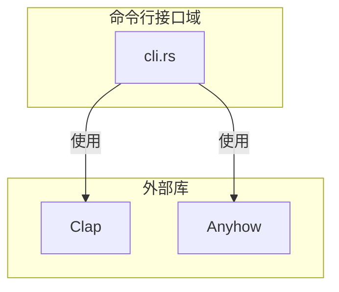
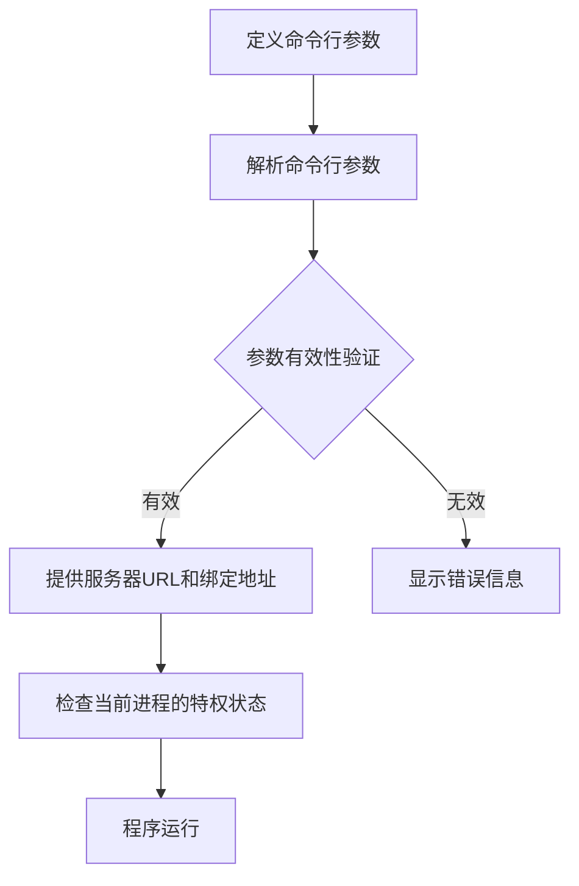
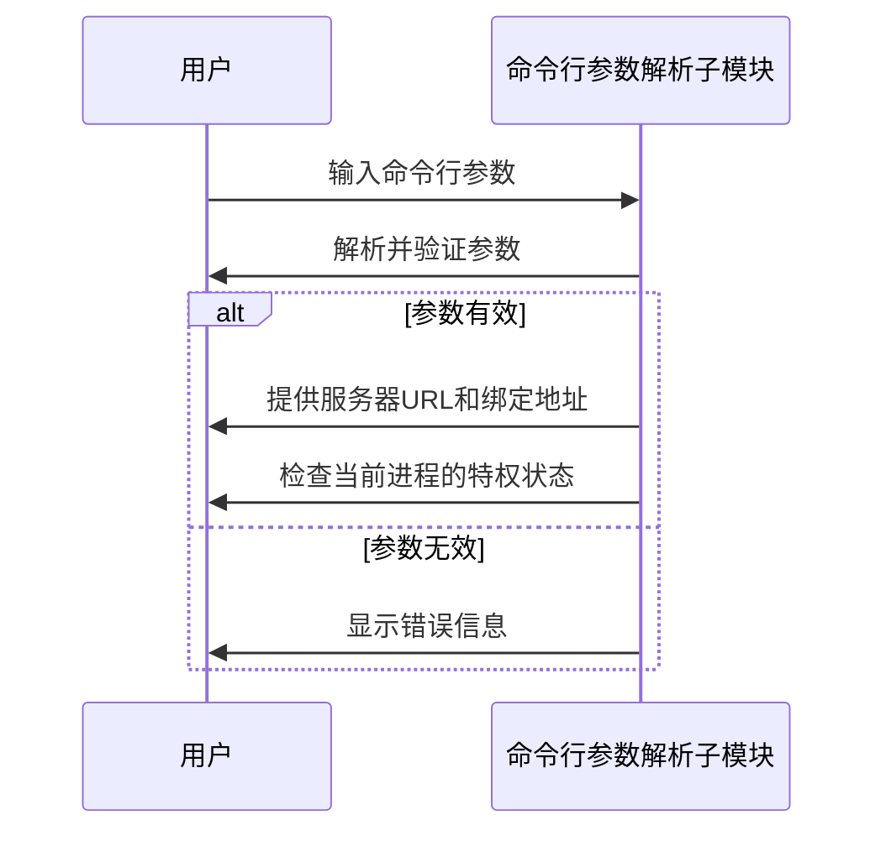

# 命令行接口域技术实现文档

## 1. 概述

### 1.1 目的

本文档详细描述了litho-book项目中命令行接口域的技术实现细节，包括模块架构、功能实现、交互流程以及与其他模块的关系。

### 1.2 范围

本文档涵盖以下内容：
- 命令行接口域的整体架构
- 命令行参数解析子模块的详细实现
- 与其他模块的交互方式
- 错误处理机制
- 使用示例

## 2. 架构概述

### 2.1 模块结构

命令行接口域主要由以下子模块组成：
- 命令行参数解析子模块（cli.rs）

### 2.2 架构图



### 2.3 与其他模块的关系

命令行接口域与其他模块的关系如下：
- 依赖错误处理域（error.rs）来处理命令行参数解析过程中可能出现的错误。
- 与服务器域（server.rs）交互，提供服务器URL和绑定地址。

## 3. 命令行参数解析子模块

### 3.1 功能描述

命令行参数解析子模块负责以下功能：
- 定义命令行参数的结构
- 解析实际的命令行参数
- 验证参数的有效性
- 提供服务器URL和绑定地址
- 检查当前进程的特权状态

### 3.2 实现细节

#### 3.2.1 依赖库

- **Clap**: 用于定义和解析命令行参数
- **Anyhow**: 用于错误处理

#### 3.2.2 核心代码

```rust
// src/cli.rs

use clap::{Arg, Command};
use anyhow::{Context, Result};

/// 定义命令行参数结构
pub fn build_cli() -> Command {
    Command::new("litho-book")
        .version("1.0")
        .author("Your Name")
        .about("A Rust-based document management system")
        .arg(
            Arg::new("server_url")
                .short('u')
                .long("server-url")
                .value_name("URL")
                .help("Sets the server URL")
                .required(true),
        )
        .arg(
            Arg::new("bind_address")
                .short('b')
                .long("bind-address")
                .value_name("ADDRESS")
                .help("Sets the bind address")
                .required(true),
        )
}

/// 解析命令行参数
pub fn parse_args() -> Result<Args> {
    let matches = build_cli().get_matches();
    let args = Args {
        server_url: matches
            .get_one::<String>("server_url")
            .context("Failed to get server URL")?
            .clone(),
        bind_address: matches
            .get_one::<String>("bind_address")
            .context("Failed to get bind address")?
            .clone(),
    };
    Ok(args)
}

/// 验证参数有效性
pub fn validate_args(args: &Args) -> Result<()> {
    // 验证服务器URL格式
    if !args.server_url.starts_with("http://") && !args.server_url.starts_with("https://") {
        anyhow::bail!("Invalid server URL: must start with http:// or https://");
    }

    // 验证绑定地址格式
    if !args.bind_address.contains(':') {
        anyhow::bail!("Invalid bind address: must be in the format IP:PORT");
    }

    Ok(())
}

/// 检查当前进程的特权状态
pub fn check_privileges() -> Result<()> {
    // 检查当前进程是否具有足够的权限
    // 这里可以添加具体的权限检查逻辑
    Ok(())
}

/// 提供服务器URL和绑定地址
pub fn get_server_config(args: &Args) -> (String, String) {
    (args.server_url.clone(), args.bind_address.clone())
}

#[derive(Debug, Clone)]
pub struct Args {
    pub server_url: String,
    pub bind_address: String,
}
```

### 3.3 流程图



### 3.4 序列图



## 4. 与其他模块的交互

### 4.1 错误处理域

命令行接口域依赖错误处理域（error.rs）来处理命令行参数解析过程中可能出现的错误。具体交互方式包括：
- 使用Anyhow库进行错误处理
- 将错误信息传递给错误处理域进行统一处理

### 4.2 服务器域

命令行接口域与服务器域（server.rs）的交互主要包括：
- 提供服务器URL和绑定地址
- 检查当前进程的特权状态

## 5. 使用示例

### 5.1 命令行参数示例

```bash
litho-book --server-url http://localhost:8080 --bind-address 127.0.0.1:3000
```

### 5.2 代码示例

```rust
use litho_book::cli;

fn main() {
    // 解析命令行参数
    let args = cli::parse_args().expect("Failed to parse command line arguments");

    // 验证参数有效性
    cli::validate_args(&args).expect("Invalid command line arguments");

    // 检查当前进程的特权状态
    cli::check_privileges().expect("Insufficient privileges");

    // 获取服务器配置
    let (server_url, bind_address) = cli::get_server_config(&args);

    println!("Server URL: {}", server_url);
    println!("Bind Address: {}", bind_address);

    // 启动服务器
    // 这里可以调用服务器域的相关函数
}
```

## 6. 错误处理

### 6.1 错误类型

命令行接口域可能遇到的错误类型包括：
- 无效的服务器URL
- 无效的绑定地址
- 缺少必要的命令行参数
- 当前进程权限不足

### 6.2 错误处理示例

```rust
use anyhow::{Context, Result};

fn validate_args(args: &Args) -> Result<()> {
    if !args.server_url.starts_with("http://") && !args.server_url.starts_with("https://") {
        anyhow::bail!("Invalid server URL: must start with http:// or https://");
    }

    if !args.bind_address.contains(':') {
        anyhow::bail!("Invalid bind address: must be in the format IP:PORT");
    }

    Ok(())
}

fn main() {
    let args = cli::parse_args().context("Failed to parse command line arguments")?;
    cli::validate_args(&args).context("Invalid command line arguments")?;
    cli::check_privileges().context("Insufficient privileges")?;
    // 继续执行其他操作
}
```

## 7. 最佳实践

### 7.1 命令行参数设计

- 使用Clap库定义和解析命令行参数，确保参数的清晰性和一致性。
- 为每个参数提供详细的帮助信息，便于用户理解和使用。

### 7.2 错误处理

- 使用Anyhow库进行错误处理，确保错误信息的清晰和一致性。
- 对于命令行参数解析过程中可能出现的错误，提供详细的错误信息，便于用户排查和解决问题。

### 7.3 特权检查

- 在启动服务器之前，检查当前进程的特权状态，确保程序以正确的权限运行。
- 对于需要特殊权限的操作，提供明确的错误信息，提示用户以适当的权限运行程序。

## 8. 结论

本文档详细描述了litho-book项目中命令行接口域的技术实现细节，包括模块架构、功能实现、交互流程以及与其他模块的关系。通过使用Clap库解析命令行参数，并结合Anyhow库进行错误处理，命令行接口域能够高效地解析和验证命令行参数，并提供服务器URL和绑定地址，确保程序以正确的权限运行。