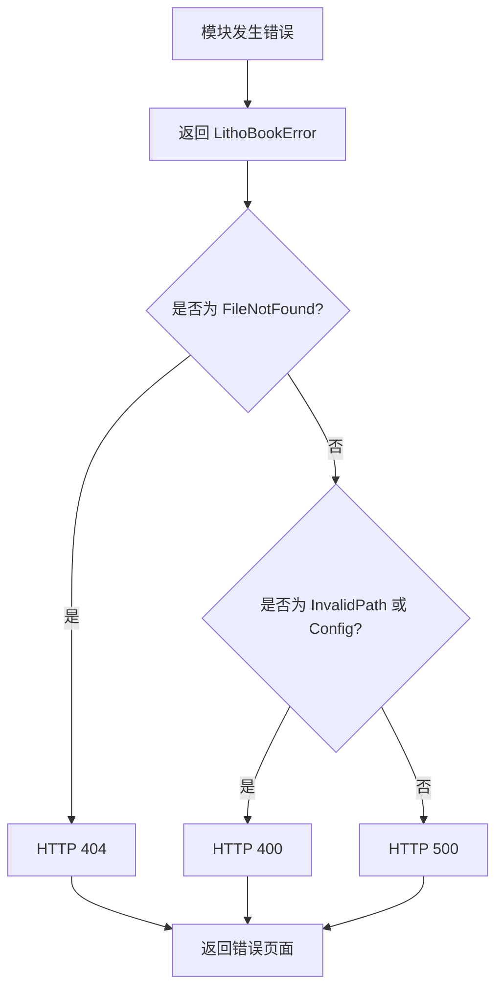

# 通用错误域技术实现文档

## 概述

**通用错误域**是 `litho-book` 项目中的核心支撑模块，负责统一管理应用程序中所有可能发生的运行时错误。该模块通过定义中心化的错误枚举类型 `LithoBookError`，实现了跨领域（CLI、文件系统、服务器）的错误标准化封装与语义化表达，并支持向 HTTP 状态码的自动转换，为系统的健壮性、可维护性和用户体验一致性提供了关键保障。

本模块位于 `src/error.rs`，采用 Rust 生态中广泛使用的 `thiserror` 库进行声明式错误定义，结合标准库的 `std::result::Result` 类型别名机制，显著提升了代码的可读性与错误处理的一致性。

---

## 核心设计目标

1. **集中化管理**：避免分散在各模块中的原始错误类型（如 `std::io::Error`），提供统一的错误入口。
2. **语义清晰**：将底层技术错误映射为具有业务含义的错误变体，便于开发者理解与调试。
3. **无缝集成 Web 层**：实现从应用级错误到 HTTP 状态码的自动转换，简化 REST API 的错误响应逻辑。
4. **简化函数签名**：通过类型别名 `Result<T>` 减少重复书写泛型参数，提升开发效率。
5. **透明转换**：利用 `#[from]` 属性自动生成底层错误到 `LithoBookError` 的转换逻辑，降低手动实现成本。

---

## 错误枚举定义：`LithoBookError`

### 枚举结构

```rust
#[derive(Error, Debug)]
pub enum LithoBookError {
    #[error("IO error: {0}")]
    Io(#[from] std::io::Error),

    #[error("JSON serialization error: {0}")]
    Json(#[from] serde_json::Error),

    #[error("File not found: {path}")]
    FileNotFound { path: String },

    #[error("Invalid file path: {path}")]
    InvalidPath { path: String },

    #[error("Directory scan error: {0}")]
    DirectoryScan(String),

    #[error("Server error: {0}")]
    Server(String),

    #[error("Configuration error: {0}")]
    Config(String),
}
```

### 变体说明

| 变体 | 触发场景 | 封装内容 |
|------|----------|---------|
| `Io` | 文件读写失败、权限不足、设备不可访问等 | 原始 `std::io::Error` 实例 |
| `Json` | JSON 序列化/反序列化失败（如配置解析） | 原始 `serde_json::Error` 实例 |
| `FileNotFound` | 请求的 Markdown 文件不存在 | 文件路径字符串 |
| `InvalidPath` | 路径包含非法字符或超出允许范围 | 用户提供的路径字符串 |
| `DirectoryScan` | 扫描目录时发生非 IO 类错误（如递归过深） | 错误描述信息 |
| `Server` | HTTP 服务内部异常（如路由冲突） | 自定义错误消息 |
| `Config` | 配置加载或验证失败 | 错误原因描述 |

> ⚠️ **注**：`Io` 和 `Json` 使用了 `#[from]` 属性，表示它们可以直接由对应的底层错误类型隐式转换而来，无需显式构造。

---

## 关键特性实现

### 1. 自动错误转换（via `thiserror`）

通过 `#[from]` 属性，`thiserror` 宏会自动生成 `From<std::io::Error>` 和 `From<serde_json::Error>` 的实现，使得以下代码可以无缝工作：

```rust
use std::fs;

fn read_config(path: &str) -> Result<String> {
    fs::read_to_string(path).map_err(LithoBookError::from) // 自动转为 LithoBookError::Io
}
```

这极大减少了样板代码，确保底层错误能够平滑地“升级”为应用级错误。

---

### 2. 到 HTTP 状态码的映射

为了与 Axum Web 框架集成，模块实现了 `From<LithoBookError> for axum::http::StatusCode` trait，使每个错误类型都能对应一个标准的 HTTP 响应状态码：

```rust
impl From<LithoBookError> for axum::http::StatusCode {
    fn from(err: LithoBookError) -> Self {
        match err {
            LithoBookError::FileNotFound { .. } => StatusCode::NOT_FOUND,
            LithoBookError::InvalidPath { .. } => StatusCode::BAD_REQUEST,
            LithoBookError::Config(_) => StatusCode::BAD_REQUEST,
            _ => StatusCode::INTERNAL_SERVER_ERROR,
        }
    }
}
```

#### 映射规则表

| 错误类型 | HTTP 状态码 | 含义 |
|--------|-------------|------|
| `FileNotFound` | `404 Not Found` | 用户请求的资源不存在 |
| `InvalidPath`, `Config` | `400 Bad Request` | 客户端输入有误 |
| 其他所有错误 | `500 Internal Server Error` | 服务端内部异常 |

此设计遵循 RESTful 最佳实践，帮助前端准确判断错误性质并做出相应处理（如重试、提示用户修正输入等）。

---

### 3. 统一结果类型别名

模块导出了一个全局可用的类型别名：

```rust
pub type Result<T> = std::result::Result<T, LithoBookError>;
```

这一设计带来以下优势：

- **简化函数签名**：
  ```rust
  pub fn get_tree(&self) -> Result<&DocumentTree>; // 替代冗长写法
  ```

- **增强一致性**：全项目范围内使用相同的错误返回类型，减少认知负担。
- **易于重构**：若未来需更换错误类型，只需修改一处定义即可。

---

## 在系统工作流中的角色

### 主要参与流程

#### ✅ 文档浏览启动流程
- CLI 参数验证失败 → 抛出 `InvalidPath` 或 `Config`
- 目录扫描失败 → 返回 `DirectoryScan` 或 `Io`

#### ✅ 文档内容查询流程
- 文件读取失败 → 返回 `Io`
- 文件不存在 → 返回 `FileNotFound`
- 渲染数据为 JSON 失败 → 返回 `Json`

#### ✅ 系统错误处理流程（核心）
1. 任意模块抛出 `LithoBookError`
2. Axum 中间件调用 `.into()` 转换为 `StatusCode`
3. 生成结构化错误响应（JSON 或 HTML 页面）



---

## 模块交互关系

| 依赖方 | 被依赖方 | 交互方式 | 强度 | 描述 |
|-------|---------|--------|-----|------|
| 文件系统域 | 通用错误域 | 继承依赖 | ★★★☆☆ | 使用 `LithoBookError` 作为操作返回类型，封装 IO 和扫描错误 |
| 服务器域 | 通用错误域 | 服务调用 | ★★★★★ | 接收错误并转换为 HTTP 状态码，统一生成响应 |
| 命令行接口域 | 通用错误域 | 服务调用 | ★★☆☆☆ | 参数校验失败时返回 `InvalidPath` 或 `Config` 错误 |

> 🔗 **关键连接点**：`src/server.rs` 中的错误处理器通过 `Into<StatusCode>` 将 `LithoBookError` 注入 HTTP 响应链。

---

## 最佳实践建议

1. **新增错误类型时保持克制**：优先复用现有变体，避免过度细分导致维护困难。
2. **携带上下文信息**：对于非 `#[from]` 错误（如 `FileNotFound`），务必填充具体路径以便排查问题。
3. **日志记录配合使用**：建议在顶层捕获 `LithoBookError` 时结合 `tracing` 输出详细日志。
4. **前端友好提示**：可在中间件中扩展错误响应体，加入用户可读的消息摘要。

---

## 总结

`通用错误域` 虽然代码量不大（仅约 40 行），但在整个 `litho-book` 系统中扮演着“中枢神经”的角色。它不仅解决了 Rust 项目常见的错误分散问题，还通过与 Axum 框架的深度集成，实现了从前端请求到后端异常的闭环处理能力。

其设计体现了典型的 Rust 工程哲学：**利用类型系统和宏机制，在编译期消除错误处理的不确定性，同时保持运行时零开销**。该模块的成功实践为后续可能的功能扩展（如插件系统、远程同步）奠定了坚实的错误处理基础。