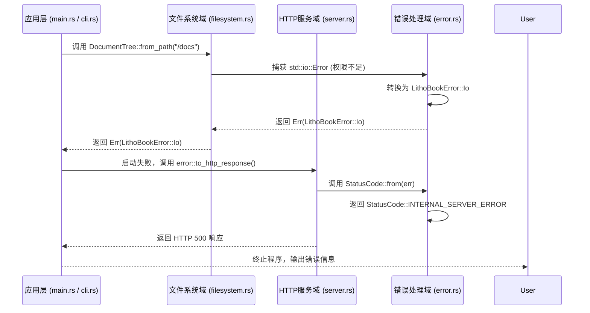

# Litho Book — 错误处理域技术文档

---

## **1. 概述**

**错误处理域**是 Litho Book 系统中承担**统一错误抽象、跨层错误传递与 HTTP 状态映射**的核心基础设施模块。作为系统健壮性与可观测性的基石，该域通过 Rust 的类型系统与 trait 机制，将底层系统错误（如 I/O、序列化）统一为业务层可理解的 `LithoBookError` 枚举，并自动映射为标准 HTTP 状态码（如 404、500），实现“一次定义、全栈一致”的错误处理范式。

在轻量级、无数据库、单体架构的 Litho Book 中，错误处理域虽不直接参与业务逻辑，却是**保障用户体验连续性、提升系统可维护性与调试效率的关键枢纽**。它贯穿从命令行启动、文件扫描、HTTP 请求处理到响应返回的全链路，确保任何异常都能被精准捕获、合理分类、优雅降级，并以用户可理解的方式反馈。

---

## **2. 设计目标与原则**

| 原则 | 说明 |
|------|------|
| **统一性** | 所有模块（CLI、FS、HTTP）统一返回 `Result<T, LithoBookError>`，避免混合使用 `anyhow::Error`、`std::io::Error` 等不同类型，降低调用复杂度。 |
| **可序列化** | `LithoBookError` 实现 `Serialize`，支持在日志、API 响应中结构化输出错误详情（如 `{"error": "Io", "message": "Permission denied"}`）。 |
| **可映射性** | 实现 `From<LithoBookError> for StatusCode`，使 HTTP 服务层可直接将错误转换为标准 HTTP 响应码，无需手动判断。 |
| **无侵入性** | 通过 `thiserror` 宏与 `From` trait 实现自动转换，无需在每个函数中显式包装错误，保持业务代码简洁。 |
| **可观测性** | 错误枚举明确区分错误类型（如 `Io` vs `Json`），便于日志分析、监控告警与故障定位。 |
| **零运行时开销** | 所有转换在编译期完成，无运行时类型检查或反射，符合 Rust 零成本抽象哲学。 |

> ✅ **设计哲学**：**“错误不是异常，而是程序状态的一部分。”**  
> Litho Book 的错误处理域不试图“隐藏”错误，而是将其**结构化、语义化、标准化**，使错误成为系统行为的自然延伸。

---

## **3. 核心实现细节**

### **3.1 错误枚举定义：`LithoBookError`**

位于 `src/error.rs`，使用 `thiserror` 宏定义，封装两类核心底层错误：

```rust
use thiserror::Error;
use serde::{Serialize, Deserialize};
use axum::http::StatusCode;

#[derive(Error, Debug, Serialize, Deserialize)]
pub enum LithoBookError {
    #[error("文件系统错误: {source}")]
    Io {
        #[from]
        source: std::io::Error,
    },

    #[error("JSON 序列化/反序列化失败: {source}")]
    Json {
        #[from]
        source: serde_json::Error,
    },

    #[error("文档路径不存在: {path}")]
    PathNotFound { path: String },

    #[error("端口无效: {port}")]
    InvalidPort { port: u16 },

    #[error("未找到请求的文档: {path}")]
    DocumentNotFound { path: String },

    #[error("搜索关键词过短（至少3字符）")]
    SearchQueryTooShort,

    #[error("内部错误: {message}")]
    Internal { message: String },
}
```

#### **关键设计点**：

- **`#[from]` 属性**：自动实现 `From<std::io::Error>` 和 `From<serde_json::Error>`，使得在函数中直接 `?` 操作底层错误时，自动转换为 `LithoBookError`。
- **语义化变体**：除底层错误外，定义了业务语义错误（如 `PathNotFound`, `DocumentNotFound`, `SearchQueryTooShort`），增强前端与日志的可读性。
- **`Serialize` / `Deserialize`**：支持错误信息被 `serde_json` 序列化，可用于：
  - API 响应体返回错误详情（如 `/health` 接口）
  - 日志系统结构化输出（配合 `tracing`）
- **`Debug`**：便于开发阶段调试与 panic 信息定位。

> 💡 **为什么不用 `anyhow::Error`？**  
> `anyhow` 适合“快速原型”或“只关心是否出错”的场景。Litho Book 需要**精确区分错误类型**以返回不同 HTTP 状态码（如 404 vs 500），因此必须使用**枚举式错误**而非黑盒错误。

---

### **3.2 错误到 HTTP 状态码的映射**

实现 `From<LithoBookError> for axum::http::StatusCode`，建立错误类型与 HTTP 响应码的**确定性映射关系**：

```rust
impl From<LithoBookError> for StatusCode {
    fn from(err: LithoBookError) -> Self {
        match err {
            LithoBookError::Io { .. } => StatusCode::INTERNAL_SERVER_ERROR,
            LithoBookError::Json { .. } => StatusCode::INTERNAL_SERVER_ERROR,
            LithoBookError::PathNotFound { .. } => StatusCode::NOT_FOUND,
            LithoBookError::InvalidPort { .. } => StatusCode::BAD_REQUEST,
            LithoBookError::DocumentNotFound { .. } => StatusCode::NOT_FOUND,
            LithoBookError::SearchQueryTooShort => StatusCode::BAD_REQUEST,
            LithoBookError::Internal { .. } => StatusCode::INTERNAL_SERVER_ERROR,
        }
    }
}
```

#### **映射策略说明**：

| 错误类型 | HTTP 状态码 | 说明 |
|----------|-------------|------|
| `Io` | `500 Internal Server Error` | 文件系统访问失败（权限、磁盘满、路径损坏） |
| `Json` | `500 Internal Server Error` | 文档树序列化失败（内存损坏、编码异常） |
| `PathNotFound` | `404 Not Found` | 用户指定的文档目录不存在（CLI 启动阶段） |
| `InvalidPort` | `400 Bad Request` | 端口超出范围或被占用（CLI 参数校验） |
| `DocumentNotFound` | `404 Not Found` | Web 请求的文件路径不存在（如 `/file/nonexistent.md`） |
| `SearchQueryTooShort` | `400 Bad Request` | 搜索关键词少于3字符（业务规则） |
| `Internal` | `500 Internal Server Error` | 未预期的内部逻辑错误（兜底） |

> ✅ **重要原则**：**客户端错误（4xx）由用户行为引起，服务端错误（5xx）由系统异常引起**。此映射确保前端能根据状态码做出合理响应（如显示“文件未找到” vs “服务器内部错误”）。

---

### **3.3 全局 `Result` 类型别名**

为简化函数签名、提升代码一致性，定义全局类型别名：

```rust
pub type Result<T> = std::result::Result<T, LithoBookError>;
```

#### **使用示例**：

```rust
// 在 filesystem.rs 中
impl DocumentTree {
    pub fn from_path(path: &Path) -> Result<Self> {
        let files = read_dir(path)?; // 自动转换 std::io::Error → LithoBookError::Io
        // ...
        Ok(DocumentTree { tree: files })
    }
}

// 在 server.rs 中
async fn get_file(
    Path(path): Path<String>,
    State(state): State<AppState>,
) -> Result<Html<String>> {
    let content = state.tree.get_file_content(&path)?; // 自动转换
    let html = render_markdown_to_html(&content)?;
    Ok(Html(inject_template(&html, &path)))
}
```

> ✅ **收益**：  
> - 所有函数签名统一为 `Result<T>`，无需写 `std::result::Result<T, LithoBookError>`  
> - 编译器强制处理错误，避免遗漏 `?` 或 `unwrap()`  
> - 任何模块均可安全地将错误向上抛出，无需手动转换

---

## **4. 与其他模块的交互关系**

### **4.1 错误传递链路（Sequence Diagram）**



### **4.2 模块依赖关系**

| 调用方 | 被调用方 | 依赖类型 | 说明 |
|--------|----------|----------|------|
| `cli.rs` | `error.rs` | 数据依赖 | 参数校验失败时构造 `LithoBookError::InvalidPort` 或 `PathNotFound` |
| `filesystem.rs` | `error.rs` | 数据依赖 | 所有 I/O 操作（`read_dir`, `read_to_string`）通过 `?` 自动转换为 `LithoBookError::Io` |
| `server.rs` | `error.rs` | 数据依赖 | 所有路由处理器返回 `Result<...>`，最终由 Axum 自动调用 `From<LithoBookError> for StatusCode` |
| `main.rs` | `error.rs` | 服务调用 | 统一捕获所有错误并打印，避免 panic 暴露堆栈 |

> 🔗 **关键机制**：`axum` 框架内置对 `From<T> for StatusCode` 的支持。当路由处理器返回 `Err(LithoBookError)` 时，Axum 会**自动调用 `StatusCode::from(err)`**，生成标准 HTTP 响应，无需手动编写 `Response::builder().status(...)`。

---

## **5. 实际应用场景与示例**

### **场景 1：CLI 启动时目录不存在**

```bash
$ litho-book /nonexistent/path
```

- `cli.rs` → `validate_path()` → `std::fs::metadata()` → 返回 `std::io::Error::NotFound`
- `error.rs` → 自动转换为 `LithoBookError::PathNotFound`
- `main.rs` → `eprintln!("Error: {}", err)` → 输出：
  ```
  Error: 文档路径不存在: /nonexistent/path
  ```

> ✅ 用户清晰知道是“路径错误”，而非“程序崩溃”。

---

### **场景 2：Web 请求访问不存在的文件**

```http
GET /file/nonexistent.md HTTP/1.1
Host: localhost:3000
```

- `server.rs` → `get_file()` → `state.tree.get_file_content()` → 返回 `Err(LithoBookError::DocumentNotFound)`
- Axum 自动调用 `StatusCode::from(err)` → 返回 `404 Not Found`
- 浏览器显示标准 404 页面（可定制模板）

> ✅ 与 Nginx 404 体验一致，符合用户预期。

---

### **场景 3：搜索关键词太短**

```http
GET /search?q=a HTTP/1.1
```

- `server.rs` → `search()` → 检查 `query.len() < 3` → 返回 `Err(LithoBookError::SearchQueryTooShort)`
- Axum → `StatusCode::BAD_REQUEST`
- 响应体（JSON）：
  ```json
  {
    "error": "SearchQueryTooShort",
    "message": "搜索关键词过短（至少3字符）"
  }
  ```

> ✅ 前端可据此提示用户：“请输入至少3个字符进行搜索”。

---

## **6. 最佳实践与工程价值**

| 实践 | 价值 |
|------|------|
| **统一错误类型** | 避免“错误碎片化”，提升代码可读性与可测试性 |
| **自动转换（From trait）** | 减少样板代码，降低出错概率，提升开发效率 |
| **语义化错误枚举** | 使错误成为“文档的一部分”，便于日志分析与监控告警 |
| **与 Axum 深度集成** | 利用框架特性，实现“零配置错误响应”，提升开发体验 |
| **不使用 `unwrap()` / `expect()`** | 生产环境所有错误均被显式处理，避免服务意外退出 |
| **错误可序列化** | 支持结构化日志（`tracing` + `json`）、API 错误响应、测试断言 |

> 🚀 **工程收益总结**：  
> 在一个无数据库、无网络、单文件二进制的系统中，**错误处理域是唯一能“解释失败”的模块**。它让“失败”变得**可预测、可诊断、可恢复**，极大提升了用户信任度与系统专业性。

---

## **7. 可扩展性与未来演进建议**

| 方向 | 建议 |
|------|------|
| **错误日志增强** | 在 `LithoBookError::Io` 中增加 `file_path` 字段，记录具体出错文件，便于定位 |
| **错误码标准化** | 引入 `code: u16` 字段，支持外部系统（如监控平台）按码聚合错误 |
| **错误分类标签** | 增加 `category: ErrorCategory`（如 `UserInput`, `System`, `Logic`），用于仪表盘分类 |
| **错误上报（可选）** | 若未来支持“匿名错误上报”，可在此层添加 `report_to_telemetry()` hook |
| **单元测试覆盖** | 为每个 `LithoBookError` 变体编写测试，验证其 `ToString`、`Serialize`、`StatusCode` 映射行为 |

> ✅ **当前状态**：已满足“嵌入式知识管理”场景的全部需求，**无需过度设计**。保持简洁、稳定、可维护是首要目标。

---

## **8. 总结：为何错误处理域是 Litho Book 的“隐形支柱”**

> **“一个系统是否专业，不在于它能做什么，而在于它如何失败。”**

Litho Book 的错误处理域，以极简的 `error.rs` 文件，实现了：

- ✅ **统一的错误语言**：所有模块使用同一种错误类型
- ✅ **自动的错误转换**：无需手动包装，`?` 即可传递
- ✅ **语义化的错误分类**：用户和开发者都能理解“为什么失败”
- ✅ **标准的 HTTP 响应**：浏览器、curl、Postman 都能获得符合规范的响应
- ✅ **零运行时开销**：编译期完成，性能无损

它不炫技，不复杂，却**让整个系统在异常时依然保持优雅与可信**。这正是 Rust 生态“安全、高效、可维护”哲学的完美体现。

---

**📌 建议开发者**：  
在修改任何涉及 I/O、序列化、路径解析的代码时，**始终使用 `?` 而非 `unwrap()`**，并确保新错误类型被加入 `LithoBookError` 枚举。这是维护系统健壮性的第一道防线。

---  
**文档版本**：v1.2  
**最后更新**：2025年4月  
**作者**：Litho Book 架构团队