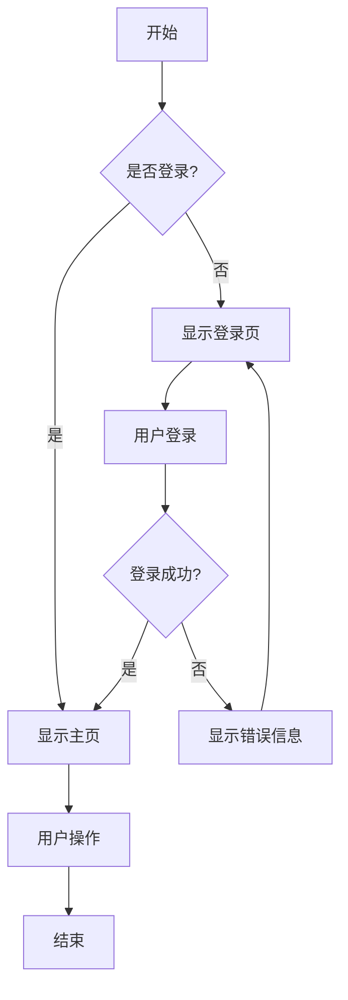
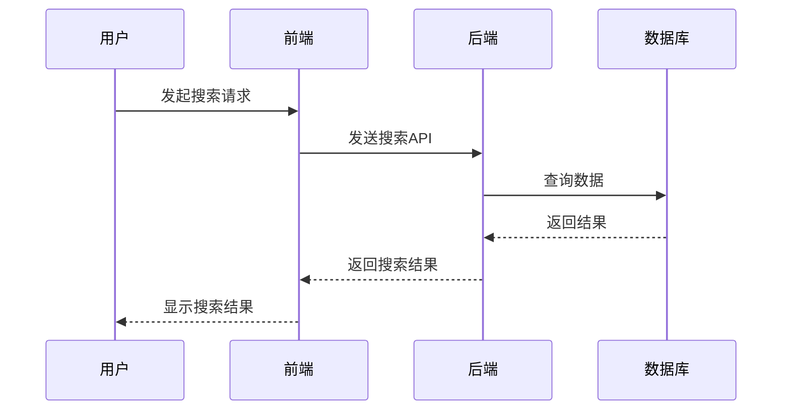
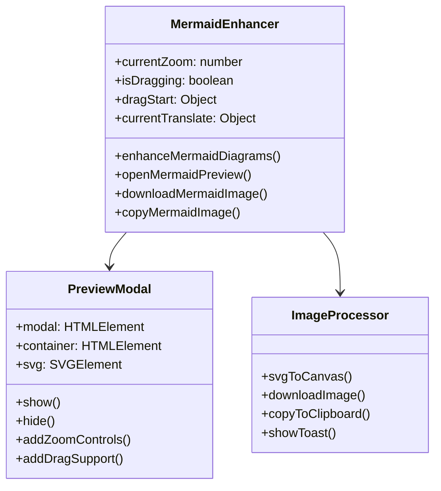
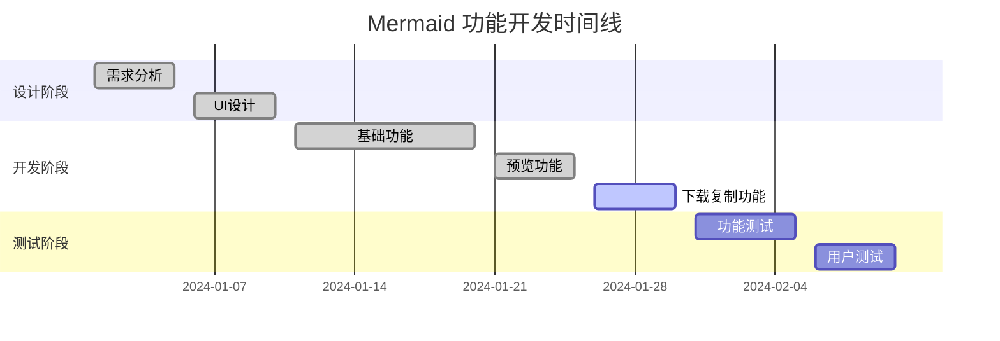
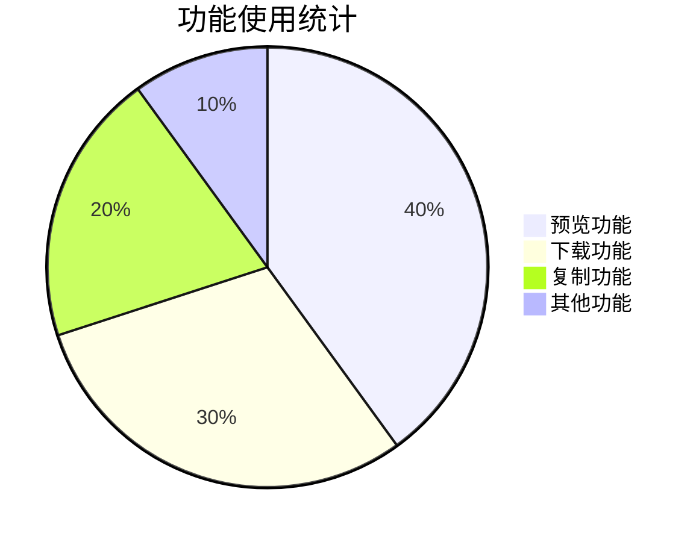

# Mermaid 图表演示

这个文档用于测试 Mermaid 图表的增强功能，包括大图预览、下载和复制功能。

## 🎯 功能测试

### 1. 流程图示例

### 2. 时序图示例

### 3. 类图示例

### 4. 甘特图示例

### 5. 饼图示例

## 📋 功能说明

### 🎮 如何使用

1. **查看控制按钮**：
   - 将鼠标悬停在任何 Mermaid 图表上
   - 右上角会显示下载（⬇️）和复制（📋）按钮

2. **大图预览**：
   - 点击图表任意位置打开预览模式
   - 支持鼠标拖拽移动图表
   - 支持滚轮缩放
   - 按 ESC 键或点击背景关闭

3. **下载图片**：
   - 点击蓝色下载按钮
   - 图表将保存为高分辨率 PNG 图片

4. **复制图片**：
   - 点击绿色复制按钮
   - 图片将复制到系统剪贴板

### ⚡ 功能特色

- ✅ **自动检测**：自动识别页面中的所有 Mermaid 图表
- ✅ **响应式设计**：适配不同屏幕尺寸
- ✅ **高分辨率**：下载的图片为 2x 分辨率
- ✅ **流畅动画**：所有交互都有平滑的过渡效果
- ✅ **键盘支持**：ESC 键快速关闭预览
- ✅ **视觉反馈**：操作成功后显示提示消息

### 🔧 技术实现

- **SVG 转换**：使用 Canvas API 将 SVG 转换为 PNG
- **剪贴板 API**：使用现代浏览器的 Clipboard API
- **事件监听**：MutationObserver 自动检测新图表
- **防重复增强**：避免对同一图表重复添加功能

## 🧪 测试步骤

1. 悬停在上面的任意图表上，查看是否显示控制按钮
2. 点击图表测试大图预览功能
3. 在预览模式下测试缩放和拖拽
4. 测试下载功能（应该下载 PNG 文件）
5. 测试复制功能（应该显示成功提示）

所有功能都应该正常工作！🎉